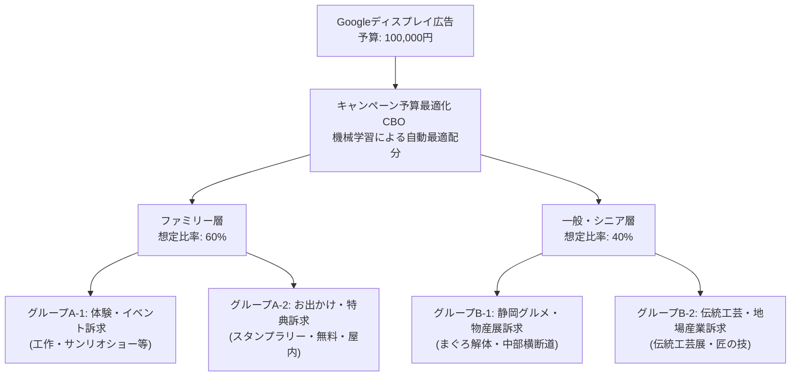

# 議論ログ：Googleディスプレイ広告（GDN）詳細配信計画と広告グループの複数提案について

## 1. 議論の背景と目的
「産業フェアしずおか2026」のWebプロモーションにおけるGoogleディスプレイ広告（GDN）（予算：100,000円）の成果最大化に向け、実入稿が可能なレベルまでセグメント・興味関心・広告グループ構成を精緻化する。
ユーザーからの「セグメントを細かく設定したい」「これを見たら入稿ができるぐらいに興味関心等も設定したい」「広告グループを複数提案してほしい（産業フェアへの誘客、イベント訴求など）」という要望に基づき、より効果的なターゲティング設計について合意形成を図る。

---

## 2. 議題と提案内容

### ① 広告グループの複数構成案（細分化）
従来の「ファミリー層」「一般・シニア層」の2大グループを、訴求内容および検索行動に基づいて**4つの広告グループ**へ細分化することを提案。

### ② 入稿可能な詳細セグメンテーション設計
各広告グループに対し、Google広告管理画面で直接設定できる以下のパラメータを設計。

*   **ファミリー層（体験・イベント）**:
    *   **ユーザー属性**: 子供あり（乳児・幼児・未就学児・小学生の親）
    *   **カスタムセグメント（Google検索キーワード）**: 「静岡 子連れ お出かけ」「静岡 週末 イベント」「子ども 工作 体験」「サンリオショー 静岡」「子ども プラモデル 体験」「静岡 木のおもちゃ」「ツインメッセ イベント 家族」
    *   **アフィニティ（興味関心）**: ファミリー向け旅行好き、DIY・工作ファン、テーマパーク・遊園地ファン
    *   **インマーケット（購買意向）**: おもちゃ、ゲーム、家族向けアトラクション・遊園地
*   **ファミリー層（お出かけ・特典）**:
    *   **ユーザー属性**: 子供あり
    *   **カスタムセグメント（Google検索キーワード）**: 「静岡 無料 イベント」「静岡 週末 お出かけ 雨の日」「スタンプラリー 静岡」など
    *   **インマーケット（購買意向）**: 国内旅行（静岡県）、ファミリー向けレジャー
*   **一般・シニア層（静岡グルメ・物産）**:
    *   **ユーザー属性**: 年齢（45歳以上、55歳以上、65歳以上）
    *   **カスタムセグメント（Google検索キーワード）**: 「まぐろ 解体ショー」「静岡 グルメ イベント」「ツインメッセ 物産展」「中部横断道 グルメ」など
    *   **アフィニティ（興味関心）**: グルメ・食べ歩き、旅行好き（国内）
    *   **インマーケット（購買意向）**: 食品・飲料、外食・デリバリー
*   **一般・シニア層（伝統工芸・地場産業）**:
    *   **ユーザー属性**: 年齢（45歳以上、55歳以上、65歳以上）
    *   **カスタムセグメント（Google検索キーワード）**: 「静岡 伝統工芸」「駿河竹千筋細工」「静岡 漆器」「日本の伝統技術」など
    *   **アフィニティ（興味関心）**: アート・クラフトファン、歴史・日本の伝統工芸愛好家

---

## 3. 論点と確認事項

1.  **広告グループ細分化に伴う予算管理方式の選択**
    *   **選択肢ア（推奨・自動最適化）**：キャンペーン予算最適化（CBO）をオンにし、Google広告のAIが全体の予算100,000円から、最もパフォーマンスの良い広告グループ（A-1, A-2, B-1, B-2）へリアルタイムに予算を傾斜配分する。
    *   **選択肢イ（手動固定）**：従来の「ファミリー計 60,000円（A-1とA-2で30,000円ずつ）」「シニア・一般計 40,000円（B-1とB-2で20,000円ずつ）」のように手動で予算を完全に分離・固定する。
2.  **カスタムセグメント用キーワードの妥当性**
    *   「産業フェアしずおか2026」の具体的なコンテンツに直結するキーワードが網羅されているか。

---

## 4. 決定事項・合意内容（2026年8月5日 確定）
智之さん（ユーザー）より実装計画書の承認およびフィードバックをいただき、以下の通り決定・合意した。

1.  **広告グループの細分化とCBOの採択**:
    *   提案の通り、広告グループを「ファミリー（体験・イベント）」「ファミリー（お出かけ・特典）」「一般・シニア（静岡グルメ・物産）」「一般・シニア（伝統工芸・地場産業）」の4グループに拡張して運用を開始する。
    *   予算配分は、広告効果の最大化を図るため**キャンペーン予算最適化（CBO）を用いた自動配分（選択肢ア）**を採用する。
2.  **入札戦略の変更（重要意思決定）**:
    *   当初案の「コンバージョン値の最大化」から**「クリック数の最大化（上限クリック単価の設定を推奨）」**へ変更する。
    *   **変更理由**：今回のキャンペーンの主要目的が公式サイトへの「アクセス（訪問）」やパンフレット閲覧の獲得であること、また新規アカウント且つ約1ヶ月の短期間配信であるため、過去のコンバージョンデータが無く機械学習に時間を要する「コンバージョン最大化」よりも、開始初期から確実に多くのサイト訪問（クリック）を安価に集められる「クリック数の最大化」の方が適していると判断したため。
3.  **入稿用パラメータの確定**:
    *   カスタムセグメント（検索キーワード）およびアフィニティ、インマーケットの設計通りにGoogle広告管理画面へ入稿を行う。
4.  **配信計画書の更新**:
    *   上記合意内容および入稿アセットテキストを [Googleディスプレイ広告配信計画書_2026.md](file:///Users/sap220701/Desktop/産業フェア_ローカル/docs/02_プロモーション計画/Googleディスプレイ広告配信計画書_2026.md) に反映した。

---

## 5. 議論参加者
*   智之さん（プロジェクト責任者）
*   Antigravity（AIアシスタント）
