<!-- _class: title -->

# 📝 Instagram広告文・クリエイティブ案リライト提案書（v1）
## ファクトチェック＆人間味＆農林水産バランス反映版

- **対象**: Instagram広告配信計画書（パートナーシップ広告・公式直接広告・リール絵コンテ）
- **ステータス**: ⚠️ ドラフト提案（未FIX・智之さんの承認待ち）
- **作成日**: 2026年8月5日

---

## 🚨 ファクトチェック＆リライト方針

GDN / YDAと同様のロジックをInstagram広告にも適用します。

| 項目 | ステータス | 広告での扱い |
| :--- | :---: | :--- |
| **サンリオ 30周年ショー** | ✅ 確定 | **ポムポムプリン30周年スペシャルステージ「ぱぴぷぺPom！」＋シナモロール＆フォトセッション**を強力訴求 |
| **プラモデル・シズレンガ・マグロ解体** | ⚠️ 未定 | 確定するまで広告から除外。「工作体験」「木工体験」「しずまえ海鮮・農産物」に置き換え |
| **産業の訴求バランス** | ⚖️ 調整 | 海鮮偏重を解消し、**農業（新鮮野菜）・林業（丸太・木工）・水産・地場産業（伝統技術）・中部横断道（山梨・長野名物）**をバランスよく展開 |
| **AIっぽさ排除** | 💡 修正 | 「〜満載」「〜大集合」「〜目白押し」を排除し、インスタ特有の**リアルなママ・パパの本音・情景描写**に徹底シフト |

---

## 4. 広告コピー・クリエイティブ案（各5パターン）

### ■ キャンペーンA：パートナーシップ広告（ブースト配信）用

#### コピー案1【体験・親子お出かけ訴求】

> ＼「週末どこ行こう…」とお悩みの静岡ママ・パパへ／ 🎒✨
> 11/28(土)・29(日)はツインメッセ静岡で「産業フェアしずおか2026」が開催！
>
> 職人さんに教わる木工・工作体験や、ポムポムプリンの30周年スペシャルショーなど、子どもが夢中になる体験がいっぱい！
> 自分で作った作品はそのまま笑顔でお持ち帰りできますよ🙌
> 暖房完備の屋内会場だから天気を気にせず1日中楽しめます！
>
> 📍 ツインメッセ静岡（北館・南館）
> 🗓 11/28(土)・29(日) 10:00〜16:00
> 🎫 入場無料
>
> 会場マップや駐車場情報はプロフィール（ @shizuoka_info / @shizuokaosanponikki ）のリンクからチェックしてね🔗
>
> #産業フェアしずおか2026 #ツインメッセ静岡 #静岡お出かけ #静岡ママ #静岡子育て #入場無料イベント #ポムポムプリン

#### コピー案2【山・海・里の味覚＆物産展訴求】

> ＼静岡の「山・海・里」の旨いものが集まる2日間！／ 🌾🐟🍊
> 11/28(土)・29(日)ツインメッセ静岡で「産業フェアしずおか2026」開催！
>
> しずまえの新鮮な海鮮、農家さんの採れたて野菜、そして中部横断道でつながった山梨・長野から届く限定名産品まで！
> 「あれも食べたい、これも買いたい」が止まらない食欲の秋にぴったりのイベントです😋
> 家族でドライブがてら出かけてみてね🚗
> 詳細はプロフィールリンクから🔗
>
> #静岡グルメ #しずまえ #農家直送 #山梨長野名物 #静岡イベント #産業フェアしずおか2026 #ツインメッセ静岡

#### コピー案3【週末お出かけ・安心・快適性訴求】

> 「雨が降ったらどうしよう」「子連れで行けるかな…」の心配ゼロ！👀
> 11/28(土)・29(日)は、ツインメッセ静岡の「産業フェアしずおか2026」へGO！
>
> 【入場無料・暖房完備・駐車場あり・ベビーカーOK・授乳室完備】と、小さなお子さん連れに優しい条件が揃っています。
> 職人さんの手ほどきで楽しむ工作体験やキッズエリアなど、家族みんなが快適に一日過ごせますよ。
> 詳しくはプロフィールのリンクを見てね🔗
>
> #子育て静岡 #静岡ママ #雨の日お出かけ #ベビーカーでお出かけ #産業フェアしずおか2026

#### コピー案4【家族3世代・手仕事と産業体験訴求】

> 子どもも大人も、おじいちゃんおばあちゃんも笑顔になれる週末！【入場無料】🥺💕
> 11/28(土)・29(日)にツインメッセ静岡で開催される「産業フェアしずおか」へ！
>
> 駿河竹千筋細工や木工など職人の技を間近で見られる伝統工芸展から、地元のおいしい食が並ぶブースまで見どころたっぷり！
> 作って、食べて、選んで。3世代みんなで素敵な秋の思い出を作りませんか？
> 詳細＆アクセス情報はプロフィールリンクからチェックしてね！
>
> #静岡お出かけ #週末お出かけ #伝統工芸 #手仕事の暮らし #3世代でお出かけ #産業フェアしずおか2026

#### コピー案5【直前・ポムポムプリン＆スタンプラリー訴求】

> ＼いよいよ今週末！11/28(土)・29(日)開催／
> ツインメッセ静岡で「産業フェアしずおか2026」が開幕します！🎉
>
> ★ポムポムプリン30周年スペシャルステージ「ぱぴぷぺPom！」（シナモロールも登場＆フォトセッションあり！）
> ★4,500名様に当たるデジタルスタンプラリーなど注目の企画が目白押し！
> 会場マップと駐車場の詳細はプロフィールリンクから今すぐチェック！🔗
>
> #静岡市イベント #ツインメッセ静岡 #ポムポムプリン #シナモロール #サンリオショー #産業フェアしずおか2026

---

### ■ キャンペーンB：公式直接広告用

#### コピー案1【体験型リール用：手仕事・木工体験訴求】

> 【11/28(土)・29(日)開催】入場無料！ツインメッセ静岡で「産業フェアしずおか2026」が開幕！🌲🔨
>
> 「できた！見て！」職人さんに教わりながら作る木工・工作体験コーナー！
> 自分の手で完成させた作品は、そのまま思い出のお土産に。
> 暖房ポカポカの屋内会場なので、天気を気にせず快適に楽しめます。
> 詳細はこちら ➡️ [公式プロフィール / サイトへ誘導]
>
> #木工体験 #工作体験 #親子お出かけ #雨でも安心 #ツインメッセ静岡 #産業フェアしずおか2026

#### コピー案2【グルメ型カルーセル用：山・海・里の恵み＆物産ストリート】

> 【静岡の「食」と「技」が一堂に！】11/28(土)・29(日)は「産業フェアしずおか2026」へ！🌾🐟🧁
>
> しずまえの海鮮や農家直送の新鮮野菜、静岡の伝統家具・地場産業品に加え、山梨・長野の名産品が集まる「中部横断道交流物産ストリート」も出店！
> お腹も心も満たされる2日間。ご家族みんなでツインメッセへお越しください！
> 詳細はこちら ➡️ [公式プロフィール / サイトへ誘導]
>
> #静岡グルメ #地産地消 #中部横断道 #週末ドライブ #ツインメッセ静岡 #産業フェアしずおか2026

#### コピー案3【ステージ型・ポムポムプリン30周年訴求】

> ＼ポムポムプリン30周年スペシャルステージ！シナモロールもやって来る！／🐶☁️
> 11/28(土)・29(日)は、ツインメッセ静岡の「産業フェアしずおか2026」へ！
>
> ポムポムプリン30周年記念のスペシャルステージ「ぱぴぷぺPom！」を観覧無料で開催！
> シナモロールと一緒に写真が撮れるフォトセッション（撮影会/ハイタッチ会）もお見逃しなく！
> 各ステージのタイムスケジュールは公式プロフィールのリンクからチェック！
>
> #ポムポムプリン #シナモロール #サンリオ #キャラクターショー #写真撮影会 #ツインメッセ静岡 #産業フェアしずおか2026

#### コピー案4【実務ガイド・アクセス・子連れ安心訴求】

> 【アクセス・駐車場・子連れ安心ガイド】11/28(土)・29(日)開催の「産業フェアしずおか2026」へお越しの方へ🚗🚃
>
> 当日は無料の臨時駐車場（静岡総合庁舎）や提携駐車場をご用意しております。静鉄電車・バスなど公共交通機関でのご来場も便利です。
> 【入場無料・ベビーカー置き場・授乳室完備】なので小さなお子様連れでも安心！
> 詳細マップはリンク先へ ➡️ [公式プロフィール / サイトへ誘導]
>
> #静岡アクセス #臨時駐車場 #ツインメッセ静岡 #子連れお出かけ #産業フェアしずおか2026

#### コピー案5【デジタルスタンプラリー＆ブース総選挙訴求】

> 【スマホで簡単！4,500名様に当たるデジタルスタンプラリー】📱🎁
> 11/28(土)・29(日)開催の「産業フェアしずおか2026」で、会場を巡って楽しもう！
>
> **2日間合計4,500名様に豪華景品が当たるデジタルスタンプラリー**！
> 会場内でお気に入りのブースを見つけてアンケートに回答＆スタンプGET！
> ご家族でワクワクしながら会場を探索してみてくださいね！
> 参加方法の詳細はリンク先へ ➡️ [公式プロフィール / サイトへ誘導]
>
> #デジタルスタンプラリー #ブース総選挙 #ツインメッセ静岡 #産業フェアしずおか2026

---

## 5. クリエイティブ構成案（絵コンテ修正版）

### ① パートナーシップ広告用／公式体験型リール動画（9:16 縦型動画）

- **絵コンテのファクト修正点**：
  - 「プラモデル・しずまえ版画」→「職人さんに教わる木工・工作体験」に変更。
  - 「まぐろ・しらす丼」→「しずまえ鮮魚・農家さんの採れたて野菜・山梨長野名物」に変更。

```mermaid
gantt
    title リール動画（25秒構成案）タイムライン
    dateFormat  X
    axisFormat %s
    section 映像展開
    [0-3秒] 親子の笑顔カット（フックテロップ） : 0, 3
    [4-10秒] 木工・職人手仕事体験 : 4, 10
    [11-17秒] サンリオ ポムポムプリン＆シナモロール : 11, 17
    [18-22秒] 農山漁村の絶品グルメ＆物産展 : 18, 22
    [23-25秒] 開催日程・場所（エンドカード） : 23, 25
```

- **構成詳細（25秒）**：
  - **[0-3秒]**
    - 映像：子どもが工作体験で自分の作った作品を嬉しそうに見せる笑顔のアップ。
    - テロップ：**「入場無料！週末どこ行く？ツインメッセ静岡へ！」**
  - **[4-10秒]**
    - 映像：伝統工芸の職人さんが優しく教える木工体験・手仕事の実演。
    - テロップ：**「職人さんと一緒にモノづくり体験！」**
  - **[11-17秒]**
    - 映像：ポムポムプリン＆シナモロールのステージ映像・写真撮影の様子。
    - テロップ：**「ポムポムプリン30周年ショーも無料観覧！」**
  - **[18-22秒]**
    - 映像：しずまえ海鮮・農産物・中部横断道物産ストリートのシズルカット。
    - テロップ：**「静岡の山・海・里の旨いものが一堂に！」**
  - **[23-25秒]**
    - 映像：会場外観と「入場無料 11/28(土)・29(日) ツインメッセ静岡」のエンドカード。

