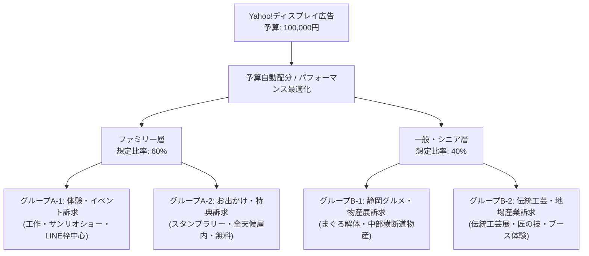

# 議論ログ：Yahoo!ディスプレイ広告（YDA）詳細配信計画と4広告グループ化・入稿パラメータの精緻化

## 1. 議論の背景と目的
「産業フェアしずおか2026」のYahoo!ディスプレイ広告（YDA：LINE配信面含む）（予算：100,000円）において、運用担当者が広告管理画面（Yahoo! JAPAN Ads Promotion Manager）へそのまま迷わず入稿（コピー＆ペースト）できるレベルまで、ターゲットセグメント・検索履歴キーワード（サーチターゲティング）・オーディエンスカテゴリ・入稿コピーを精緻化する。

---

## 2. 議題と決定事項（2026年8月5日 確定）

智之さん（プロジェクト責任者）との協議および承認に基づき、以下の通り決定・合意した。

### ① 4つの広告グループへの細分化（GDNと同等の構造化）
従来の2グループ構成から、訴求メッセージおよび検索行動・生活インサイトに基づいた**4つの広告グループ**へ細分化する。

### ② 入稿可能な詳細セグメンテーション設計（Yahoo!広告パラメータ）
各広告グループに対し、Yahoo!広告管理画面で直接設定できる以下のパラメータを設計した。

* **グループA-1：ファミリー層（体験・イベント訴求）**
  * **ユーザー属性**: 性別：指定なし / 年齢：20歳〜49歳 / 子供の有無：あり（未就学児、小学生）
  * **サーチターゲティング（検索履歴キーワード）**:
    `静岡 子連れ お出かけ`、`子ども 工作 体験`、`サンリオショー 静岡`、`子ども プラモデル 体験`、`静岡 木のおもちゃ`、`ツインメッセ イベント 家族`、`静岡 週末 子ども`
  * **オーディエンスカテゴリ**: お出かけ・レジャー ＞ 知育・玩具・アトラクション
  * **主要配信面**: LINEトークリスト最上部（Smart Channel）、LINE NEWS、Yahoo! JAPANスマホトップ

* **グループA-2：ファミリー層（お出かけ・特典訴求）**
  * **ユーザー属性**: 年齢：20歳〜49歳 / 子供の有無：あり
  * **サーチターゲティング**:
    `静岡 無料 イベント`、`静岡 週末 お出かけ 雨の日`、`スタンプラリー 静岡`、`ツインメッセ 産業フェア`、`静岡市 週末 イベント`
  * **オーディエンスカテゴリ**: お出かけ・レジャー ＞ テーマパーク・レジャー施設、地域情報 ＞ 静岡県
  * **主要配信面**: LINE NEWS、LINEウォレット、Yahoo!天気

* **グループB-1：一般・シニア層（静岡グルメ・物産展訴求）**
  * **ユーザー属性**: 年齢：50歳〜70歳以上（性別・子供有無は限定しない）
  * **サーチターゲティング**:
    `まぐろ 解体ショー`、`静岡 グルメ イベント`、`ツインメッセ 物産展`、`中部横断道 グルメ`、`静岡 特産品`、`静岡 ご当地グルメ`
  * **オーディエンスカテゴリ**: グルメ・飲食 ＞ ご当地グルメ・特産品、旅行・レジャー ＞ 国内旅行
  * **主要配信面**: Yahoo! JAPANトップ（PC・スマホ）、Yahoo!天気、Yahoo!乗換案内

* **グループB-2：一般・シニア層（伝統工芸・地場産業訴求）**
  * **ユーザー属性**: 年齢：50歳〜70歳以上
  * **サーチターゲティング**:
    `静岡 伝統工芸`、`駿河竹千筋細工`、`静岡 漆器`、`日本の伝統技術`、`クラフト フェア 静岡`、`地場産業 展示会`
  * **オーディエンスカテゴリ**: 暮らし・生活 ＞ アート・クラフト・伝統・文化
  * **主要配信面**: Yahoo! JAPAN PCブランドパネル、Yahoo!ニュース

### ③ 入稿用アセット案（タイトル・説明文 各4グループ×5パターン完全整備）
* Yahoo!ディスプレイ広告規定（タイトル：全角20文字以内、説明文：全角90文字以内）を厳密に遵守したドラフトアセットを各グループ5パターンずつ網羅。

---

## 3. 計画書への反映
上記決定に基づき、[Yahooディスプレイ広告配信計画書_2026.md](file:///Users/sap220701/Desktop/産業フェア_ローカル/docs/02_プロモーション計画/Yahooディスプレイ広告配信計画書_2026.md) を全面的に更新・強化した。

---

## 4. 議論参加者
* 智之さん（プロジェクト責任者）
* Antigravity（AIアシスタント）
