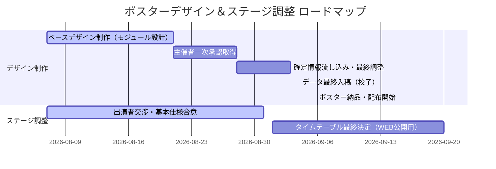

<!-- _class: title -->

# 📐 YDP合意形成討論ログ：ステージスケジュール未確定時におけるポスターデザイン推進方針

- **対象案件**: ステージスケジュール未確定状態における、ポスターデザイン（9/4入稿）の進行アプローチおよびデザインレイアウト方針の合意
- **作成日（タイムスタンプ）**: 2026年8月7日
- **アサイン部署**: 総合ディレクター (`web-promoter`)、クリエイティブディレクター (`web-designer`)、アカウントプランナー (`web-account-planner`)、AI COO、AI EA
- **最終決裁者**: 山田プロデューサー（人間）

---

## 🏛️ 組織アーキテクトによる「アーキテクチャ適合宣言」

本ドキュメントは、最高憲法 v1.8.3 のガバナンスルールに完全に適合していることを宣言します。
ポスター入稿期限（9/4）とステージスケジュール確定（9月以降順次）のタイムラグを解決するための、デザイン推進プロセスに関する公式の意思決定および合意ログです。

---

## 📅 1. 背景とスケジュールギャップの整理

ポスターの納品・掲示スケジュールと、ステージプログラムの確定時期には以下のタイムラグ（ギャップ）が存在します。

* **ポスターデザイン確定・主催者承認**: **8月28日（金）**（WMS目標）
* **ポスター最終データ入稿（校了）**: **9月4日（金）**（WMS厳守）
* **ポスター＆チラシ納品**: **9月15日（火）**
* **ステージ出演者・タイムスケジュールの確定**: **9月以降順次**
  * *現在（8/7時点）の状況*: 11/29(日)の「サンリオキャラクターショー」や「きのいい羊達」の出演自体は基本合意していますが、他ステージの出演交渉や具体的なタイムテーブル（時間枠）の決定は9月以降にずれ込む見込みです。

---

## 💡 2. ポスターデザイン推進のための3つのアプローチ（提案）

スケジュールギャップをクリアし、予定通り9月4日に入稿するためのデザイン方針として、以下を提案します。

### 📌 【アプローチA】 「WEB連携型・QRコード誘導」レイアウト（推奨）
* **概要**: ポスターには詳細な「タイムスケジュール（時間）」を一切記載せず、主要な見どころとWEBへの誘導（QRコード）に特化します。
* **メリット**: 印刷後のスケジュール変更や出演者の追加に100%対応可能。誤情報の掲載リスクを排除できます。
* **デザイン要素**: 「ステージイベント多数開催！最新のタイムスケジュールは公式HPへ」として、大きめのQRコードを配置。

---

## 💡 2. ポスターデザイン推進のための3つのアプローチ（続き）

### 📌 【アプローチB】 「確定済主要コンテンツ限定」でのビジュアル訴求
* **概要**: 9/4時点で「出演が100%確定」している目玉コンテンツ（例：サンリオキャラクターショー、きのいい羊達など）のみ、ロゴや写真を大きく掲載します。
* **メリット**: 来場意欲を刺激する強力な集客フック（キャラクター等）を活かしつつ、未確定情報によるトラブルを防げます。
* **表現手法**: 未確定の枠については「and more...」「他にも豪華ステージが目白押し！」といった抽象的な表現で補足します。

### 📌 【アプローチC】 「モジュール型（2段階）デザイン制作プロセス」
* **概要**: 8月中にメインビジュアルや基本レイアウト（骨組み）を校了させ、ステージ紹介部分を「差し替え可能な独立した枠（モジュール）」として設計。
* **プロセス**: 9月4日の入稿直前まで情報を待ち、その時点で確定したテキストや出演者情報をその枠に流し込んで即入稿します。

---

## 🛠️ 3. 具体的な推奨進行プラン（ロードマップ）

YDPとしては、**「アプローチA・B・Cのハイブリッド運用」**を推奨します。

1. **8月21日まで**: ステージ紹介エリアを「モジュール枠」とし、サンリオ・きのいい羊達の画像/ロゴ ＋ QRコードを配置したベースデザインを作成。
2. **8月28日まで**: 主催者に基本デザインの承認を得る（ステージの詳細は9/4時点で確定しているもののみ流し込む前提）。
3. **9月3日まで**: ギリギリまでステージ調整を継続し、確定したテキストをモジュール内に流し込む。
4. **9月4日**: 最終入稿（校了）。
5. **入稿後（9月中）**: 公式ホームページにステージ詳細・タイムテーブル特設ページを構築し、ポスター掲示に合わせて情報を順次WEBで公開。

---

## 📅 今後のタスク・アクションアイテム

- [ ] **ポスターの「モジュール型」ベースレイアウトの作成（デザイナー：鈴木）**
  - ステージ情報（QRコード誘導エリア ＋ 確定コンテンツ枠 ＋ and more表現）のエリアを定義したラフデザインの作成。
- [ ] **主催者への「WEB誘導型ポスター進行方針」の事前説明と合意（アカウントプランナー：長島）**
  - タイムテーブルは掲載せずWEB（QRコード）で担保する進行についての合意取得。
- [ ] **9/4入稿時点での「ステージ確定情報」の抽出基準の策定（ディレクター：草ケ谷）**
  - どの情報までならポスターにテキストで刷り込んで良いか（サンリオ等の確定案件のみ）の精査。
- [ ] **WEBサイト側の「ステージ情報公開用特設ページ」の準備（プロモーター：山田）**
  - ポスターQRコードのリンク先となるステージ詳細ページの受け皿をWordpress等の下書きで作成。

---

## 👨‍💼 山田プロデューサーによる【最終意思決定（A）】

本進行方針および対応アクションについて、山田プロデューサー（人間）による確認ステータス：

* **承認状況**: [ 未承認 / 検討中 ]
* **指示・フィードバック**:
  > （ここに山田プロデューサーからのフィードバックや承認日を追記します）
