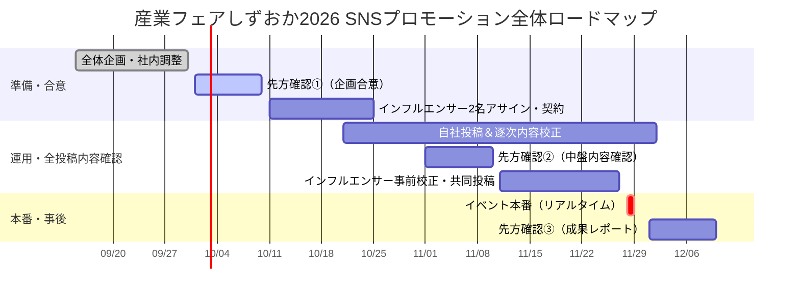

# 産業フェアしずおか2026 Instagram公式アカウント＆インフルエンサー投稿スケジュール【リスクゼロ・完全確定版】

**更新日**: 2026年9月7日
**目的**: 11月28日（土）・29日（日）開催「産業フェアしずおか2026」に向けた、公式InstagramアカウントおよびインフルエンサーPRの実践用確定投稿スケジュール案（直前ストーリーズを前日金曜に集中配置し、本番初日土曜朝〜昼の移動中まで閲覧可能な体制を確保）

---

## 🎯 本スケジュールの実務的リスクヘッジポイント

1. **本番初日（11/28 土曜朝〜昼）の閲覧確保**
   - インフルエンサー2名のストーリーズを**11/27（金）の昼・夜**に投稿。
   - 24時間ルールにより、**本番初日（11/28 土）の開場前〜昼〜移動中までストーリーズが確実にタイムラインに残る**ため、当日の来場誘導・最終確認を完璧にカバー。
2. **インフルエンサー2名（各2投稿）のCollab ＆ 広告連携**
   - 静岡県ニュース速報様 ＆ おちゃ様の2名（各リール1本・ストーリーズ1本）。
   - リール全2本で公式アカウントとの共同投稿（Collab）を実施し、投稿翌日よりMetaパートナーシップ広告を配信。
3. **全投稿「5営業日前先方確認」の徹底**
   - 自社投稿10回＋インフルエンサー4コンテンツすべての素材を投稿日の5営業日前（祝日考慮）までに先方提出し、リスクを排除。

---

## 📅 全体進行ロードマップとマイルストーン

---

## 1. 公式Instagramアカウント 投稿スケジュール（全10回＋本番速報）
※すべての投稿において、祝日を考慮した**投稿日の5営業日前**に投稿内容を先方へ確認提出します。

| No | 投稿日（曜日） | フェーズ | 投稿タイトル / テーマ | 形式 | 🚨 先方への内容提出日（5営業日前） |
|---|---|---|---|---|---|
| **1** | **10/21（水）** | 告知 | **【出展発表・第1報】産業フェアしずおか2026 開催決定！** | フィード / 15秒動画 | **10/14（水）** |
| **2** | **10/28（水）** | 告知 | **【テーマ＆ステージ紹介】サンリオキャラクターがやってくる！** | カルーセル | **10/21（水）** |
| **3** | **11/04（水）** | 見どころ | **【注目ブース＆体験①】4つに増設！体験コーナー特集** | リール / カルーセル | **10/27（火）** *(※11/3祝日考慮)* |
| **4** | **11/11（水）** | 見どころ | **【グルメ＆ノベルティ】しずまえ＆まぐろグルメ＋来場特典** | カルーセル | **11/04（水）** |
| **5** | **11/18（水）** | 見どころ | **【ブース攻略ガイド】出展企業＆地場産業ゾーン回遊マップ** | 🤝 **共同リール承認** | **11/11（水）** |
| **6** | **11/25（水）** | 直前 | **【カウントダウン】あと3日！デジタルスタンプラリー攻略法** | フィード＋ストーリーズ | **11/17（火）** *(※11/23祝日考慮)* |
| **7** | **11/27（金）** | 直前 | **【明日開幕！】アクセス・駐車場＆お出かけチェックリスト** | カルーセル（保存用） | **11/19（木）** *(※11/23祝日考慮)* |
| **8** | **11/28（土）** | 本番 | **【本日開幕！初日速報】会場の熱気をリアルタイムお届け！** | リール / ストーリーズ | **事前運用方針確認済** |
| **9** | **11/29（日）** | 本番 | **【最終日スタート！】本日16時まで！まだ間に合う注目情報** | ストーリーズ / 速報 | **事前運用方針確認済** |
| **10** | **12/02（水）** | 事後 | **【御礼＆アフターレポート】ご来場ありがとうございました！** | カルーセル / 動画 | **11/25（水）** |

---

## 2. インフルエンサーPR ＆ 広告連携スケジュール（2名 × 各「リール1本＋ストーリーズ1本＝計2投稿」）

### 📢 インフルエンサー①：「静岡県ニュース速報」様（計2投稿）
| 区分 | 投稿予定日時 | 投稿タイトル / テーマ | 形式 | 🚨 先方内容提出 | 🎯 Meta広告配信 / 閲覧可能期間 |
|---|---|---|---|---|---|
| **リール投稿** | **11/13（金） 19:00** | 【現場速報】子ども大歓喜！体験ブース・グルメ完全攻略 | 🤝 **共同リール (Collab)** | **11/06（金）** | 🚀 **11/14（土）〜 11/27（金） 広告配信** |
| **ストーリーズ** | **11/27（金） 19:00** | 【前日直前速報】いよいよ明日！アクセス＆駐車場ガイド | ストーリーズ（リンク付） | **11/19（木）** *(※11/23祝日)* | ⏰ **11/28（土）19:00まで閲覧可能（初日カバー）** |

---

### 🌸 インフルエンサー②：「おちゃ｜静岡県コンシェルジュ」様（@shizuoka_info）（計2投稿）
| 区分 | 投稿予定日時 | 投稿タイトル / テーマ | 形式 | 🚨 先方内容提出 | 🎯 Meta広告配信 / 閲覧可能期間 |
|---|---|---|---|---|---|
| **リール投稿** | **11/18（水） 18:00** | 【事前レポ】家族で1日楽しめる！ブース・体験回り方ガイド | 🤝 **共同リール (Collab)** | **11/11（水）** | 🚀 **11/19（木）〜 11/27（金） 広告配信** |
| **ストーリーズ** | **11/27（金） 12:00** | 【直前案内】明日開幕！会場アクセス＆お出かけ前チェック | ストーリーズ（リンク付） | **11/19（木）** *(※11/23祝日)* | ⏰ **11/28（土）12:00まで閲覧可能（初日午前カバー）** |

---

## 3. 実務運用の最終確定ポイント
1. **本番初日朝の完全カバー**: インフルエンサーのストーリーズを11/27（金）の昼と夜に分けることで、11/28（土）の本番初日午前〜夕方までストーリーズがアクティブに残り、当日の駆け込み・来場前確認を完全にフォローできます。
2. **5営業日前先方確認**: 自社10回＋インフルエンサー4コンテンツすべてで厳守。
3. **Collab ＆ パートナーシップ広告**: 11/13・11/18公開のリール動画2本で相互露出＆Meta広告ブーストを実施。
