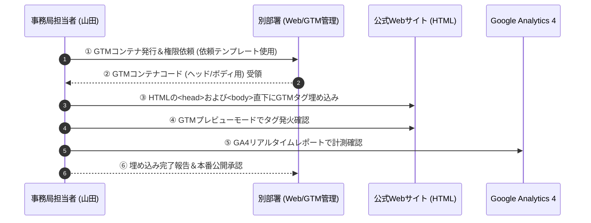

# 🏷️ 「産業フェアしずおか2026」GTMタグ設置・GA4計測設定タスク指示書

本ドキュメントは、公式サイト特設LPおよび各種WebフォームにおけるGA4（Google Analytics 4）等のアクセストラッキングおよびディスプレイ広告コンバージョン計測を実現するため、Google Tag Manager（GTM）コンテナタグの**「別部署への発行依頼」「HTMLへの設置」「発火疎通テスト」**を誰が担当しても迷わず遂行できるように整理した実務タスク仕様書です。

---

## 📌 タスク概要と役割分担

| 項目 | 内容 |
| :--- | :--- |
| **タスクID** | `T2.12` （詳細実行タスク管理簿連動） |
| **タスク名** | GTMタグ発行依頼・HTML埋め込み・GA4疎通検証 |
| **主担当者** | **山田**（プロモーション・広告運用部）/ 事務局Web担当者 |
| **GTM発行担当** | **別部署**（Web制作・システム管理部署等） |
| **対象ページ** | 公式サイト特設LP（トップページ、マップ、アクセス等）、デジタルスタンプラリー画面 |



---

## 📝 実行ステップ（誰でも迷わない4ステップ手順）

### 【ステップ1】別部署へGTMタグ発行・コンテナ権限の依頼

GTMのアカウントおよびコンテナタグの発行は別部署が管理・担当します。以下の依頼文テンプレートをコピーして、別部署の担当窓口へメールまたはチャットで依頼してください。

<details>
<summary>📧 別部署宛て 依頼メール文面テンプレート（クリックで展開）</summary>

```text
件名：【依頼】産業フェアしずおか2026 公式サイト用GTMコンテナタグ発行のお願い

〇〇部 〇〇様
（お疲れ様です。静鉄アド・パートナーズの山田です。）

「産業フェアしずおか2026」のWebプロモーション・広告運用（Google/Yahoo/Meta広告）に伴い、
アクセス解析（GA4）および広告コンバージョン計測を行うため、GTM（Google Tag Manager）コンテナタグの発行と埋め込みコードの共有をお願いしたくご連絡いたしました。

■ 依頼要記
1. 対象WEBサイト：産業フェアしずおか2026 特設LP（URL: https://...）
2. 要望事項：
   - 新規GTMコンテナの発行（または既存コンテナの割り当て）
   - Webサイト埋め込み用GTMコード（<head>用、<body>用）の共有
   - 事務局アクセス権限（編集権限または閲覧権限）の付与
     ・付与対象Googleアカウント： [事務局用メールアドレス]

3. 設置完了希望日： 2026年9月15日（月）まで

ご不明な点がございましたらご連絡ください。
何卒よろしくお願い申し上げます。
```
</details>

---

### 【ステップ2】HTMLソースコードへのGTMタグ埋め込み

別部署よりGTM埋め込みコード（`GTM-XXXXXXX`）を受領したら、対象となるHTMLファイルの指定位置にタグを貼り付けます。

#### 貼り付け位置①：`<head>` タグ内のなるべく上部
受領した1つ目のコード（JavaScript）を、`index.html` 等の `<head>` 開始タグの**直後（できるだけ上）**に挿入します。

```html
<!DOCTYPE html>
<html lang="ja">
<head>
  <!-- Google Tag Manager -->
  <script>(function(w,d,s,l,i){w[l]=w[l]||[];w[l].push({'gtm.start':
  new Date().getTime(),event:'gtm.js'});var f=d.getElementsByTagName(s)[0],
  j=d.createElement(s),dl=l!='dataLayer'?'&l='+l:'';j.async=true;j.src=
  'https://www.googletagmanager.com/gtm.js?id='+i+dl;f.parentNode.insertBefore(j,f);
  })(window,document,'script','dataLayer','GTM-XXXXXXX');</script>
  <!-- End Google Tag Manager -->

  <meta charset="UTF-8">
  <title>産業フェアしずおか2026</title>
  ...
```

#### 貼り付け位置②：`<body>` タグの直後
受領した2つ目のコード（`<noscript>`）を、`<body>` 開始タグの**直後**に挿入します。

```html
</head>
<body>
  <!-- Google Tag Manager (noscript) -->
  <noscript><iframe src="https://www.googletagmanager.com/ns.html?id=GTM-XXXXXXX"
  height="0" width="0" style="display:none;visibility:hidden"></iframe></noscript>
  <!-- End Google Tag Manager (noscript) -->

  <header>
    ...
```

---

### 【ステップ3】GTMプレビューモード ＆ GA4リアルタイム発火テスト

埋め込み完了後、正しく動作しているか確認します。

1. **GTMプレビューモードの起動**:
   - GTM管理画面にログインし、画面右上の「**プレースビュー（Preview）**」ボタンをクリック。
   - 対象サイトのURL（`https://...`）を入力して「Connect」をクリック。
2. **Tag Assistantの確認**:
   - 別ウィンドウでサイトが開き、Tag Assistant画面で `GTM-XXXXXXX` が **Connected** になることを確認。
   - `GA4 Configuration Tag` または `Page View` が **Tags Fired** にリストアップされているか確認。
3. **GA4 リアルタイムレポートの確認**:
   - GA4管理画面を開き、「レポート」➔「リアルタイム」を選択。
   - 自身がアクセスしている地域・デバイスからのアクセスが「1」以上カウントされていることを確認。

---

### 【ステップ4】本番公開 ＆ 別部署への完了報告

疎通テストで問題がなければ、以下の作業を行い完了とします。

1. WebサーバーへのHTML本番アップロード。
2. GTM管理画面で「**公開（Submit）**」ボタンを押し、バージョン名（例：`20260915_GA4本番タグ設置`）を入力して公開。
3. 別部署へ「GTMタグ設置およびGA4計測発火テスト完了」の報告メールを送信。

---

## 🚨 注意点・トラブルシューティング

> [!IMPORTANT]
> **全ページへのタグ設置確認**
> トップページだけでなく、会場マップページ、アクセス案内、スタンプラリー完了画面等、プロモーション広告の離脱・遷移を計測する全ページにGTMコードが設置されているか必ず確認してください。

> [!WARNING]
> **二重計測の防止**
> 既存のGA4直接埋め込みタグ（`gtag.js`）が既にHTMLに直書きされている場合、GTM経由のGA4タグと重複してアクセス数が2重カウントされるリスクがあります。直書きの `gtag.js` がある場合は必ず削除またはコメントアウトしてください。

> [!TIP]
> **UTMパラメータとの連動**
> タグ埋め込み完了後は、Google/Yahoo/Instagram広告で設定したUTMパラメータ（例：`?utm_source=google&utm_medium=cpc&...`）付きURLでアクセステストし、GA4の「セッションの参照元/メディア」に正しく反映されるか合わせて確認してください。
