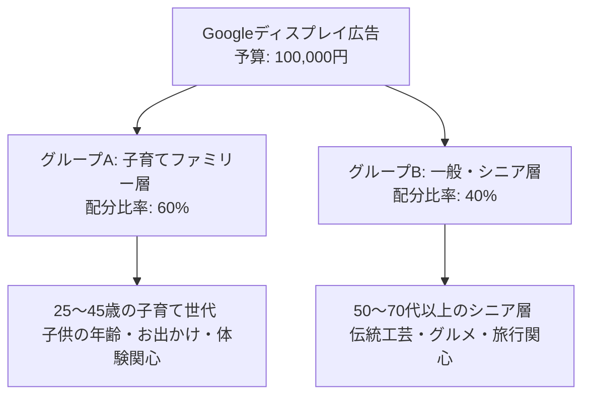

# 「産業フェアしずおか2026」Googleディスプレイ広告（GDN）配信計画書

本計画書は、「産業フェアしずおか2026」のプロモーションにおいて、割り当てられた予算（100,000円）を最適に運用し、Googleディスプレイネットワーク（GDN）を通じて幅広いターゲット層にアプローチし、公式サイトへの集客と来場者数を最大化するための「詳細広告配信プラン」です。

単発イベントの認知獲得に非常に有効なディスプレイ広告の強みを活かし、メインターゲットである「ファミリー層」と、3世代来場を促す「シニア・一般層」の2つのセグメントにグループ分けして効率的に配信します。

---

## 1. 広告目的と主要KPI

### 広告目的
静岡県内の主要8市町（静岡市・焼津市・藤枝市・富士市・島田市・吉田町・牧之原市・富士宮市）に居住する幅広い世代へビジュアル広告を配信し、イベントの認知拡散と公式サイト特設LPへの遷移を促し、週末の来場獲得に直結させること。
また、企画書におけるディスプレイ広告（GDN/YDA合計）目標「2,966,667回」に対し、本広告単体で**「1,111,111回（目標値の約37%）」**の獲得に貢献します。

### 主要KPI（シミュレーション目標）
* **総予算上限**：100,000円
* **想定表示回数（インプレッション数）**：1,111,111回
* **想定クリック数**：4,500回 〜 8,125回（想定平均CTR: 0.55% ➔ 6,111回）
* **想定クリック単価（CPC）**：12.3円 〜 22.2円
* **目標オフライン来場世帯数**：2組 〜 12組（想定CVR: 0.05% 〜 0.15%）

---

## 2. ターゲットセグメンテーション（グループ分け設計）

単発イベントの限られた予算内で無駄のない配信を行うため、ターゲットを以下の2つのグループに分けて広告グループを設計します。

### 【グループA】子育てファミリー層（予算配分：60,000円 / 60%）
* **メインターゲット**：25〜45歳の子育て世代（幼稚園・保育園・小学生の親）
* **ターゲティング設定（シグナル）**：
  - **ライフステージ**：子供を持つ親（幼児の親、未就学児 of 親、小学生の親）
  - **カスタムインテント/関心分野**：週末のお出かけ、遊園地・テーマパーク、子供の体験・工作、家族旅行。
* **訴求ポイント**：伝統工芸の工作体験、木のジャングルジム、キャラクターショー（サンリオキャラクターズステージ）、雨でも遊べる屋内型イベント。

### 【グループB】一般・シニア層（予算配分：40,000円 / 40%）
* **メインターゲット**：50代〜70代以上の地元の一般・シニア層（および3世代世帯）
* **ターゲティング設定（シグナル）**：
  - **年齢制限**：50歳〜65歳以上
  - **関心分野**：グルメ・日本の地食、地産地消、伝統工芸品、ローカルニュース、物産展・ご当地グルメ。
* **訴求ポイント**：地元静岡が誇る「まぐろゾーン」「しずまえ（水産業）ゾーン」の極上グルメ、山梨・長野の中部横断道物産ストリート、静岡伝統工芸展（地場産業の匠の技）。

---

## 3. 配信設定パラメータ（2026年最適化）

| 設定項目 | 指定パラメータ仕様 | 備考・設定意図 |
| :--- | :--- | :--- |
| **配信期間** | **2026年11月1日（日）0:00 〜 11月29日（日）15:00** | イベント告知開始（11/1）から本番2日目終了直前まで配信。 |
| **配信地域** | **静岡県静岡市、焼津市、藤枝市、富士市、島田市、吉田町、牧之原市、富士宮市の8市町指定** | 行政境界データによる厳格な指定。Advantage+ターゲット等の「拡張地域」は適用せず8市町に完全ロック。 |
| **キャンペーンタイプ** | **レスポンシブ ディスプレイ広告（RDA）** | AIによる複数アセット（画像、見出し、説明文）の自動最適化表示。 |
| **入札戦略** | **コンバージョン値の最大化（目標コンバージョン単価制なし）** | 限られた予算（100,000円）の中で公式サイトの「アクセス」および「デジタルパンフレット閲覧」を最大化。 |
| **広告のローテーション** | **最適化（パフォーマンスの良い広告を優先的に配信）** | Googleの機械学習に最適化を委ね、CTRの高い組み合わせを優先。 |
| **デバイス指定** | **スマートフォン ＆ PC（タブレットは除外）** | シニア層のPC閲覧、ファミリー層のスマホ閲覧双方に対応。 |

---

## 4. レスポンシブディスプレイ広告用コピー案（アセット構成）

Googleのレスポンシブディスプレイ広告（RDA）は、複数の見出しと説明文をアセットとして登録し、AIが最適な組み合わせで配信します。ターゲットグループ別に以下のテキストアセットを入稿します。

### 【グループA：ファミリー層向け】アセット案（各5パターン）

#### ① 短い見出し（全角15文字以内 / スマホ等で優先表示）
1. 静岡で親子体験！
2. 家族で遊べる2日間
3. 雨でも安心！屋内型
4. 4大体験ブース登場
5. 入場無料！産業フェア

#### ② 長い見出し（全角45文字以内 / バナー面積が広い場合に表示）
1. 入場無料！プラモデル組立や伝統工芸の工作など親子体験が満載の2日間
2. 11/28・29はツインメッセ静岡へ！木のジャングルジムやグルメも大集合
3. 親子で一日中遊べるイベント！サンリオキャラクターズのステージも開催
4. 静岡の体験と食が集合！アンケート回答で豪華景品が当たるスタンプラリー
5. 【入場無料】雨天決行の快適屋内イベント！11月28・29日は家族でお出かけ

#### ③ 説明文（全角45文字以内 / 見出しの補足として表示）
1. 入場無料！木のジャングルジムやプラモデル工作など、親子で一日中遊べる体験が満載！
2. 11月28日(土)・29日(日)にツインメッセ静岡で開催！美味しいグルメと体験が大集合。
3. サンリオキャラクターズのステージも開催！暖房完備の快適な屋内会場だから雨でも安心。
4. アンケートに答えて豪華景品を当てよう！デジタルスタンプラリーなどお楽しみ企画が目白押し。
5. 伝統工芸の木工・職人体験が今年はさらに拡大！自分で作った作品はお土産にお持ち帰り可能。

---

### 【グループB：一般・シニア層向け】アセット案（各5パターン）

#### ① 短い見出し（全角15文字以内 / スマホ等で優先表示）
1. 静岡のグルメと技
2. 匠の技を五感で体験
3. 地産地消グルメ大集合
4. 入場無料の2日間
5. 中部横断道物産展

#### ② 長い見出し（全角45文字以内 / バナー面積が広い場合に表示）
1. 11/28・29開催！まぐろ解体ショーやしずまえ鮮魚などの極上グルメが満載
2. 静岡の伝統工芸と匠の技を間近で体感！伝統工芸展や限定販売品も多数登場
3. 山梨・長野の名産品がツインメッセに集結！中部横断道物産ストリート開催
4. 入場無料！静岡の産業の魅力と美味しい食が大集合する年に一度の感謝イベント
5. 【11月28・29日】入場無料！ツインメッセ静岡で地場産業とグルメを満喫

#### ③ 説明文（全角45文字以内 / 見出しの補足として表示）
1. 冷凍マグロの裁断ショーやしずまえグルメなど、静岡の絶品グルメがツインメッセに大集合！
2. 駿河竹千筋細工など静岡が世界に誇る匠の技が集結。伝統工芸の職人技を間近で体験できます。
3. 中部横断道物産ストリートで長野・山梨の限定名産品をGET！ご当地フードも盛りだくさん。
4. 入場無料！11月28日(土)・29日(日)は、家族3世代で楽しめるツインメッセ静岡へ。
5. デジタルスタンプラリーで合計4,500名様に豪華景品が当たる！快適な全天候型の屋内会場で開催。

---

## 5. クリエイティブアセット仕様

デザイナー（鈴木氏）から回収、あるいは事務局で用意する画像アセットの共通規格です。

### 画像アセット規格
1. **横長画像（1.91:1）**：1200px × 628px（必須）
2. **正方形画像（1:1）**：1200px × 1200px（必須）
3. **ロゴ（1:1）**：1200px × 1200px（必須）

### ビジュアル制作の注意点
* **テキスト占有率の抑制（20%以下ルール）**
  - 画像内に文字情報を入れる場合、Googleの掲載審査落ちを防ぐため、**文字の合計面積が画像全体の20%以下**になるように設計してください。（メインコピー等はアセットの「見出し」テキストに委ねるため、画像自体は「視覚的インパクト・シズル感」を優先する）。
* **セグメント別推奨ビジュアルイメージ**：
  - **グループA（ファミリー）用**：笑顔の子どもが木工工作やプラモデルを組み立てている写真、楽しそうな会場風景。
  - **グループB（シニア）用**：シズル感のあるマグロのどんぶり写真、伝統工芸 of 完成品（駿河竹千筋細工や漆器など）と職人の手元のクローズアップ写真。

### クリエイティブの最適化・本数コントロール（GDN実務ルール）
Googleの機械学習（AI）による自動組み合わせ最適化を最大限活かすため、以下の「画像バリエーション登録ルール」を適用します。

1. **アセットとしての画像本数（3〜5種類）**：
   - 各広告グループにおいて、ビジュアルコンセプトが異なる画像を**最低3種類〜推奨5種類**登録してください。（それぞれ横長・正方形の両サイズ）。
   - **例（グループA）**：①木工工作（子ども主役）、②巨大な木のつみき（体験シーン）、③ステージ（キャラクターショー）。
   - **理由**：テキストだけでなく、画像のバリエーションをテストさせることで、AIが最もクリック率（CTR）を高めるビジュアルの最適解を自動で見つけ出します。
2. **入札最適化期間**：
   - 配信開始から最低3〜5日間はAIの機械学習期間となるため、クリエイティブの強制差し替えや編集は行わず、静観して機械学習を進めます。

---

## 6. 費用対効果（ROI）シミュレーション詳細

予算「100,000円」を最適運用した場合の、Googleディスプレイ広告単体の成果シミュレーションです。

| 評価項目 | 最悪シナリオ（Lower） | 想定平均シナリオ（Medium） | 最良シナリオ（Upper） | 算出根拠・計算プロセス |
| :--- | :---: | :---: | :---: | :--- |
| **広告予算** | 100,000円 | 100,000円 | 100,000円 | 固定値 |
| **想定CPM** | 100円 | **90円** | 80円 | エリア配信競争度に基づく推移 |
| **想定表示回数** | 1,000,000回 | **1,111,111回** | 1,250,000回 | 予算 ÷ (CPM ÷ 1,000) |
| **想定CTR** | 0.45% | **0.55%** | 0.65% | 過去の同種地方イベント実績値 |
| **想定クリック数** | 4,500回 | **6,111回** | 8,125回 | 表示回数 × CTR |
| **想定平均CPC** | 22.2円 | **16.4円** | 12.3円 | 予算 ÷ クリック数 |
| **想定来場転換率 (CVR)** | 0.05% | **0.1%** | 0.15% | クリック数からオフライン来場への転換率 |
| **想定来場世帯数** | 2組 | **6組** | 12組 | クリック数 × CVR（四捨五入） |
| **想定CPA** | 50,000円 | **16,667円** | 8,333円 | 予算 ÷ 来場世帯数 |

* ※企画書のディスプレイ広告合計目標値 **「2,966,667回表示」** に対し、本広告（GDN）の想定平均シナリオで **1,111,111回**（目標の約37%）を確保します。

---

## 7. 🚨 智之さん（人間）による入稿前チェックリスト

運用担当者がGoogle広告管理画面（Google Ads Manager）で配信設定を行う際、手戻りや設定ミスを防ぐための最終確認項目です。

- [ ] **【予算ロック】** キャンペーン総予算が「100,000円」に正しく設定され、日予算換算（約3,450円/日）で超過アラートが出ないように設定されているか？
- [ ] **【地域ターゲットの「除外」整合】** 配信地域を「静岡市、焼津市、藤枝市、富士市、島田市、吉田町、牧之原市、富士宮市」に設定する際、その他の静岡県内自治体や隣接県が誤って配信対象に入っていないか？（特に「現在地または関心を示しているユーザー」ではなく「現在地のみ」にターゲット設定がロックされているか？）
- [ ] **【画像アセットの複数コンセプト登録】** 各広告グループに、ビジュアルコンセプトの異なる画像（横長・正方形）が最低3種類以上登録されているか？
- [ ] **【テキスト表示の文字数チェック】** レスポンシブアセットの「短い見出し（15文字）」「説明文（45文字）」が文字数制限を超えて切り捨てられていないか？
- [ ] **【遷移先URL】** 広告クリック後のランディングページが、「産業フェアしずおか2026 公式サイト特設LP（https://...）」に正しく設定されており、かつGoogleアナリティクス測定用のパラメータ（utm_source=google&utm_medium=cpc&utm_campaign=gdn2026）が付与されているか？
- [ ] **【配信除外カテゴリ】** 「アダルト・デリケートなコンテンツ」や「不適切なプレースメント（ゲーム内広告や子ども向けYouTubeチャンネル等）」がプレースメント除外設定されているか？

