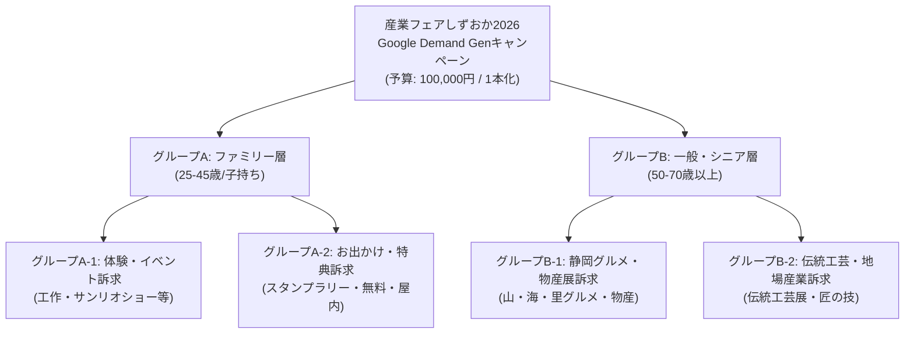
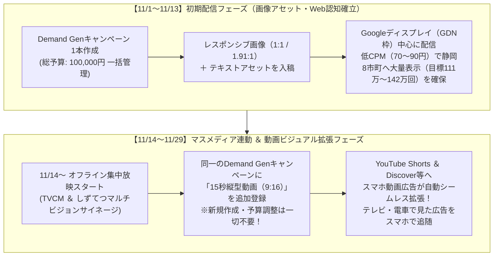

<!-- _class: title -->

# 「産業フェアしずおか2026」Googleデマンドジェネレーション（Demand Gen）配信計画書

本計画書は、「産業フェアしずおか2026」のプロモーションにおいて、割り当てられた予算（100,000円）を最適運用し、Googleの最新統合フォーマットである「デマンドジェネレーション（Demand Gen）キャンペーン」を通じて、Googleディスプレイネットワーク（GDN）、YouTube（Shorts含む）、Discover全域から効率的にターゲット層へアプローチし、公式サイトへの集客と来場者数を最大化するための「詳細広告配信プラン」です。

Googleの公式仕様（GDNのDemand Genへの移行・統合）に準拠し、キャンペーンを2つに分けず**「1つのデマンドジェネレーションキャンペーン」に一本化**してスマートかつ高効率に運用します。

---

## 1. 広告目的と主要KPI

### 広告目的

静岡県内の主要8市町（静岡市・焼津市・藤枝市・富士市・島田市・吉田町・牧之原市・富士宮市）に居住する幅広い世代へビジュアル広告（画像・動画）を配信し、イベントの認知拡散と公式サイト特設LPへの遷移を促し、週末の来場獲得に直結させること。

### 配信ネットワーク範囲
- **Googleディスプレイネットワーク（GDN）**：静岡ローカルニュース、ブログ、天気予報サイト等のバナー枠
- **YouTube（Shorts・Watch Next）**：ショート動画・動画広告枠
- **Google Discover ＆ Gmail**：おすすめ記事フィード・プロモーション枠

---

## 2. ターゲティング＆グループ設計（一本化構造）

1つのデマンドジェネレーションキャンペーン内で、ターゲット層と訴求テーマに応じた4つの広告グループを作成し、アセットを最適化します。

```mermaid
graph TD
    Root["産業フェアしずおか2026<br>Google Demand Genキャンペーン<br>(予算: 100,000円 / 1本化)"] --> GroupA["グループA: ファミリー層<br>(25-45歳/子持ち)"]
    Root --> GroupB["グループB: 一般・シニア層<br>(50-70歳以上)"]

    GroupA --> GroupA1["グループA-1: 体験・イベント訴求<br>(工作・サンリオショー等)"]
    GroupA --> GroupA2["グループA-2: お出かけ・特典訴求<br>(スタンプラリー・無料・屋内)"]

    GroupB --> GroupB1["グループB-1: 静岡グルメ・物産展訴求<br>(山・海・里グルメ・物産)"]
    GroupB --> GroupB2["グループB-2: 伝統工芸・地場産業訴求<br>(伝統工芸展・匠の技)"]
```

---

## 2. ターゲティング＆グループ設計（グループA）

### 【グループA-1】子育てファミリー層：体験・イベント訴求

- **配信目的**：ポムポムプリン30周年ステージや各種工作・体験ブースなど、子どもの体験・エンタメに関心の高い親層を誘客する。
- **Google広告入稿パラメータ設定**：
  - **ユーザー属性**：子供あり（乳児の親（0-1歳）、幼児の親（2-3歳）、未就学児の親（4-5歳）、小学生の親（6-12歳））
  - **カスタムセグメント（検索キーワード）**：`静岡 子連れ お出かけ`、`静岡 週末 イベント`、`子ども 工作 体験`、`サンリオショー 静岡`、`子ども 木工 体験`、`静岡 木のおもちゃ`、`ツインメッセ イベント 家族`
  - **アフィニティセグメント（興味・関心）**：`ファミリー向け旅行好き`、`DIY・工作ファン`、`テーマパーク・遊園地ファン`
  - **インマーケットセグメント（購買意向）**：`おもちゃ、ゲーム`、`家族向けアトラクション・遊園地`
- **訴求ポイント**：ポムポムプリン30周年ステージ「ぱぴぷぺPom！」、シナモロール出演、フォトセッション、職人さんに教わる木工・工作体験など、子どもが夢中になる体験ブース。

---

### 【グループA-2】子育てファミリー層：お出かけ・特典訴求

- **配信目的**：週末のお出かけ先を探している層、デジタルスタンプラリーや大抽選会などのお得感に惹かれる層を誘客する。
- **Google広告入稿パラメータ設定**：
  - **ユーザー属性**：子供あり（乳児・幼児・未就学児・小学生の親）
  - **カスタムセグメント（検索キーワード）**：`静岡 無料 イベント`、`静岡 週末 お出かけ 雨の日`、`スタンプラリー 静岡`、`ツインメッセ 産業フェア`、`静岡市 週末 子ども`
  - **インマーケットセグメント（購買意向）**：`国内旅行（静岡県）`、`ファミリー向けレジャー`、`レジャー施設・遊園地`
- **訴求ポイント**：雨でも安心な暖房完備の全天候型屋内会場、入場無料、4,500名に当たる豪華デジタルスタンプラリー、ベビーカー置き場・授乳室完備。

---

## 2. ターゲティング＆グループ設計（グループB）

### 【グループB-1】一般・シニア層：静岡グルメ・物産展訴求

- **配信目的**：「しずまえゾーン」、農家直送野菜、長野・山梨の中部横断道物産ストリートなど、絶品グルメ・物産展に関心のある一般・シニア層を誘客する。
- **Google広告入稿パラメータ設定**：
  - **ユーザー属性**：年齢：45〜54歳、55〜64歳、65歳以上（性別・子供の有無は限定しない）
  - **カスタムセグメント（検索キーワード）**：`静岡 海鮮 グルメ`、`静岡 グルメ イベント`、`ツインメッセ 物産展`、`中部横断道 グルメ`、`静岡 特産品`、`静岡 ご当地グルメ`
  - **アフィニティセグメント（興味・関心）**：`グルメ・食べ歩き`、`料理好き`、`旅行好き > 国内旅行ファン`
  - **インマーケットセグメント（購買意向）**：`食品・飲料 > 食料品`、`外食・デリバリー > レストラン・カフェ`
- **訴求ポイント**：静岡の「山・海・里」の絶品グルメ、「しずまえ（水産業）ゾーン」の新鮮海鮮、中部横断道物産ストリート（長野・山梨）の限定名産品。

---

### 【グループB-2】一般・シニア層：伝統工芸・地場産業訴求

- **配信目的**：駿河竹千筋細工や漆器など、静岡が世界に誇る匠の技が集結する「伝統工芸展」や職人技の体験・限定販売に関心のある層を誘客する。
- **Google広告入稿パラメータ設定**：
  - **ユーザー属性**：年齢：45〜54歳、55〜64歳、65歳以上
  - **カスタムセグメント（検索キーワード）**：`静岡 伝統工芸`、`駿河竹千筋細工`、`静岡 漆器`、`日本の伝統技術`、`クラフト フェア 静岡`、`地場産業 展示会`
  - **アフィニティセグメント（興味・関心）**：`アート・クラフトファン`、`インテリア・ガーデニングファン`、`歴史・日本の伝統工芸愛好家`
- **訴求ポイント**：静岡伝統工芸展（地場産業 of 匠の技）、駿河竹千筋細工など職人技の実演と体験、手仕事の品々の展示販売。

---

## 3. 配信設定パラメータ（一本化仕様）

| 設定項目 | 指定パラメータ仕様 | 備考・設定意図 |
| :--- | :--- | :--- |
| **配信期間** | **2026年11月1日（日）0:00 〜 11月29日（日）15:00** | イベント告知開始（11/1）から本番2日目終了直前まで配信。 |
| **配信地域** | **静岡県静岡市、焼津市、藤枝市、富士市、島田市、吉田町、牧之原市、富士宮市の8市町指定（現在地限定）** | 行政境界データによる厳格な指定。「現在地に居住・滞在するユーザー」に固定。 |
| **キャンペーンタイプ** | **デマンドジェネレーション（Demand Gen）キャンペーン** | Google最新統合フォーマット。GDN、YouTube、Discoverを一括最適化。 |
| **チャネルコントロール** | **配信初期：GDN（ディスプレイネットワーク）指定** ※11月中旬〜：YouTube/DiscoverをチャネルONに拡張 | Demand Gen最新機能。初期はGDN枠に限定し低CPMを確保、中旬から全枠開放。 |
| **入札戦略** | **クリック数の最大化（上限クリック単価の設定を推奨）** | 新規かつ短期間のため、CVデータ蓄積を待たずに限られた予算でLPへのアクセスを最大化。 |
| **アセット構成** | **画像（1:1 / 1.91:1）＋テキスト ＋ 縦型動画（9:16 / 11月中旬追加）** | 初期は画像・テキスト主軸で低CPM確保。11月中旬に動画アセットを追加。 |
| **配信スケジューリング** | **11/21〜11/29：木・金・土・日重視の出稿傾斜** | 告知後半〜直前期はお出かけ検討が高まる木〜日曜日に予算配分を20%寄せる。 |
| **プレースメント除外** | **ゲームアプリ内広告枠・子ども向けYouTubeチャンネル除外** | 誤タップ率が高くCV寄与率が低い枠を除外リスト化し費用対効果を保護。 |
| **トラッキングURL** | `?utm_source=google&utm_medium=cpc&utm_campaign=demandgen_2026` | GA4でのメディア別流出入計測精度向上のための統一パラメータ。 |
| **デバイス指定** | **スマートフォン ＆ PC（タブレットは除外）** | シニア層のPC閲覧、ファミリー層のスマホ閲覧双方に対応。 |

---

## 4. アセット構成案（テキスト＆ビジュアル）

デマンドジェネレーションキャンペーンでは、レスポンシブ画像、見出し、説明文、動画をアセットとして登録し、Google AIが最適な組み合わせで配信します。

---

### 【グループA-1：ファミリー層（体験・イベント訴求）】アセット案

#### ① 短い見出し（全角15文字以内）
1. 「できた！」が持ち帰れる
2. ポムポムプリンに会える！
3. 入場無料で一日遊べる
4. 11/28-29 入場無料
5. 雨OK！暖房きいた屋内

#### ② 長い見出し（全角45文字以内）
1. 「見て！自分で作ったの！」工作体験で作った作品はそのままお土産に。入場無料です
2. ポムポムプリン30周年ショー＆シナモロールも！一緒に写真も撮れるよ。入場無料
3. 工作体験にキッズエリアにキャラクターショー。飽きる前に次のワクワクが待ってます
4. 11/28・29ツインメッセ静岡。ポムポムプリンとシナモロールが来る！入場無料
5. 木の香りに包まれて工作体験。職人さんが隣で教えてくれるから小さい子でも大丈夫

#### ③ 説明文（全角45文字以内）
1. 入場無料。工作体験で作った作品をニコニコ持ち帰る子続出。11/28・29ツインメッセ
2. ポムポムプリン30周年ショー開催！シナモロールも来るよ。入場無料で観覧できます
3. 職人さんが横について教えてくれるから初めてでも安心。作品はそのままお持ち帰り
4. 暖房ポカポカの屋内会場。天気を気にせず遊べるから、雨の日のお出かけにもぴったり
5. ポムポムプリンとシナモロールと一緒に写真が撮れる！11/28・29ツインメッセ静岡

---

## 5. シームレスな運用・動画アセット追加フロー

デマンドジェネレーションキャンペーン1本で運用するため、キャンペーンの追加作成や複雑な予算手動分割は一切不要です。11月中旬のテレビCM・サイネージ開始に合わせて動画を追加登録するだけのシンプルな運用フローです。

```mermaid
graph TD
    subgraph Step1["【11/1〜11/13】初期配信フェーズ（画像アセット・Web認知確立）"]
        A1["Demand Genキャンペーン 1本作成<br>(総予算: 100,000円 一括管理)"] --> A2["レスポンシブ画像（1:1 / 1.91:1）<br>＋ テキストアセットを入稿"]
        A2 --> A3["Googleディスプレイ（GDN枠）中心に配信<br>低CPM（70〜90円）で静岡8市町へ大量表示（目標111万〜142万回）を確保"]
    end

    subgraph Step2["【11/14〜11/29】マスメディア連動 ＆ 動画ビジュアル拡張フェーズ"]
        B1["11/14〜 オフライン集中放映スタート<br>(TVCM ＆ しずてつマルチビジョンサイネージ)"] --> B2["同一のDemand Genキャンペーンに<br>「15秒縦型動画（9:16）」を追加登録<br>※新規作成・予算調整は一切不要！"]
        B2 --> B3["YouTube Shorts ＆ Discover等へ<br>スマホ動画広告が自動シームレス拡張！<br>テレビ・電車で見た広告をスマホで追随"]
    end

    Step1 --> Step2
```

### 💡 動画制作予算がない（0円で運用する）場合の完全対応方針

1. **追加制作費は0円で100%完遂できます**
   - 動画制作者への外注費や追加予算は1円も必要ありません。本計画書に記載の「画像バナー（1:1 / 1.91:1）＋テキスト見出し・説明文」のみで完璧に出稿・運用できます。
2. **静止画のみ運用の大きなメリット**
   - 高コストな動画専用枠を避け、安価なGDNバナー枠・Discover枠に配信が集中するため、CPM（70〜90円）が抑えられ、**目標表示回数（1,111,111回〜1,428,571回）を一番確実に獲得**できます。
3. **制作費0円で動画枠に載せる方法（Google管理画面の無料AI生成）**
   - 「予算ゼロだけどYouTube Shorts等にも動画で出したい」場合は、Google広告管理画面に標準搭載されている**「無料動画自動作成ツール（Auto-generated Video）」**をチェックONにするだけ。入稿したバナー画像とテキストから、GoogleがBGM・アニメーション付き動画を完全無料（0円）で自動作成して配信してくれます。

### 🎬 （超推奨テクニック）オフラインサイネージ動画の「縦型（9:16）マルチユースレイアウト」
- **レイアウト構成（実例画像確認済み）**：キャンバス全体を縦型（9:16）にし、**【中央】にビジョン/TVCM用動画（16:9または1:1）を再生**させ、**【上部】に「産業フェアしずおか2026」のロゴ/ヘッダー**、**【下部】に「11/28(土)・29(日) ツインメッセ静岡 / 入場無料」の文字テロップを常時固定表示**する構成。
- **神メリット**：
  - **追加制作費0円**でサイネージ素材から完璧な縦型動画広告（YouTube Shorts / Metaリール用）を書き出せる。
  - スマホの縦画面で無音再生された場合でも、下部の常時固定テロップにより「開催日・場所・無料」が一目で伝わり、認知・クリック率が劇的に跳ね上がる！

---

## 6. 費用対効果（ROI）シミュレーション詳細

予算「100,000円」をデマンドジェネレーションキャンペーン1本で最適運用した場合の成果シミュレーションです。

| 評価項目 | 最悪シナリオ（Lower） | 想定平均シナリオ（Medium） | 最良シナリオ（Upper） | 算出根拠・計算プロセス |
| :--- | :---: | :---: | :---: | :--- |
| **広告予算** | 100,000円 | **100,000円** | 100,000円 | 固定値 |
| **想定CPM** | 100円 | **90円** | 80円 | エリア配信競争度に基づく推移 |
| **想定表示回数** | 1,000,000回 | **1,111,111回** | 1,250,000回 | 予算 ÷ (CPM ÷ 1,000) |
| **想定CTR** | 0.45% | **0.55%** | 0.65% | 過去の同種地方イベント実績値 |
| **想定クリック数** | 4,500回 | **6,111回** | 8,125回 | 表示回数 × CTR |
| **想定平均CPC** | 22.2円 | **16.4円** | 12.3円 | 予算 ÷ クリック数 |
| **想定来場転換率 (CVR)** | 0.05% | **0.1%** | 0.15% | クリック数からオフライン来場への転換率 |
| **想定来場世帯数** | 2組 | **6組** | 12組 | クリック数 × CVR（四捨五入） |
| **想定CPA** | 50,000円 | **16,667円** | 8,333円 | 予算 ÷ 来場世帯数 |

- ※3媒体合計（Demand Gen / YDA / Instagram）の目標表示回数 **「2,966,667回」** のうち、本キャンペーンで **1,111,111回**（約37%）を確保します。

---

## 7. 🚨 智之さん（人間）による入稿前チェックリスト

- [ ] **【キャンペーンタイプ確認】** キャンペーンタイプが「デマンドジェネレーション」で作成されているか？
- [ ] **【予算設定】** キャンペーン総予算が「100,000円」に正しくロックされているか？
- [ ] **【地域ターゲットの「除外」整合】** 静岡県内8市町指定（現在地のみ）にロックされているか？
- [ ] **【画像アセット登録】** 各広告グループに画像（1:1、1.91:1）が最低3種類以上登録されているか？
- [ ] **【動画アセット準備】** 11月中旬のTVCM・サイネージ開始時に追加する15秒縦型動画（9:16）が準備できているか？
- [ ] **【遷移先URL】** GA4測定用パラメータ（`utm_campaign=demandgen_2026`）が付与されているか？

