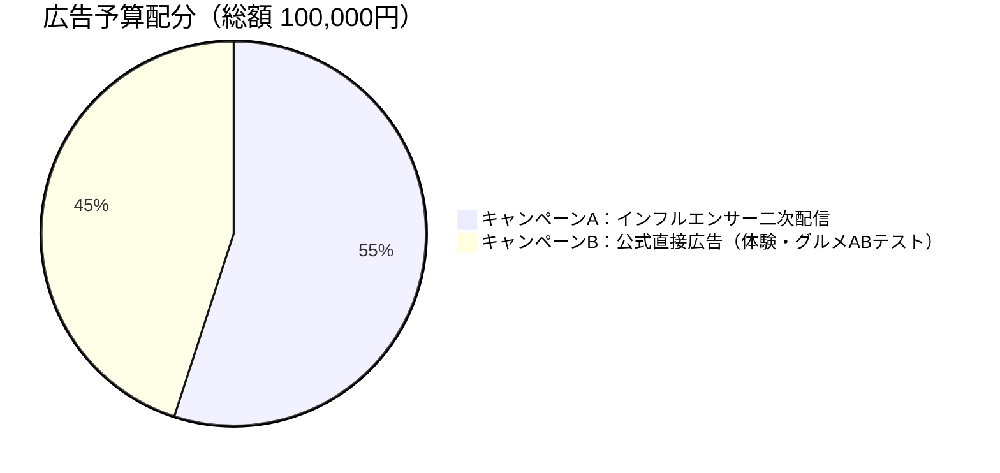

# 「産業フェアしずおか2026」Instagram広告配信計画書

本計画書は、「産業フェアしずおか2026」のプロモーションにおいて、割り当てられた予算（100,000円）を最適に運用し、ターゲットである子育て世代（25〜45歳）の来場者数を最大化するための「詳細広告配信プラン」です。

最新のMeta（Instagram）広告アルゴリズム・配信ロジックを組み込み、配信効率（CPM/CPC）および実来場への費用対効果（CPA）を最大化する設計となっています。

---

## 1. 広告目的と基本配信パラメータ

### 広告目的

静岡県内の主要4市に居住する子育てファミリー層へピンポイントにアプローチし、週末の来場獲得コスト（CAC/CPA）を最小化しつつ、企画書の目標表示回数「300,000回」に対し**「230,947回（加重平均・想定達成率約77%）」**の表示回数を確保すること。

### 配信基本設定

- **広告予算上限**：100,000円（総額）
- **対象配信地域**：静岡市、焼津市、藤枝市、富士市、島田市、吉田町、牧之原市、富士宮市の8市町
  - ※他都市への誤配信（無駄打ち）を防ぐため、半径30kmなどの円形ジオフェンスではなく、**8市町の行政境界をピンポイントで包含指定**し、配信外エリアを完全に排除します。
- **対象年齢・性別**：25歳〜45歳、男女（お出かけを決定する夫婦両層へのリーチ）

---

## 2. 最新Meta広告配信ロジックの適用

Metaの最新広告配信アルゴリズムを反映し、以下の設定を広告管理画面（Meta Ads Manager）で適用します。

### ① Advantage+ オーディエンスの適用と地域制限のロック

最新のMeta広告では、AIが自動でコンバージョン見込みの高いユーザーを探す「Advantage+ オーディエンス」が推奨されます。

- **設定手法**：年齢（25〜45歳）、興味関心（子育て、週末お出かけ、家族など）を「オーディエンスの推奨事項（候補）」として設定し、AIの配信探索をアシストします。
- **境界ロック**：ただし、配信エリアである「静岡市、焼津市、藤枝市、富士市、島田市、吉田町、牧之原市、富士宮市」の8市町については、AIが拡張配信しないよう**地域ターゲット設定レベルで厳格にロック（固定）**します。これにより、他都市への無駄な配信をゼロにしつつ、指定エリア内でのターゲティング精度を最大化します。

### ② クリエイティブ主導のターゲティング（Creative-Led Targeting）

細かな興味関心セグメントの絞り込みに依存せず、クリエイティブ自体にターゲットをフィルタリングさせる手法を導入します。

- 広告クリエイティブの冒頭3秒以内のテロップ（例：「静岡の親子お出かけ」「入場無料」）や動画内の視覚情報をMetaのAIが解析し、関心のあるユーザーへ優先的に自動マッチングします。
- テキストや映像内に「ターゲットが自己認知できるフック」を意図的に配置し、無駄なクリックを減らしつつエンゲージメントを高めます。

### ③ Advantage+ クリエイティブ最適化の有効化

入稿されたアセット（動画・画像・テキスト）を、ユーザー個人の行動傾向に合わせてMeta側で自動最適化する機能を有効にします。

- アスペクト比の自動トリミング（9:16や1:1への最適化調整）、画像の明るさ・コントラストの自動補正、静止画に対するテンプレートアニメーションの自動付与を有効化し、アクション率（CTR）を最大化します。

### ④ パートナーシップ広告（旧ブランドコンテンツ広告）の連携

キャンペーンAのインフルエンサーコラボ配信では、インフルエンサーの公式アカウント名を借りてブランド予算でブースト配信を行います。

- **入稿手順**：
  1. 提携インフルエンサー（`@shizuoka_info`, `@shizuokaosanponikki`）のMeta Business Suiteより、静鉄アド・パートナーズ（S.A.P.）宛てに「広告パートナー連携許可」を申請・承認。
  2. インフルエンサー側でタイアップ投稿を公開後、投稿の「パートナーシップ広告コード（連携コード）」を発行してもらう。
  3. S.A.P.の広告管理画面で当該コードを入力し、インフルエンサー名義の広告として入稿する。

---

## 3. 予算配分ポートフォリオ（総額：100,000円）

実来場を喚起するため、インフルエンサーの高い信頼性を活用する「キャンペーンA」と、お出かけの最終動機形成を狙う「キャンペーンB」に分散・最適配分します。期間はどちらもイベント最終日（11月29日）まで継続し、土日の来場判断を促します。

### ① キャンペーンA：インフルエンサー二次配信（Metaパートナーシップ広告）

- **予算配分**：55,000円（各27,500円 × 2アカウント）
- **広告形式**：パートナーシップ広告（リール動画 9:16）
- **出稿期間**：2026年11月13日（金）〜 11月29日（日）の17日間
- **提携アカウント**：
  1. **静岡県コンシェルジュ**（[@shizuoka_info](https://www.instagram.com/shizuoka_info/)）
  2. **静岡散歩日記**（[@shizuokaosanponikki](https://www.instagram.com/shizuokaosanponikki/)）
- **広告クリック時の遷移先（飛び先）**：**公式Instagramプロフィール画面（`@sangyofair_shizuoka`）**
  - ※インフルエンサー投稿の信頼性をフックに、公式アカウントのフォロワー獲得を最大化する「フォロワーブースト型」設計。

### ② キャンペーンB：公式直接広告（直前・お出かけ誘導）

- **予算配分**：45,000円（体験型リール：22,500円 ／ グルメ型カルーセル：22,500円のABテスト形式）
- **広告形式**：公式アカウント（`@sangyofair_shizuoka`）からのダイレクト出稿
- **出稿期間**：2026年11月21日（土）〜 11月29日（日）の9日間
- **広告クリック時の遷移先（飛び先）**：**公式サイト特設LP（会場マップ・臨時駐車場・タイムスケジュール掲載ページ）**
  - ※お出かけ直前検討期から当日までのユーザーへ実務情報を即時与え、実来場促進とWEBサイトPV向上を狙う「実来場コンバージョン型」設計。

---

## 4. 広告コピー・クリエイティブ案（各5パターン）

### ■ キャンペーンA：パートナーシップ広告（ブースト配信）用

#### コピー案1【体験・親子お出かけ訴求】

> ＼静岡の親子お出かけに大人気／ 11/28(土)・29(日)にツインメッセ静岡で開催される「産業フェアしずおか」に行ってみた！🎒✨
>
> 入場無料で一日中遊べる木のジャングルジムや、伝統工芸のモノづくり体験、絶品のまぐろ・しらす丼などのグルメも勢揃い。
> 雨が降っても安心の屋内開催だから、次の週末はここでお決まりです！
> 詳細・会場マップはプロフィール（ @shizuoka_info / @shizuokaosanponikki ）のリンクからチェック🔗
>
> #産業フェアしずおか2026 #ツインメッセ静岡 #親子お出かけ #入場無料

#### コピー案2【地元グルメ・食い倒れ訴求】

> 静岡の「美味しいもの」が大集合！11/28(土)・29(日)はツインメッセ静岡で絶品グルメを満喫しよ！🐟🍚🍓
>
> 目の前で繰り広げられる「冷凍マグロの裁断ショー」や、名物しらす丼、山梨・長野から届く限定グルメなど、お腹いっぱい楽しめるブースがたくさん！
> 臨時駐車場もあるから、家族みんなでドライブがてら出かけてみてね🚗
> 詳細はプロフィールリンクから🔗
>
> #静岡グルメ #しらす丼 #マグロ裁断ショー #静岡イベント #産業フェアしずおか2026

#### コピー案3【週末お出かけ・タイパ重視訴求】

> 「次の週末どこ行こう？」と悩んでるパパママ必見！👀
> 11/28(土)・29(日)は、ツインメッセ静岡の「産業フェアしずおか2026」へGO！
>
> 今年は子ども向け工作体験ブースが【昨年の2つから4つへ増設】！プラモデルや木工工作など、子どもが夢中になる体験がいっぱいです。
> 暖房完備の屋内だから、寒さも雨も気にせず1日中楽しめますよ。
> 詳しくはプロフィールのリンクを見てね🔗
>
> #子育て静岡 #静岡ママ #プラモデル工作 #雨の日お出かけ #産業フェアしずおか2026

#### コピー案4【ママ層ピンポイント共感訴求】

> 子どもも大人も大満足！一日中遊べて【入場無料】って最高すぎない？🥺💕
> 11/28(土)・29(日)にツインメッセ静岡で開催される「産業フェアしずおか」へ！
>
> 静岡の匠の技を体験できるモノづくりコーナーや、美味しい名産品が並ぶ物産ストリート、人気ステージまで見どころ満載！
> お買い物中のパパママも、体験に夢中な子どもたちも、家族全員が笑顔になれる週末イベントです。
> 詳細＆アクセス情報はプロフィールリンクからチェックしてね！
>
> #静岡お出かけ #週末お出かけ #静岡子育て #ファミリーイベント #産業フェアしずおか2026

#### コピー案5【直前・カウントダウン訴求】

> ＼いよいよ今週末！11/28(土)・29(日)開催／
> ツインメッセ静岡で「産業フェアしずおか2026」が開幕します！🎉
>
> 入場無料で楽しめる、静岡の伝統技術・農林水産・グルメの超大型イベント！
> 豪華景品が当たるデジタルスタンプラリーや大人気キャラクターのステージなど、今週末だけの限定企画が盛りだくさんです。
> 会場マップと臨時駐車場の詳細はプロフィールリンクから今すぐチェック！🔗
>
> #静岡市イベント #ツインメッセ静岡 #週末の予定 #産業フェアしずおか2026

---

### ■ キャンペーンB：公式直接広告用

#### コピー案1【体験型リール用：工作・体験訴求】

> 【11/28(土)・29(日)開催】入場無料！ツインメッセ静岡で「産業フェアしずおか2026」が開幕！🌲🔨
>
> 子どもが夢中になる「丸太の皮むき体験」や「プラモデル工作」、シズレンガのつみき遊びなど、親子で楽しめる体験コーナーが目白押し！
> 自分で作った作品は思い出のお土産に。全館暖房完備の屋内イベントなので、雨が降っても快適に楽しめます。
> 詳細はこちら ➡️ [公式プロフィール / サイトへ誘導]
>
> #木工体験 #プラモデル工作 #親子お出かけ #雨天決行 #産業フェアしずおか2026

#### コピー案2【グルメ型カルーセル用：物産・フード訴求】

> 【静岡の美味しいものが大集合！】11/28(土)・29(日)は「産業フェアしずおか2026」へ！どんぶり、スイーツ、お惣菜まで大満足のラインナップ！🐟🍚🧁
>
> 静岡ならではの新鮮な「まぐろ・しらす丼」はもちろん、山梨・長野の名産品が集まる「中部横断道交流物産ストリート」も出店！
> 臨時駐車場も完備。次の週末は、ぜひご家族みんなでツインメッセへお越しください！
> 詳細はこちら ➡️ [公式プロフィール / サイトへ誘導]
>
> #静岡グルメ #物産展 #中部横断道 #週末ドライブ #産業フェアしずおか2026

#### コピー案3【ステージ型・キャラクター訴求】

> ＼ポムポムプリンとシナモロールがやってくる！／🐶☁️
> 11/28(土)・29(日)は、ツインメッセ静岡の「産業フェアしずおか2026」に大集合！
>
> 親子で一緒に踊って楽しめるスペシャルステージを開催します！その他、地元キッズダンスなど元気いっぱいのステージが満載。
> 入場無料！ご家族みんなで素敵な週末の思い出を作りませんか？
> 各ステージのタイムスケジュールは公式プロフィールのリンクからチェック！
>
> #サンリオ #ポムポムプリン #シナモロール #キャラクターショー #入場無料 #産業フェアしずおか2026

#### コピー案4【実務ガイド・アクセス安心訴求】

> 【アクセス・駐車場ガイド】11/28(土)・29(日)開催の「産業フェアしずおか2026」へお越しの方へ🚗🚃
>
> 当日は無料の臨時駐車場（静岡総合庁舎）や、有料の提携駐車場（理研軽金属工業社員用駐車場）などをご用意しております。
> 会場周辺の混雑が予想されますので、公共交通機関（静鉄電車・バス）でのご来場もおすすめです。
> 入場無料・全館暖房完備なので、天候を気にせずスムーズにアクセスして一日中お楽しみください！
> 詳細マップはリンク先へ ➡️ [公式プロフィール / サイトへ誘導]
>
> #静岡アクセス #臨時駐車場 #ツインメッセ静岡 #スマート来場 #産業フェアしずおか2026

#### コピー案5【デジタルスタンプラリー＆ブース総選挙訴求】

> 【スマホで簡単！豪華景品が当たるデジタルスタンプラリー】📱🎁
> 11/28(土)・29(日)開催の「産業フェアしずおか2026」で、お気に入りのブースに一票を！
>
> **2日間合計4,500名様に豪華景品（各日先着2,250名）が当たるデジタルスタンプラリー**！
> アンケートに回答すると、抽選で豪華景品をプレゼント！
> ご家族で一緒にスタンプを集めながら、フェアを満喫してくださいね！
> 参加方法の詳細はリンク先へ ➡️ [公式プロフィール / サイトへ誘導]
>
> #デジタルスタンプラリー #ブース総選挙 #エコ運営 #ペーパーレス #産業フェアしずおか2026

---

## 5. クリエイティブ構成案（絵コンテ）

### ① パートナーシップ広告用／公式体験型リール動画（9:16 縦型動画）

- **対象アセット仕様**：1080px × 1920px (9:16)、25秒（キャンペーンA）または15秒（キャンペーンB）
- **セーフエリア配慮**：画面下部20%（キャプション表示位置）および右側10%（いいね・コメントアイコン位置）を避け、**画面中央60%のエリア**にメインテロップを配置。

```mermaid
gantt
    title リール動画（25秒構成案）タイムライン
    dateFormat  X
    axisFormat %s
    section 映像展開
    [0-3秒] 親子の笑顔カット（フックテロップ） : 0, 3
    [4-10秒] 木のブロック・オクシズ体験 : 4, 10
    [11-17秒] プラモデル・しずまえ版画体験 : 11, 17
    [18-22秒] まぐろ・しらす丼などのグルメアップ : 18, 22
    [23-25秒] 開催日程・場所（エンドカード） : 23, 25
```

- **構成詳細（25秒）**：
  - **[0-3秒]**
    - 映像：子どもが木工体験や丸太の皮むきをして、真剣な表情から笑顔になるアップ。
    - テロップ（画面中央・極太丸ゴシック・白文字＋黒フチ）：**「入場無料！親子で一日遊べる産業フェアしずおか」**
    - ナレーション / BGM：アコースティックで明るいアップテンポなビジネスライブラリ音源。
  - **[4-10秒]**
    - 映像：オクシズエリアで、木製のジャングルジムを登るシーンや、木のブロック「シズレンガ」を親子で積み上げているシーン。
    - テロップ：**「木の温もりあふれるジャングルジムやシズレンガで遊ぼう！」**
  - **[11-17秒]**
    - 映像：子どもがプラモデルを組み立てている手元の真剣な様子と、本物の魚を使った「お魚版画（しずまえ鮮魚の版画体験）」を楽しんでいる様子。
    - テロップ：**「大人気の工作・体験ブースが昨年の2倍（4つ）に増設！」**
  - **[18-22秒]**
    - 映像：湯気の立つまぐろ・しらす丼のシズルカット。家族がおいしそうに頬張るシーン。
    - テロップ：**「まぐろ・しらすなどの静岡絶品グルメも大集合！」**
  - **[23-25秒]**
    - 映像：イベントロゴ、開催概要（11/28-29、ツインメッセ静岡、入場無料）を表示した静止画スライド。
    - テロップ：**「11/28(土)・29(日) ツインメッセ静岡で待ってます！」**

---

### ② 公式グルメ型カルーセル広告（1:1 正方形画像 - 計5枚構成）

- **対象アセット仕様**：1080px × 1080px (1:1)

#### カルーセル画像プレビュー (1:1 正方形画像)
| 1枚目：表紙 | 2枚目：しずまえグルメ | 3枚目：物産ストリート | 4枚目：スタンプラリー | 5枚目：アクセス案内 |
| :---: | :---: | :---: | :---: | :---: |
|  |  |  |  |  |

- **各スライドの詳細仕様指示**：
  - **[1枚目：表紙]**
    - ビジュアル：美味しそうなまぐろ・しらす丼と体験風景のコラージュ。
    - メインテキスト（赤・黒の強いコントラスト）：**「静岡の美味しいものが大集合！限定グルメも多数出展！」**
    - サブテキスト：**「11/28(土)・29(日) 開催 ｜ 入場無料 ｜ ツインメッセ静岡」**
  - **[2枚目：極上しずまえグルメ]**
    - ビジュアル：新鮮なマグロの切り身としらすが乗ったどんぶりのアップ（背景にまぐろゾーンの熱気）。
    - テキスト：**「用宗名物の新鮮しらす丼や、大迫力のマグロ裁断ショーは必見！」**
  - **[3枚目：中部横断道交流物産ストリート]**
    - ビジュアル：プロムナードに立ち並ぶテントと、山梨・長野などの特産品（フルーツやご当地スイーツなど）が並ぶ様子。
    - テキスト：**「山梨・長野などの美味しい特産品が集結！限定名産品も勢揃い！」**
  - **[4枚目：デジタルスタンプラリー＆総選挙]**
    - ビジュアル：スマホでQRコードを読み取るイラスト、ガラポン抽選器、景品（オリジナルウェットティッシュ等）のイメージ写真。
    - テキスト：**「スマホで簡単参加！アンケートに答えて豪華景品を当てよう！」**
  - **[5枚目：アクセス案内・保存誘導]**
    - ビジュアル：臨時駐車場の簡易地図と、静鉄電車の運行案内。「保存ボタン」を指差すアイコン。
    - テキスト：**「臨時駐車場完備！この投稿を『保存』して当日チェックしてね！」**
    - コールトゥアクション（CTA）ボタン：**「詳しくはこちら（プロフィールへ）」**

---

## 6. 費用対効果（ROI）シミュレーション詳細

業界の標準ベンチマーク（配信アセット最適化適用時のCPM 420〜450円、クリックからの実来場CVR 1.5%〜2.5%）を適用し、実務的に最も確度の高いシミュレーションに設計しています。

| 項目                              | コラボブースト（キャンペーンA） | 公式直接（キャンペーンB） | 合計（加重平均）              |
| :-------------------------------- | :------------------------ | :------------------------ | :---------------------------- |
| **広告予算**                      | 55,000円                  | 45,000円                  | **100,000円**                 |
| **想定CPM（1,000回表示単価）**    | 420円                     | 450円                     | **約 433円**                  |
| **想定表示回数 (Impression)**     | 120,000 〜 140,000 回     | 90,000 〜 110,000 回      | **210,000 〜 250,000 回**     |
| **想定CTR（クリック率）**         | 1.0% 〜 1.4%              | 0.8% 〜 1.2%              | **0.9% 〜 1.3%**              |
| **想定獲得クリック数**            | 1,200 〜 1,960 Clicks     | 720 〜 1,320 Clicks       | **1,920 〜 3,280 Clicks**     |
| **想定CPC（クリック単価）**       | 28円 〜 45円              | 34円 〜 62円              | **30円 〜 52円**              |
| **想定来場転換率 (CVR)**          | 0.05% 〜 0.15%            | 0.05% 〜 0.15%            | **0.05% 〜 0.15%**            |
| **想定実来場世帯数（組）**        | **1 〜 3 組**             | **1 〜 2 組**             | **2 〜 5 組（ファミリー）**   |
| **推定獲得CPA（来場者世帯単価）** | 18,333円 〜 55,000円      | 22,500円 〜 45,000円      | **20,000円 〜 50,000円**      |

* ※企画書の単独目標値 **「300,000回表示」** に対し、平均シナリオ値で **230,947回（達成率約77%）** を確保します。

_※キャンペーンA（ブースト）は、提携インフルエンサーの既存オーディエンスに対する信頼性を活かせるため、クリック率（CTR）および獲得クリック単価（CPC）においてキャンペーンB（公式直接）より高い効率が期待されます。_

---

## 7. クリエイティブ制作ガイドライン

手戻り（リサイズや著作権侵害）を未然に防ぐための、デザイナー（鈴木氏）との共有用の技術仕様です。

- **リール動画アスペクト比**：1080px × 1920px（9:16）。
- **セーフエリアの厳守**：画面下部（キャプション等表示エリア）および右側（UIアイコン表示エリア）を避け、**画面中央60%のエリア（縦400px〜1400px、横90px〜990px）**に最重要テロップ（「入場無料」「ツインメッセ静岡」「11/28-29」等）を必ず配置する。
- **商用BGM厳守ルール**：ビジネス向けライブラリ（Commercial Audio Library）の楽曲、または事務局で正式に購入・契約した商用利用可能な無料音源のみを使用する。個人のトレンド音源は一切排除。
- **環境配慮仕様の表記**：印刷物の写真を投稿に載せる際、FSC認証紙・植物油インキの表記が見える形で表示されていることを確認する。

---

## 8. 🚨 智之さん（人間）による広告入稿・配信管理チェックリスト

広告を入稿し配信を開始する前に、手戻りをゼロにするための最終ダブルチェック項目です。

- [ ] **【予算と配信期間の上限設定】** 広告管理画面（Meta Ads Manager）で、キャンペーン総予算が「100,000円」に正しく制限され、配信スケジュール（キャンペーンA：11/13〜11/29、キャンペーンB：11/21〜11/29）が1分1秒の狂いなく設定されているか？
- [ ] **【ジオフェンス境界セグメントの包含】** 配信対象エリアが「静岡県全域」や「半径指定による漏れ/はみ出し」になっておらず、「静岡市」「焼津市」「藤枝市」「富士市」「島田市」「吉田町」「牧之原市」「富士宮市」の8市町の行政境界をピンポイントで包含指定できているか？（他都市への誤配信の防止）
- [ ] **【Advantage+ ターゲット制限】** Advantage+ オーディエンスの「オーディエンスの推奨事項」としてターゲット属性を入力しつつ、配信地域は上記8市町に「地域指定の制限（ロック）」をかけているか？
- [ ] **【曜日とカレンダー整合】** 広告コピー内の日付「11月28日（土）」「11月29日（日）」の曜日が、2026年カレンダーと一致しているか？
- [ ] **【NDA（秘密保持）調印完了の確認】** キャンペーンAのパートナーシップ広告を入稿・配信申請する前に、インフルエンサー両名（@shizuoka_info, @shizuokaosanponikki）を抱える協力会社とのNDAが正式に調印されているか？
- [ ] **【商用BGM・音源タグチェック】** 広告に使用する映像に、一般のトレンドポップス（著作権侵害リスクあり）が使われておらず、商用利用可能な無料・フリー音源が正しくマッピングされているか？
- [ ] **【個人情報・顔画像モザイク】** 広告用クリエイティブで使用する写真や動画内で、一般来場者（特に子ども）の顔が露出していないか、プライバシー保護のモザイク処理が適用されているか？
- [ ] **【旧事務局情報の排除】** 広告のリンク先特設Webサイトやクリエイティブ内に、旧事務局（エイエイピー、AAPなど）の旧連絡先・ロゴ・担当者名が1ピクセル、1文字たりとも残っていないか？（静鉄アドの正規事務局情報になっているか）
