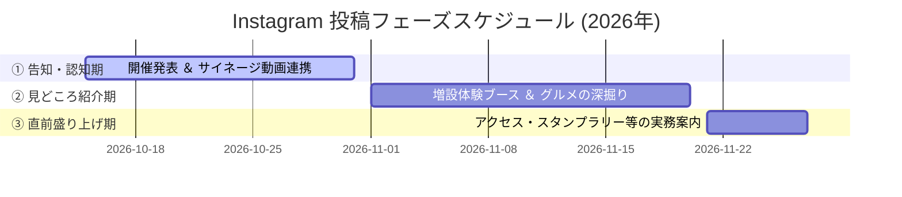

# 「産業フェアしずおか2026」公式Instagram運用・投稿計画書

本計画書は、「産業フェアしずおか2026」のプロモーションにおいて、ターゲットである子育て世代（25〜45歳）の集客を最大化し、フェア全体の来場者数増加に直接貢献するための、公式Instagramの「運用・投稿」に関する具体的なガイドラインおよびスケジュール設計です。

---

## 1. 運用目的と全体KPI

### 運用目的
「静岡市・焼津市・藤枝市・富士市・島田市・吉田町・牧之原市・富士宮市」の8市町に住む25〜45歳の子育てファミリー層に対し、週末のお出かけ先として「産業フェアしずおか2026」を第一選択肢にしてもらうこと。

### 運用KPI（指標の区分設定）

運用成果を正確に測定するため、**「公式アカウント運用KPI」** と **「インフルエンサーPR連携KPI」** に分けて評価指標を設定します。

#### ① 公式Instagramアカウント 運用KPI（自社アカウント自体の指標）
- **新規フォロワー獲得数**：**+300 〜 +500名**（堅実達成目標 / フェア終了時点）
- **公式投稿の平均エンゲージメント率**：**3.5%以上**（いいね・保存・コメント数 ÷ リーチ数）
- **公式投稿の「保存」獲得数**：**累計 1,500件以上**（お出かけ直前の見返し保存数）
- **公式プロフィール訪問・LP遷移数**：**3,000回以上**（公式特設サイトへの送客）
- **投稿本数**：フィード/リール計 **15本以上**、ストーリーズ **30本以上**

#### ② インフルエンサーPR・タイアップ連携KPI（@shizuoka_info / @shizuokaosanponikki）
- **タイアップ投稿の総閲覧数（再生数）**：**合計 30万回閲覧以上**
- **タイアップ投稿の総リーチ数**：**11万リーチ以上**
- **公式アカウントへの送客・タグ付けアクション**：タイアップ経由のプロフ遷移数 **5,000件以上**
- **スタンプラリー事前認知貢献**：Instagram告知経由でのデジタルスタンプラリーアンケート回収（2日間で4,500件）への貢献

---

## 2. 過去投稿分析に基づく「勝ちパターン」とトンマナ

公式アカウント（[@sangyofair_shizuoka](https://www.instagram.com/sangyofair_shizuoka/)）の過去の運用データを分析し、最もエンゲージメントの高いルールと言語仕様をマニュアル化しました。

### ① クリエイティブ・ビジュアル仕様
- **Reels（縦型リール動画 9:16）の優先活用**：会場の熱気や体験ブースの動き、キャラクターの愛らしさ、グルメのライブ感を伝えるため、通常フィードよりもリール動画をメインに構築する。
- **高コントラストな太字サムネイル**：フィードに並んだ際、瞬時にテーマが伝わるよう、中央付近に太字の日本語テキスト（白文字＋黒シャドウ）を配置する。
- **暖色系ライフスタイル写真**：料理や工芸体験の写真は、行政的な記録写真を避け、暖色系の柔らかい光で撮られた子どもの真剣な表情や、美味しそうなアップ写真を使用する。

### ② 投稿テキストのトーン＆マナー
- **親しみやすく熱量のある文章**：「〜ですね！」「〜ですよ！」「お待ちしております！」など、語尾を和らげたウェルカムトーン。
- **ストーリーテリングの重視**：単なるブースの陳列ではなく、「木の温もりを感じるオクシズの素材」「用宗しらす加工組合が守る伝統の味」など、職人や生産者のバックストーリーに触れて価値を伝える。
- **視覚的読みやすさの確保**：セクションの区切りに絵文字（🐟, 🪵, 🎊）を効果的に配置し、改行を多く入れてスマホ画面での可読性を極限まで高める。

---

## 3. 運用体制と役割分担（株式会社NEXTLOCAL 委託体制）

公式Instagramの立ち上げおよび運用にあたり、実績豊富な **株式会社NEXTLOCAL（代表取締役：辻田 敬）** に運用実務およびインフルエンサーキャスティング・連携業務を全面的に委託し、事務局（静鉄アド・パートナーズ：SAP）との密な連携のもとで集客効果を最大化します。

### 3.1 役割分担ルール

1. **「公式からのお知らせ系」投稿（開催発表、ステージイベント、実務ガイド等）**
   - **担当**：株式会社NEXTLOCAL
   - **内容**：マスタースケジュールに基づき、企画・構成・クリエイティブ（画像・動画）の作成を意図的にリードし、投稿まで完結させます。
2. **「出展ブース・コンテンツの案内」投稿（各ゾーンの出展者スポットライト紹介等）**
   - **担当**：静鉄アド・パートナーズ（SAP） ✕ 株式会社NEXTLOCAL（代理投稿）
   - **プロセス**：
     - SAPが「出展者向けヒアリングシート」を通じて各出展者から回収した素材（回答・画像）をもとに、投稿用原稿および使用画像を準備・作成します（**原稿等の完全支給**）。
     - SAPと株式会社NEXTLOCALの事前協議に基づき、株式会社NEXTLOCALが支給された原稿・素材を使用して公式アカウントへ代理投稿（または予約投稿）を行います。
3. **インフルエンサーアサイン・PR進行管理**
   - **担当**：株式会社NEXTLOCAL
   - **内容**：提携インフルエンサー（@shizuoka_info, @shizuokaosanponikki）の進行管理、撮影スケジュール調整、タイアップ投稿・広告連携コード（パートナーシップ広告コード）の発行および事前チェックを担当します。

---

### 3.2 運用開始前ヒアリング・要件定義項目（株式会社NEXTLOCAL 実施）

キックオフミーティングにおいて、株式会社NEXTLOCALとの間で以下の事前ヒアリングおよび運用ルールのすり合わせを実施します。

| ヒアリング分類 | 具体的な確認・ヒアリング項目 | 担当 / 確認事項 |
| :--- | :--- | :--- |
| **① アカウント運用方針** | ・ターゲット層（25〜45歳子育て世代）に届くフォロワー獲得・エンゲージメント戦略 ・投稿頻度（週2〜3回、直前期は毎日投稿）および投稿推奨時間帯（18:00〜21:00） ・ストーリーズの日常運用（出展者投稿のリポストルール等） | **株式会社NEXTLOCAL** × SAP智之さん |
| **② レギュレーション・NG設定** | ・NGワード・表現（誤解を招く過剰な表記、旧事務局AAPの露出排除） ・商用BGM厳守ルール（Metaビジネスライブラリ/契約フリー音源の指定） ・一般来場者・子どもの顔画像モザイク処理基準 | **SAP智之さん** → NEXTLOCAL共有 |
| **③ インフルエンサーPR連携** | ・2名（@shizuoka_info, @shizuokaosanponikki）の現地撮影・編集スケジュール ・リール動画の冒頭3秒フック案・キャプション構成案の事前承認フロー ・Metaパートナーシップ広告コードの発行手順とSAP広告管理画面への共有フロー | **株式会社NEXTLOCAL** 辻田社長 |
| **④ 出展者素材受渡フロー** | ・出展者ヒアリングシート回答データ（Googleフォーム）の共有形式 ・画像アセット（高画質写真データ）の格納フォルダ（Google Drive / Dropbox）指定 | **SAP山田さん** → NEXTLOCAL共有 |

---

## 4. インフルエンサーPR全体設計

仕様書および企画書に基づき、株式会社NEXTLOCALを通じてアサインされた、静岡で圧倒的な知名度を誇る2名のインフルエンサーとのタイアップ全体像です。

### アサインインフルエンサー
1. **静岡県コンシェルジュ**（[@shizuoka_info](https://www.instagram.com/shizuoka_info/)）：静岡県内のお出かけ情報を網羅する、ファミリー層へ極めて強い影響力を持つアカウント。
2. **静岡散歩日記**（[@shizuokaosanponikki](https://www.instagram.com/shizuokaosanponikki/)）：地元の美味しいグルメや隠れたスポットを親しみやすいトーンで発信するお出かけ特化アカウント。

### 進行プロセスとタスク（2026年）
現在、情報漏洩やコンプライアンスリスクを完全に排除するため、株式会社NEXTLOCAL（協力会社）との間で秘密保持契約（NDA）の締結を進めています。

1. **NDA締結完了（目標：8月7日（金）まで）**：
   事務局（山田）主導で調印。締結後、今回の「4倍に増設された地場体験コーナー」「しずまえ・まぐろゾーン」などの詳細仕様データを株式会社NEXTLOCALへ共有。
2. **構成・台本の合意（目標：8月28日（金）まで）**：
   「親子で一日中楽しめる週末お出かけスポット」としての切り口でリール台本およびフィードの構成案をすり合わせる。なお、広告の二次配信（ブースト広告）で問題が生じないよう、この段階で**「ビジネス向けまたは商用利用可能な無料音源のみを使用する」ルールを厳密に合意**する。
3. **現地撮影・編集（10月中旬〜11月上旬）**：
   株式会社NEXTLOCAL進行のもと、出展者と調整のうえ体験ブースや物産、グルメの撮影を実施。
4. **タイアップ投稿の実施（11月9日（月）〜11月13日（金）の期間）**：
   11月中旬の紙媒体（リーフレット等）の納品・配布時期と連動して順次投稿を行い、広告の二次配信（ブースト広告）の受け皿を作る。

---

## 5. 出展者紹介（スポットライト投稿）の情報収集・ヒアリングスキーム

第2フェーズ（見どころ紹介期）において、各出展ゾーンの魅力を深く掘り下げる「出展者スポットライト投稿」を実施します。
少人数での事務局運営で効率的かつ高クオリティな情報収集を行うため、現地取材ではなく**「出展者向けヒアリングシート（アンケート）」**を活用した回答回収・投稿作成スキームを採用します。

### 5.1 出展者ヒアリングシートの具体的収集項目

出展者説明会（9月25日）にて配布・回収するGoogleフォームのヒアリング項目は以下の通りです。この回答データを株式会社NEXTLOCALと共有し、投稿クリエイティブの素材とします。

1. **基本情報**：出展団体名、出展ゾーン（地場・水産・林業・企業等）、出展ブース番号
2. **公式SNS・HP情報**：Instagramアカウント（`@〜`）、WebサイトURL（※相互タグ付け用）
3. **おすすめポイント（キャッチコピー）**：「一言で言うとどんなブースか？」（30文字程度）
4. **子育てファミリー向けアピール点**：子どもが体験できること、試食・購入できるおすすめ品
5. **掲載用画像データ**：高画質写真1〜3枚（商品アップ、体験風景、スタッフの笑顔写真など）
6. **来場者へのメッセージ**：当日の意気込みや限定特典（「SNS見た」でプチプレゼント等）

### 5.2 情報収集と投稿作成のプロセス

1. **ヒアリングシートの配布・告知（9月25日（金）の出展者説明会）**：
   - 出展者説明会マニュアルにヒアリング項目を掲載するとともに、オンライン回答用GoogleフォームのQRコードを記載した案内状を配布します。
   - シートのフォーマットは [出展者PR用インタビューシートテンプレート.md](../docs/出展者PR用インタビューシートテンプレート.md) を参照。
2. **回答・写真素材の回収（目標締切：10月16日（金）まで）**：
   - 出展申込のデータ集計時期と連動し、Googleフォーム経由でテキスト回答および画像データを回収し、株式会社NEXTLOCALと共有フォルダで同期。
3. **投稿コンテンツの編集（10月中旬〜下旬）**：
   - 回収したヒアリング回答をもとに、SAPおよび株式会社NEXTLOCALにて公式Instagramのトンマナ（親しみやすくストーリーテリングを重視した文章）にリライトしたキャプション原稿を作成します。
4. **スポットライト投稿の順次公開（11月1日〜20日の見どころ紹介期）**：
   - 回収した魅力的な写真（シズル感のあるグルメ、体験中の笑顔など）を活用し、株式会社NEXTLOCALが代理投稿を実施します。

### 出展者自社SNSからの公式アカウント送客スキーム
出展者自身のSNSアカウント（Instagram等）で出展告知を行ってもらう際、公式アカウントへの誘導（フォロワー化）と認知拡散を最大化するため、以下の発信ルールを説明会およびシートで依頼します。

1. **【遷移率No.1：ストーリーズでのメンションスタンプ貼付】**
   - ストーリーズ投稿時に「メンションスタンプ（`@sangyofair_shizuoka`）」を貼り付けてもらいます。
   - **メリット**：1タップで公式アカウントへ飛べるため最も効果的です。また、出展者の投稿を**公式アカウント側で「リポスト（ストーリー再シェア）」できる**ため、公式フォロワーへ出展ブースを宣伝し返す相乗効果が得られます。
2. **【投稿の資産化：画像へのアカウントタグ付け ＆ 本文メンション】**
   - 通常のフィード/リール投稿のキャプション本文に「`@sangyofair_shizuoka`」を含め、さらに**「投稿画像自体にアカウントタグ付け」**を依頼します。
   - **メリット**：画像にタグ付けされると、公式アカウントの「タグ付けされた投稿」タブに自動的に出展者の投稿がストックされ、来場検討者が「出展ブースの生のクチコミ・情報」を一覧で確認できるようになります。
3. **【検索性の統一：共通ハッシュタグの指定】**
   - キャプション内に「`#産業フェアしずおか2026`」を必須で記載するよう依頼します。
   - **メリット**：タグ検索時に公式・出展者・一般来場者の全投稿が一本化され、イベント全体の熱量が可視化されます。

---

## 6. 他媒体（マルチビジョン・イントラ）とのシンクロ計画

- **新静岡駅13面マルチビジョン連動**（10月15日放映開始）：
  - サイネージ放映に合わせて、Instagram側でも15秒ビジョン動画を公開。「新静岡駅で動画を見た方はコメント欄へ！」といったエンゲージメント獲得施策を打つ。
- **静鉄グループ内インナー告知**（11月上旬〜）：
  - 静鉄グループウェア（イントラ用）にお出かけ周知メッセージを配信する際、公式Instagramのスタンプラリー解説投稿（保存用）へのリンクを貼り、グループ内（約1,500〜2,000人規模）からの初期エンゲージメントをブーストする。

---

## 7. 3フェーズ運用計画・投稿スケジュール（2026年カレンダー準拠）

イベント開催（11月28日（土）〜29日（日））に同期した、日付と曜日に一切のズレがない投稿計画です。

### 【第1フェーズ：告知・認知期】 10月15日（木）〜 10月31日（土）
新静岡駅13面マルチビジョン放映開始と同日にInstagramを稼働。認知度を最大化し、「今年も産業フェアがある」という話題作りを行います。

* **10月15日（木）**：【イベント開催決定】新静岡駅ビジョン動画（15秒）の同時公開 ＆ 開催日（11/28 - 11/29）アナウンス。
* **10月22日（木）**：【ステージ豪華ゲスト公開】ポムポムプリンとシナモロールの出演ステージ情報、タイムスケジュールの第一弾解禁。
* **10月29日（木）**：【コンセプト発表】「静岡『しん』発見！」に込めた想いと、マスコットキャラクター「シーズくん」起用のキービジュアル公開。

### 【第2フェーズ：見どころ紹介期】 11月1日（日）〜 11月20日（金）
体験コンテンツやグルメの魅力を掘り下げ、「体験したい」「買いたい」という具体的なお出かけ動機を形成します。

* **11月2日（月）**：【親子で楽しむ伝統工芸】増設された「地場産業体験コーナー（4つの体験：プラモデル工作、木工工作、職人体験など）」の具体的な内容と事前予約・整理券情報を紹介。
* **11月6日（金）**：【極上グルメ・しずまえ＆まぐろ】「まぐろゾーン（冷凍マグロの裁断ショー）」および「しずまえ（水産業）ゾーン」の注目出展品目・グルメ紹介。
* **11月11日（水）**：【お買い物天国】「中部横断道交流物産ストリート（プロムナード開催）」の出展自治体（山梨県・長野県等）の限定名産品とフードコート情報。
* **11月16日（月）**：【親子で学ぼう】「企業ゾーン」で体験できるSDGsコンテンツ、持続可能な未来への取り組みをビジュアル解説。

### 【第3フェーズ：直前盛り上げ・実務案内期】 11月21日（土）〜 11月27日（金）
お出かけを決定する直前1週間のフェーズ。移動方法や駐車場、会場でのスムーズな回り方をガイドし、来場への不安を完全に払拭します。

* **11月21日（土）**：【アクセス・駐車場ガイド】臨時駐車場（静岡総合庁舎・理研軽金属工業社員用駐車場など）の場所・利用ルールと、公共交通機関での来場推奨アナウンス。
* **11月24日（火）**：【事前登録でプレゼント】Googleフォームを活用した「来場者アンケート一体型デジタルスタンプラリー」の参加方法と、豪華抽選景品（オリジナルウェットティッシュ等）の公開。
* **11月26日（木）**：【準備進行中！会場潜入リール】ツインメッセ静岡で設営が進む様子のタイムラプス・ショート動画を投稿。
* **11月27日（金）前日夜**：【明日開幕！最終お出かけチェックリスト】「入場無料」「雨天決行（全館屋内開催）」を強調し、持ち物や会場マップをおさらい。

---

## 8. コピペで使える最強の投稿原稿ドラフト

### ① 【Reels用台本 ＆ キャプション】親子で遊べる「4大体験コーナー」紹介
- **映像構成（約25秒）**
  - [0-3秒] 冒頭フック：子どもが丸太の皮むきをして笑顔になっているシーン（中央に太文字「入場無料！一日中遊べる産業フェアしずおか」）
  - [4-10秒] 木のジャングルジム ＆ 木のブロック「シズレンガ」でつみき遊びをする様子
  - [11-17秒] 「お魚版画（本物の魚にインクを塗る体験）」や、プラモデル組み立ての様子
  - [18-22秒] 職人体験で真剣な表情を見せる子どもの手元のアップ
  - [23-25秒] エンディング：「11月28日(土)〜29日(日) ツインメッセ静岡でお待ちしています！」の画面
- **BGM**：Instagramビジネスライブラリ内のアコースティックポップ音源（商用利用可能）

#### キャプション本文
> 【入場無料】親子で一日中遊べる！今年の産業フェアしずおかは「体験」がすごい！🪵🐟✨
> 
> 静岡の地場産業や美味しいものがツインメッセ静岡に大集合！
> 今年は、子どもたちが夢中になる「4大体験コーナー」がさらにパワーアップします👇
> 
> 🌲 ① 林業ゾーン
> 普段は触れない「丸太の皮むき体験」や、木の温もりあふれるジャングルジムが登場！
> 
> 🧱 ② オクシズエリア
> 静岡の木で作られた「シズレンガ」で自由につみき遊び🧱 親子で巨大な塔を作ってみよう！
> 
> 🌊 ③ 水産業（しずまえ）ゾーン
> 本物のお魚を使った「しずまえ鮮魚の版画体験」！東海大学のブースで体験できます🐟
> 
> 🎨 ④ 地場産業ゾーン
> 昨年の2つから【4つへ増設】！プラモデル工作や木工工作、職人体験など、自分だけの宝物を作ってお持ち帰りできます🎒
> 
> 自分で作った作品は思い出のお土産にぴったり！
> 暖房のきいた快適な屋内会場なので、雨が降っても安心して一日中楽しめます☔️✨
> 
> ぜひご家族揃ってお越しください！
> 
> ---
> 📅 会期：2026年11月28日（土）〜11月29日（日）
> ⏰ 時間：9:30 〜 16:00
> 📍 会場：ツインメッセ静岡（北館・南館・プロムナード）
> 🎫 入場料：無料
> 🚗 臨時駐車場あり（静岡総合庁舎・理研軽金属工業社員用駐車場等）
> ---
> 
> #静岡イベント #静岡市イベント #親子お出かけ #子育て静岡 #産業フェアしずおか2026 #ツインメッセ静岡 #静岡お出かけ #入場無料

---

### ② 【Carousel用画像構成 ＆ キャプション】スタンプラリー＆ブース総選挙ガイド
- **画像構成（1:1 カルーセル - 計5枚）**
  - [1枚目] 表紙：大盛況の会場写真を背景に「豪華景品が当たる！スタンプラリー＆ブース総選挙の歩き方」
  - [2枚目] 昨年度1位の「用宗しらす加工組合 青年部」のしらす丼写真。「昨年No.1は用宗しらす！今年輝くブースはどこ？」
  - [3枚目] 参加フロー図：「①会場でQR読み取り ➡️ ②スタンプを集めてブース巡り ➡️ ③アンケート回答で抽選へ！」
  - [4枚目] 景品紹介：アンケート画面と「オリジナルウェットティッシュ」等の豪華景品写真。「2日間合計4,500名様に当たる！」
  - [5枚目] 保存誘導：「保存して当日会場で見返してね！」＋公式プロフィールのURLリンク先（特設サイト）への誘導

#### カルーセル画像プレビュー (1:1 正方形画像)
| 1枚目：表紙 | 2枚目：しらす丼 | 3枚目：フロー図 | 4枚目：景品紹介 | 5枚目：保存誘導 |
| :---: | :---: | :---: | :---: | :---: |
|  |  |  |  |  |

#### キャプション本文
> 【あなたの一票でNo.1が決まる！】大人気イベント「ブース総選挙 ＆ スタンプラリー」の完全ガイド🗳️👑
> 
> 産業フェアしずおかの名物企画「ブース総選挙」！
> 昨年見事第1位に輝いたのは、【用宗しらす加工組合 青年部】さんでした！名物の新鮮なしらす丼は今年も要チェックです🐟✨
> 
> 今年も皆さんの投票で、出展ブースの頂点を決定します！
> しかも、投票と同時に「豪華景品」が当たるダブルチャンス🎁
> **なんと、2日間合計4,500名様（各日先着2,250名様）に豪華景品が当たります！**
> 
> 💡【超簡単！参加ステップ】
> 1️⃣ 会場内の案内パネルからQRコードをスマートフォンで読み取る（専用アプリのインストールは不要！）
> 2️⃣ 会場の各ゾーンを巡りながら「デジタルスタンプ」を集める
> 3️⃣ スタンプが集まったら、Googleフォームで簡単なアンケート（※1〜2分で完了！）に回答して投票完了！
> 4️⃣ 投票完了画面を抽選会場で提示すると、豪華景品が当たるガラポン抽選に挑戦できます！
> 
> スマートフォンひとつで、ペーパーレスでスマートに参加できます📱
> ご家族みんなでスタンプを集めて、お気に入りのブースを応援してくださいね！
> 
> ⚠️ 個人情報やアンケートの回答内容は厳重に管理し、本イベントの運営・統計分析目的以外には使用いたしません。
> 
> ---
> 📅 会期：2026年11月28日（土）〜11月29日（日）
> ⏰ 時間：9:30 〜 16:00
> 📍 会場：ツインメッセ静岡
> ---
> 
> #産業フェアしずおか2026 #ブース総選挙 #デジタルスタンプラリー #静岡スタンプラリー #静岡グルメ #静岡イベント #用宗しらす #ツインメッセ静岡 #ペーパーレス

---

## 9. クリエイティブ制作ガイドライン

手戻り（リサイズや著作権侵害）を未然に防ぐための、デザイナー（鈴木氏）との共有用の技術仕様です。

- **リール動画アスペクト比**：1080px × 1920px（9:16）。
- **セーフエリアの厳守**：画面下部（キャプション等表示エリア）および右側（UIアイコン表示エリア）を避け、**画面中央60%のエリア（縦400px〜1400px、横90px〜990px）**に最重要テロップ（「入場無料」「ツインメッセ静岡」「11/28-29」等）を必ず配置する。
- **商用BGM厳守ルール**：ビジネス向けライブラリ（Commercial Audio Library）の楽曲、または事務局で正式に購入・契約した商用利用可能な無料音源のみを使用する。個人のトレンド音源は一切排除。
- **環境配慮仕様の表記**：印刷物の写真を投稿に載せる際、FSC認証紙・植物油インキの表記が見える形で表示されていることを確認する。

---

## 10. 🚨 智之さん（人間）による運用前チェックリスト

- [ ] **【カレンダー曜日検証】** 投稿文面内すべての「11月28日（土）」「11月29日（日）」の曜日がカレンダーと一致しているか？
- [ ] **【商用音源の適用】** 投稿で使用するリール動画のBGMタグが、ビジネスライブラリから正しく選択されているか？
- [ ] **【旧事務局情報の排除】** エイエイピー（AAP）等の旧事務局の残骸（旧担当者名、旧連絡先、旧ロゴ等）が1文字も入っていないか？（静鉄アドの正規事務局情報になっているか）
- [ ] **【プライバシーモザイク処理】** 投稿やリールに使用する写真や動画内で、一般来場者（特に子ども）の顔が特定できないよう、必要に応じてぼかし処理が施されているか？
