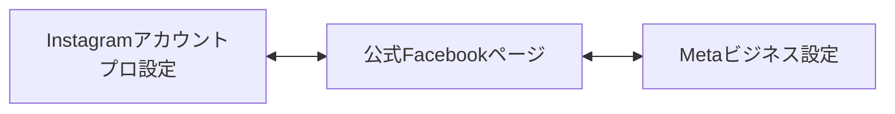
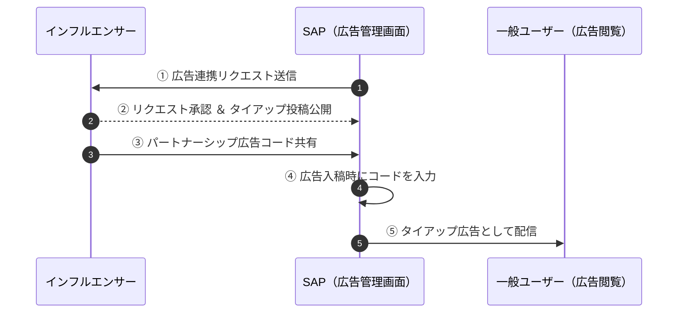
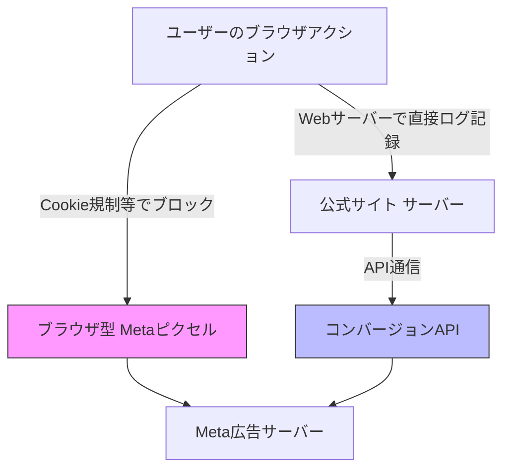

<!-- _class: title -->

# 📋 Meta広告（Facebook/Instagram） 連携・計測設定実務マニュアル

静鉄アド・パートナーズ（SAP） ｜ 産業フェアしずおか2026

---

## 📌 本マニュアルの目的

本スライドは、「産業フェアしずおか2026」のプロモーション（Instagram広告/Facebook広告）における各種連携・計測設定を、実務担当者（山田）や外部パートナー、Web制作会社が迷わず円滑に進められるよう手順をまとめたものです。

### 目次
1. Metaビジネス設定とアセット連携
2. InstagramアカウントとFacebookページの連携
3. インフルエンサーとのパートナーシップ広告連携
4. MetaピクセルとGTM（Google タグマネージャー）の連携・計測設定
5. ドメイン認証と合算イベント測定の設定
6. コンバージョンAPI（CAPI）の連携
7. 配信前テスト・疎通確認チェックリスト
8. 旧代理店/他社運用アセットの引き継ぎと移行実務

---

## 1. Metaビジネス設定とパートナー連携 (1/2)

事務局（SAP）と、Web制作会社や広告主などの外部パートナー間で安全に権限を共有し、広告アカウントやピクセル等のアセットを一元管理するための設定手順です。

### 1.1 パートナー連携（ビジネスマネージャ間）
代理店（SAP）やパートナー企業に広告運用や計測タグ設定を委託・共有する際は、個人アカウントの追加ではなく、**ビジネスID（15桁の数字）を用いた「パートナー連携」**を行います。

> [!TIP]
> **💡 操作画面の参考イメージ（画像付き）**:  
> [GLASS社ブログ：代理店をパートナーとして追加し、権限を付与する](https://glass-inc.jp/media/setting-metaads-advertiser/#%E4%BB%A3%E7%90%86%E5%BA%97%E3%82%92%E3%83%91%E3%83%BC%E3%83%88%E3%83%8A%E3%83%BC%E3%81%A8%E3%81%97%E3%81%A6%E8%BF%BD%E5%8A%A0%E3%81%97%E3%80%81%E6%A8%A9%E9%99%90%E3%82%92%E4%BB%98%E4%B8%8E%E3%81%99%E3%82%8B) の操作画面キャプチャを併せて参照しながら設定を行ってください。

---

## 1. Metaビジネス設定とパートナー連携 (2/2)

### 🛠️ 設定手順
1. **パートナーのビジネスIDを確認**：
   - 共有先（SAP等）のMetaビジネスマネージャの「ビジネス設定」➔「ビジネス情報」に表示されている「ビジネス管理元ID」（15桁の数字）を控えてもらいます。
2. **パートナーの追加**：
   - 自身の「ビジネス設定」➔「ユーザー」➔「パートナー」を開きます。
   - 「追加」➔「パートナーとアセットを共有」をクリックします。
   - 相手側の「ビジネスパートナーID」を入力して「次へ」をクリックします。
3. **アセットの割り当て**：
   - 共有するアセット（Facebookページ、広告アカウント、ピクセル/データセット、Instagramアカウントなど）を選択します。
   - 各アセットに対する権限（例: 「広告の管理」、「ピクセルの管理権限」）にチェックを入れ、「変更を保存」をクリックします。

---

## 2. InstagramアカウントとFacebookページの連携 (1/2)

Instagram広告を公式アカウント名（`@sangyofair_shizuoka`）で配信するために、InstagramビジネスプロフィールとFacebookページを紐づけます。

> [!TIP]
> **💡 操作画面の参考イメージ（画像付き）**:  
> [GLASS社ブログ：Facebookページ・Instagramアカウントのビジネス設定への追加](https://glass-inc.jp/media/setting-metaads-advertiser/#Meta%E3%83%93%E3%82%B8%E3%83%8D%E3%82%B9%E3%83%9E%E3%83%8D%E3%83%BC%E3%82%B8%E3%83%A3) の操作画面キャプチャ（ページやアカウントのリンク手順）を参照してください。

---

## 2. InstagramアカウントとFacebookページの連携 (2/2)

### 🛠️ 設定手順
1. **Instagram側での事前準備**：
   - 対象のInstagramアカウントが「プロアカウント（ビジネスまたはクリエイター）」に切り替わっていることを確認します。
2. **Facebookページからの連携（推奨）**：
   - 管理権限を持つFacebookページを開き、メニューから「設定」➔「リンク先アカウント」➔「Instagram」を選択します。
   - 「アカウントをリンク」をクリックし、画面の指示に従ってInstagramのログイン情報を入力し認証します。
3. **ビジネス設定への追加**：
   - Metaビジネス設定の「アカウント」➔「Instagramアカウント」を開きます。
   - 「追加」をクリックし、Instagramのログイン情報を入力して紐づけます。

---

## 3. インフルエンサーとのパートナーシップ広告連携 (1/2)

インフルエンサー（`@shizuoka_info`, `@shizuokaosanponikki`）のアカウント名を借りて、事務局（SAP）の広告予算で配信を行うための実務連携フローです。

---

## 3. インフルエンサーとのパートナーシップ広告連携 (2/2)

### 🛠️ 具体的な設定ステップ
* **ステップ1：広告アクセス権の連携承認**
  1. SAPの広告管理画面で、インフルエンサーのInstagramユーザーネームを入力し、広告配信の許可リクエストを送信。
  2. インフルエンサーがInstagramアプリの「設定とプライバシー」➔「クリエイターツール/ビジネスツール」➔「パートナーシップ広告」➔「リクエスト」から承認。
* **ステップ2：投稿コードの発行と広告入稿**
  1. インフルエンサーがタイアップ投稿をする際、詳細設定で「タイアップのラベルを追加」をONにし、ブランドパートナーに「産業フェアしずおか公式」を指定。
  2. 投稿後、投稿の設定から「**パートナーシップ広告コード（連携コード）**」を発行し、SAP山田へ共有。
  3. SAP広告マネージャで「パートナーシップ広告」トグルをONにし、コードを入力して入稿。

---

## 4. MetaピクセルとGTMの連携・計測設定 (1/3)

公式サイト特設LPにおけるユーザー行動をトラッキングするため、GTMを使用して「Metaピクセル（ベースコード）」および「標準イベント」を設置します。

### 4.1 Metaピクセル（ベースコード）の取得とGTM設置

> [!TIP]
> **💡 操作画面の参考イメージ（画像付き）**:  
> [GLASS社ブログ：データセット（ピクセル）の作成](https://glass-inc.jp/media/setting-metaads-advertiser/#%E3%83%87%E3%83%BC%E3%82%BF%E3%82%BB%E3%83%83%E3%83%88%EF%BC%88%E3%83%94%E3%82%AF%E3%82%BB%E3%83%AB%EF%BC%89%E3%81%AE%E4%BD%9C%E6%88%90) のピクセルID・ベースコード取得の管理画面キャプチャを参照してください。

#### ① ベースコードのコピー
Metaイベントマネージャでデータソース（ピクセル）を開き、「設定方法」➔「手動でコードを追加」を選択し、ベースコードをコピーします。

---

## 4. MetaピクセルとGTMの連携・計測設定 (2/3)

#### ② GTMでのベースコード設定手順
- **GTM管理画面**を開き、新しいタグを作成します。
- **タグタイプ**：`カスタムHTML` を選択。
- **HTML欄**：コピーしたMetaピクセルのベースコードを貼り付けます。
- **トリガー**：`Initialization - All Pages`（初期化 - すべてのページ）を設定します。
- **設定名**：`Meta - Pixel - BaseCode` と命名して保存します。

---

## 4. MetaピクセルとGTMの連携・計測設定 (3/3)

### 4.2 標準イベントの設定（コンバージョン計測）
特定の重要なアクションをコンバージョンとして計測するため、GTMでイベント用のタグを個別設定します。

| 計測対象アクション | 推奨のMeta標準イベント | GTMトリガー条件 |
| :--- | :--- | :--- |
| 公式特設LPの閲覧 | `PageView` (ベースコード同梱) | 全てのページビュー |
| アクセス案内の確認 | `ViewContent` | URLが `/access` を含む場合 |
| スタンプラリー登録 | `Lead` | 登録完了画面の表示時 |
| 出展者募集の問合せ完了 | `Contact` | 問合せ送信完了（サンクス表示） |

> [!IMPORTANT]
> **タグの順序付け**：ベースコードが先に読み込まれるよう、GTMの「詳細設定」で「`Meta - Pixel - BaseCode` が発火した後にこのタグを発火する」を設定してください。

---

## 5. ドメイン認証と合算イベント測定の設定 (1/2)

iOS 14.5以降のプライバシー保護強化（ATT制限）に対応し、コンバージョンデータの損失を最小限にするため、ドメイン認証と合算イベント測定を設定します。

### 5.1 メタビジネス設定でのドメイン認証
いずれかの方法でドメインの所有権を認証します。

- **① メタタグの追加（推奨：低難易度）**
  - `<head>` タグ内に指定された verification 用メタタグを挿入します。
- **② HTMLファイルアップロード（中難易度）**
  - 指定された認証用HTMLファイルをルートディレクトリにアップロードします。
- **③ DNSテキストレコード（高難易度）**
  - DNSのTXTレコードに認証コードを登録します。

---

## 5. ドメイン認証と合算イベント測定の設定 (2/2)

### 5.2 合算イベント測定（優先順位）の設定
ドメイン認証完了後、イベントマネージャからコンバージョンの優先順位を登録します。

#### 🛠️ 設定手順：
1. イベントマネージャの「**合算イベント測定**」タブを選択。
2. 「**ウェブイベントを設定**」をクリック。
3. 認証済みのドメインを選択し、「**イベントを管理**」をクリック。
4. 優先度の高い順にイベントを配置（最大8個）。
   - 例: `Lead`（スタンプラリー登録） ➔ `Contact`（問合せ） ➔ `ViewContent`（アクセス）
5. 設定を送信（※適用に最大72時間かかる場合があります）。

---

## 6. コンバージョンAPI（CAPI）の連携 (1/2)

ブラウザCookie規制（ITP）や広告ブロック機能による計測データ欠損（約30%〜40%）を防ぐため、サーバー側からMetaへ直接データを送信する「コンバージョンAPI」を併用します。

---

## 6. コンバージョンAPI（CAPI）の連携 (2/2)

### 🛠️ 重複排除（Deduplication）の設定
ブラウザとAPIの双方から同一コンバージョンが送信された場合の二重計上を防ぐため、重複排除を設定します。

- **設定方法**：
  ブラウザ送信（GTM）とサーバー送信（API）の双方のイベントに、同一のユニークなID（`event_id`）を付与して送信します。
  - ブラウザ側：`fbq('track', 'Contact', {}, {eventID: 'contact_12345'});`
  - サーバー側：APIパラメータに `event_id: "contact_12345"` を含める。
- **効果**：
  Metaサーバー側で同一IDを検知すると、自動的に重複データを破棄します。

---

## 7. 🚨 配信前テスト・疎通確認チェックリスト

広告配信を開始する前に、以下の項目に沿って動作確認を行ってください。

- [ ] **1. Meta Pixel Helperでの発火確認**
  - Chrome拡張機能「Meta Pixel Helper」でイベントがエラーなしで発火しているか？
- [ ] **2. イベントテストツール（イベントマネージャ内）での確認**
  - イベントマネージャ上でブラウザおよびサーバー（CAPI）のテストイベント受信が確認できるか？
- [ ] **3. ドメイン認証ステータス**
  - ビジネス設定で対象ドメインが「認証済み」になっているか？
- [ ] **4. パートナーシップ広告コードの疎通テスト**
  - 広告マネージャに入力した際、インフルエンサーの投稿が正しくプレビューできるか？
- [ ] **5. パラメータURLの着地確認**
  - UTMパラメータ付きURLでアクセスした際、GTM・GA4・ピクセルが検知しているか？
- [ ] **6. 音源およびプライバシー、旧事務局（AAP）情報の排除確認**
  - 商用音源の厳守、モザイク処理、旧代理店情報の排除は完了しているか？

---

## 8. [他社運用] アセット引き継ぎ・移行実務 (1/2)

過去に他社（旧代理店・旧事務局）が運用していた場合、各種アセットが他社のビジネマネージャに登録されているため、移行実務が必要です。

### 8.1 広告アカウントの移行
- **対応策**: **新事務局（SAP）のビジネスマネージャで「新規広告アカウント」を作成します。**
  - ※旧代理店の決済情報が紐づいているため、セキュリティ面や請求分離の観点から新規作成が必須です。

### 8.2 Facebookページの所有権移行
- **パターンA：所有権が旧他社にある場合**
  - 旧他社の設定で「ページを削除（所有権解除）」を実行してもらい、その後、新事務局（SAP）のビジネス設定でページを追加します。
- **パターンB：所有権は主催者にあり、旧他社がパートナー登録されている場合**
  - 主催者の設定画面から、旧他社のパートナー登録を解除します。

---

## 8. [他社運用] アセット引き継ぎ・移行実務 (2/2)

### 8.3 Metaピクセル（データセット）の引き継ぎ
- **引き継ぎ可能（推奨）**:
  - 過去の最適化データを活かすため、旧他社の設定から新事務局（SAP）の「ビジネスID（15桁）」宛てに、ピクセルの「パートナー共有（管理権限）」を依頼します。
- **引き継ぎ不可能な場合**:
  - 新事務局で新規ピクセルを作成し、GTM内のピクセルIDを差し替えます（※最適化データは初期化されます）。

### 8.4 旧他社のアクセス権限の完全排除
- 移行完了後、ビジネスマネージャの「パートナー」から旧代理店を削除します。
- Facebookページの「ページのアクセス許可」から旧メンバーのアカウントを削除します。
- GTMやGA4のアクセス権限（Googleアカウント）から旧他社の宛先を削除します。

---
**更新日**：2026年7月28日  
**作成者**：プロモーション・広告運用部（山田） / AIアシスタント（Antigravity）
