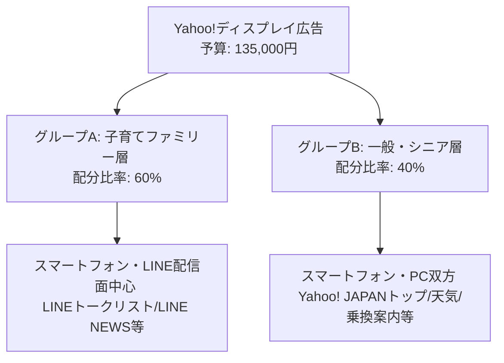

# 「産業フェアしずおか2026」Yahoo!ディスプレイ広告（YDA）配信計画書（LINE配信面含む）

本計画書は、「産業フェアしずおか2026」のプロモーションにおいて、割り当てられた予算（135,000円）を最適に運用し、Yahoo!ディスプレイ広告（YDA：旧YDN）および提携するLINEの広告枠を活用して幅広いターゲット層にアプローチし、公式サイトへの集客と来場者数を最大化するための「詳細広告配信プラン」です。

単発イベントの認知獲得に非常に有効なディスプレイ広告の強みを活かし、メインターゲットである「ファミリー層」と、3世代来場を促す「シニア・一般層」の2つのセグメントにグループ分けして効率的に配信します。

---

## 1. 広告目的と主要KPI

### 広告目的

静岡県内の主要8市町（静岡市・焼津市・藤枝市・富士市・島田市・吉田町・牧之原市・富士宮市）に居住する幅広い世代へビジュアル広告を配信し、イベントの認知拡散と公式サイト特設LPへの遷移を促し、週末の来場獲得に直結させること。
また、企画書におけるディスプレイ広告（GDN/YDA合計）目標「2,966,667回」に対し、本広告単体で**「1,500,000回（目標値の約51%）」**の獲得に貢献します。

### 主要KPI（シミュレーション目標）

- **総予算上限**：135,000円
- **想定表示回数（インプレッション数）**：1,500,000回
- **想定クリック数**：5,250回 〜 8,250回（想定平均CTR: 0.45%）
- **想定クリック単価（CPC）**：16円 〜 26円
- **目標オフライン来場世帯数**：15組 〜 49組（想定CVR: 0.3% 〜 0.6%）

---

## 2. ターゲットセグメンテーション（グループ分け設計）

単発イベントの限られた予算内で無駄のない配信を行うため、ターゲットを以下の2つのグループに分けて広告グループを設計します。

### 【グループA】子育てファミリー層（予算配分：81,000円 / 60%）

- **メインターゲット**：25〜45歳の子育て世代（幼稚園・保育園・小学生の親）
- **ターゲティング設定**：
  - **属性**：子供あり（未就学児、小学生、中学生）
  - **サーチターゲティング（検索履歴キーワード）**：「週末 子ども お出かけ」「静岡 体験 イベント」「スタンプラリー」「キャラクターショー」など。
  - **オーディエンスカテゴリ**：お出かけ・レジャー、子育て・家族、知育・玩具。
- **訴求ポイント**：伝統工芸の工作体験、木のジャングルジム、キャラクターショー（サンリオキャラクターズステージ）、雨でも遊べる屋内型イベント。
- **主要配信面**：LINEトークリスト最上部（Smart Channel）、LINE NEWS、Yahoo! JAPANスマートフォン版トップページ。

### 【グループB】一般・シニア層（予算配分：54,000円 / 40%）

- **メインターゲット**：50代〜70代以上の地元の一般・シニア層（および3世代世帯）
- **ターゲティング設定**：
  - **年齢制限**：50歳〜70歳以上
  - **サーチターゲティング（検索履歴キーワード）**：「静岡 グルメ」「まぐろ 解体ショー」「伝統工芸品 静岡」「物産展」「ツインメッセ静岡」など。
  - **オーディエンスカテゴリ**：グルメ、伝統・文化、日本の旅行・レジャー、地域情報。
- **訴求ポイント**：地元静岡が誇る「まぐろゾーン」「しずまえ（水産業）ゾーン」の極上グルメ、山梨・長野の中部横断道物産ストリート、静岡伝統工芸展（地場産業の匠の技）。
- **主要配信面**：Yahoo! JAPANトップページ（PCブランドパネル含む）、Yahoo!天気、Yahoo!乗換案内、LINE NEWS。

---

## 3. 配信設定パラメータ（2026年最適化）

| 設定項目                     | 指定パラメータ仕様                                                                      | 備考・設定意図                                                                          |
| :--------------------------- | :-------------------------------------------------------------------------------------- | :-------------------------------------------------------------------------------------- |
| **配信期間**                 | **2026年11月1日（日）0:00 〜 11月29日（日）15:00**                                      | イベント告知開始（11/1）から本番2日目終了直前まで配信。                                 |
| **配信地域**                 | **静岡県静岡市、焼津市、藤枝市、富士市、島田市、吉田町、牧之原市、富士宮市の8市町指定** | 行政境界データによる厳格な指定。ターゲティング「拡張地域」は適用せず8市町に完全ロック。 |
| **広告タイプ**               | **レスポンシブ（画像） ＆ バナー（画像）**                                              | LINE配信枠（トークリスト等）を網羅するため、レスポンシブ画像をメインに設定。            |
| **入札戦略**                 | **クリック数の最大化**                                                                  | 限られた予算（100,000円）の中で、公式サイト特設LPへの流入クリック数を最大化。           |
| **デバイス指定**             | **スマートフォン ＆ PC（タブレットは除外）**                                            | シニア層のPC閲覧、ファミリー層のスマホ・LINE閲覧双方に対応。                            |
| **フリークエンシーキャップ** | **ユーザーあたり週3回まで**                                                             | 同じユーザーへの過剰な配信による広告疲弊を防ぎ、ユニークユーザーリーチ数を最大化。      |

---

## 4. 広告コピー・見出し案（フォーマット構成）

Yahoo!ディスプレイ広告（YDA）は、登録した「画像 ＋ タイトル（見出し） ＋ 説明文」の組み合わせで表示されます。ターゲットグループ別に以下のコピードラフトを入稿します。

### 【グループA：ファミリー層向け】入稿ドラフト（各5パターン）

#### ① タイトル（全角20文字以内）

1. 入場無料！静岡で親子体験
2. 雨でも遊べる！ツインメッセ
3. 家族で楽しむ体験ブース
4. 静岡の体験とグルメが大集合
5. 11/28・29親子お出かけ

#### ② 説明文（全角90文字以内）

1. 入場無料！プラモデル組立や伝統工芸の木工体験など、子どもが夢中になる「4大体験コーナー」が登場！暖房完備の快適な屋内会場だから雨の日でも安心して一日中楽しめます。
2. 11月28日(土)・29日(日)はツインメッセ静岡へ！サンリオキャラクターズステージや、巨大な木のブロック「シズレンガ」など親子向け体験が満載。ご家族揃ってお越しください。
3. 自分で作った作品をお土産に！今年は伝統体験ブースを4つに増設。合計4,500名様に豪華景品が当たるスタンプラリーなど、親子で一日中遊べる企画が目白押しです。
4. 【入場無料】11月28・29日は家族みんなで「産業フェアしずおか」へ！地場体験コーナーや美味しいグルメゾーンが充実。屋内開催なので雨が降っても快適に回れます。
5. 週末はツインメッセ静岡へ！木のジャングルジムやプラモデル工作など、遊びながら学べる体験コンテンツがいっぱい。入場無料で一日中楽しめます！

---

### 【グループB：一般・シニア層向け】入稿ドラフト（各5パターン）

#### ① タイトル（全角20文字以内）

1. 静岡の極上グルメと匠の技
2. まぐろ解体ショー＆特産品
3. 中部横断道物産ストリート
4. 入場無料！静岡伝統工芸展
5. 11/28・29ツインメッセ

#### ② 説明文（全角90文字以内）

1. 冷凍マグロの裁断ショーやしずまえ鮮魚など、静岡自慢の美味しいものがツインメッセに大集合！山梨・長野の限定名産品が揃う物産ストリートも開催される入場無料の2日間。
2. 静岡が世界に誇る匠の技が集結する「静岡伝統工芸展」！駿河竹千筋細工などの制作体験や、職人技を間近で見学できます。11月28日(土)・29日(日)ツインメッセ静岡にて開催。
3. 長野・山梨の限定グルメや名産品をGET！中部横断道物産ストリートや静岡の海の幸グルメなど、美味しい地食が目白押し。入場無料で全天候型の快適な屋内会場で開催します。
4. 静岡の産業と食がツインメッセに集結！アンケート回答で合計4,500名様に豪華景品が当たるデジタルスタンプラリーも同時開催。11月28日(土)・29日(日)は家族3世代でぜひお越しください。
5. 【11月28日・29日開催】入場無料！ツインメッセ静岡で地場産業とグルメを満喫する年に一度のイベント。まぐろゾーンや地物フードコートなどお楽しみが盛りだくさん。

---

## 5. クリエイティブアセット仕様

Yahoo!ディスプレイ広告およびLINE広告配信枠に適合させるためのアセット規格です。

### レスポンシブ用画像規格

1. **アスペクト比 1.91:1（横長画像）**：1200px × 628px（必須）
2. **アスペクト比 1:1（正方形画像）**：1200px × 1200px（必須）
3. **アスペクト比 16:9（動画・任意）**：1920px × 1080px（タイムラプス等の15秒動画）

### LINEトークリスト（Smart Channel）配信時の注意点

- **極小バナーの可読性**：
  - LINEトークリスト最上部に表示される「画像 ＋ タイトル」の枠は非常に小さいため、画像内に細かいテキストを入れるのは厳禁です。
  - **推奨**：しらす丼のどアップや、体験中の子どものアップなど、**「一瞬で目を惹くシズル感の強いワンビジュアル」**を使用します。

### 予算分散の防止・クリエイティブ本数コントロール（YDA実務ルール）

予算規模（グループA：60,000円、グループB：40,000円）に対してクリエイティブを同時配信しすぎると、1本あたりの配信データが極小化し、学習が進みません。そのため、以下の「本数制限ルール」を適用します。

1. **初期の同時配信本数（2〜3パターン）**：
   - 各広告グループにおいて、初日から同時にオン（アクティブ）にするクリエイティブは、厳選した**「2〜3パターン」に制限**してください。
   - **理由**：日予算（約1,800円〜2,700円）の分散を防ぎ、それぞれのインプレッション数を早期に集めて成果を見極めるためです。
2. **クリエイティブのローテーション（差し替え）**：
   - 提案の残り2〜3案は「差し替え用ストック（控え）」として管理します。
   - 配信開始から1週間〜10日後、CTR（クリック率）が最も低くCPC（クリック単価）が高い1パターンを停止し、ストックから新たな1パターンを追加するサイクルで運用します（クリエイティブの摩耗対策）。

---

## 6. 費用対効果（ROI）シミュレーション詳細

予算「100,000円」を最適運用した場合の、Yahoo!ディスプレイ広告単体の成果シミュレーションです。

| 評価項目                 | 最悪シナリオ（Lower） | 想定平均シナリオ（Medium） | 最良シナリオ（Upper） | 算出根拠・計算プロセス                     |
| :----------------------- | :-------------------: | :------------------------: | :-------------------: | :----------------------------------------- |
| **広告予算**             |       100,000円       |         100,000円          |       100,000円       | 固定値                                     |
| **想定CPM**              |         100円         |          **90円**          |         80円          | 競合入札動向および配信地域制限に基づく推移 |
| **想定表示回数**         |      1,000,000回      |      **1,111,111回**       |      1,250,000回      | 予算 ÷ (CPM ÷ 1,000)                       |
| **想定CTR**              |         0.35%         |         **0.45%**          |         0.55%         | LINE配信面・YDA実績に基づく値              |
| **想定クリック数**       |        3,500回        |        **5,000回**         |        6,875回        | 表示回数 × CTR                             |
| **想定平均CPC**          |        28.6円         |         **20.0円**         |        14.5円         | 予算 ÷ クリック数                          |
| **想定来場転換率 (CVR)** |         0.05%         |          **0.1%**          |         0.15%         | クリック数からオフライン来場への転換率     |
| **想定来場世帯数**       |          2組          |          **5組**           |         10組          | クリック数 × CVR（四捨五入）               |
| **想定CPA**              |       50,000円        |        **20,000円**        |       10,000円        | 予算 ÷ 来場世帯数                          |

- ※企画書のディスプレイ広告合計目標値 **「2,966,667回表示」** に対し、本広告（YDA）の想定平均シナリオで **1,111,111回**（目標の約37%）を確保します。

---

## 7. 🚨 智之さん（人間）による入稿前チェックリスト

運用担当者がYahoo!広告管理画面（Yahoo! JAPAN Ads Promotion Manager）で配信設定を行う際、設定ミスを防ぐための最終確認項目です。

- [ ] **【予算と期間の設定】** キャンペーン総予算が「100,000円」に正しく制限され、配信スケジュールが「11/1〜11/29」に1分の狂いなく設定されているか？
- [ ] **【地域ターゲティングの適用除外】** 対象地域を「静岡市、焼津市、藤枝市、富士市、島田市、吉田町、牧之原市、富士宮市」の8市町の行政境界のみに設定し、その他の市町村へ配信が流出しない設定になっているか？
- [ ] **【同時オンにする本数の制限】** 初期配信開始時にアクティブにするクリエイティブは、予算分散を防ぐため「1広告グループあたり2〜3パターン」に制限されているか？（残りは差し替え用の控えに設定されているか）
- [ ] **【LINE配信面の有効化】** アドネットワーク配信先としてLINE（LINEアプリ内）が正しく含まれているか？（プレースメント除外でLINEを除外していないか確認）
- [ ] **【遷移先URLおよび測定タグ】** 遷移先URLが公式サイト特設LPに指定され、かつ効果計測用のYahoo!広告用URLパラメータ（utm_source=yahoo&utm_medium=cpc&utm_campaign=yda2026）が設定されているか？
- [ ] **【画像アセットの表示領域確認】** レスポンシブ画像がトリミングされた際に、最も見せたい要素（しらす丼のメイン部や、工作中の子どもの表情）が画面外に切れていないか？
