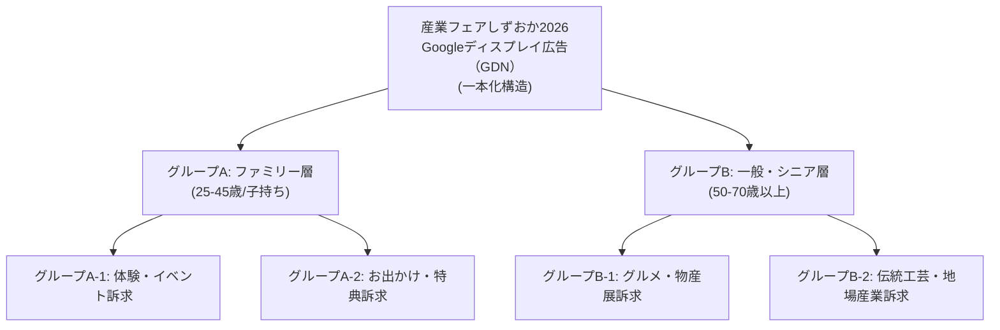

<!-- _class: title -->

# 「産業フェアしずおか2026」

# WEBプロモーション詳細統合計画・提案書

## 【主催者・クライアント説明用】

静岡市産業振興協会 / 産業フェアしずおか実行委員会 御中

---

## 1. エグゼクティブ・サマリー

### 本提案の目的

「産業フェアしずおか2026」（2026年11月28日〜29日開催）の来場者数最大化に向け、割当予算を最適配分し、静岡県内の子育て世代（25〜45歳）を中心としたターゲット層へ最も効率的にリーチするWebプロモーション詳細統合計画をご提案いたします。

### 3つの核となる戦略方針

1. **厳格なエリア・ターゲット限定配信**: 静岡市含む近隣8市町居住者に完全限定し無駄を排除
2. **インフルエンサー投稿広告 ＆ 静止画カルーセル活用**: 第三者配信（パートナーシップ広告）の共感力と静止画カルーセルで動画制作費を削減し露出最大化

---

## 2. 全体媒体選定とアプローチ構造

3つの主要デジタルプラットフォームにバランスよく配信を配置し、相互補完的なプロモーション網を構築します。

| 媒体                              | 主な役割・配信面                                                               | 期待効果・ターゲット狙い                             |
| :-------------------------------- | :----------------------------------------------------------------------------- | :--------------------------------------------------- |
| **Instagram広告**                 | フィード、ストーリーズ、発見タブ（**インフルエンサー投稿広告** ＆ カルーセル） | 子育て世代への高い共感・信頼性とビジュアル訴求       |
| **Googleディスプレイ広告（GDN）** | 地元ニュース・ポータル・天気サイト等のバナー枠 ＆ YouTube広告枠                | お出かけ・イベント関心層への広域ビジュアルアプローチ |
| **Yahoo!ディスプレイ（YDA）**     | Yahoo! JAPANトップ、LINEトークリスト、LINE NEWS                                | 地元密着層・幅広い年代層・LINEユーザーへの確実な露出 |
| **合計（3媒体統合）**             | **3大プラットフォーム統合運用**                                                | **想定総インプレッション：約296.6万回**              |

---

## 3. 配信エリア ＆ エリアロック仕様

地域プロモーションとして、遠方への無駄な配信を徹底排除し、実際に来場可能なエリアへ集中投下します。

### 配信対象エリア（静岡県内8市町限定）

- **静岡市、焼津市、藤枝市、富士市、島田市、吉田町、牧之原市、富士宮市**
- ※各広告プラットフォームの地域設定にて「**指定地域に現在居住・滞在するユーザー**」に厳格にロック

### 配信スケジュール

- **配信期間**: 11/1（日）〜 11/29（日）
  - ※インフルエンサー投稿（タイアップ＆パートナーシップ広告）は11月中旬から順次開始予定

---

## 4. オーディエンス・ターゲット設計

ターゲット層のライフスタイルと関心テーマに応じたセグメンテーションを実施します。

### セグメントA：子育てファミリー層（主ターゲット）

- **対象**: 25歳〜45歳 男女（未就学児・小学生の子どもを持つ親層）
- **関心キーワード**: 子連れお出かけ、子ども工作・体験、サンリオショー、木のおもちゃ、週末イベント
- **訴求要素**: 28日よしもと芸人ステージ（ジョイマン＆ぬまんづ）、29日ポムポムプリンスペシャルステージ（シナモロールもあそびにくるよ）、工作体験、全天候型屋内会場（暖房完備・ベビーカー置き場）

### セグメントB：一般・シニア・地場産業関心層（副ターゲット）

- **対象**: 50歳〜70代 男女（夫婦・3世代来場層）
- **関心キーワード**: 静岡グルメ、地場産業、伝統工芸展、匠の技、物産展、地酒
- **訴求要素**: 山・海・里の静岡激ウマグルメ、伝統工芸体験、地酒・特産品販売

---

## 5. Instagram公式アカウント運用計画（オーガニック運用）

子育て世代のファン化と来場意欲醸成に向け、公式アカウント（@sangyofair_shizuoka）の投稿運用を展開します。

### ① 投稿コンテンツ設計 ＆ カレンダー

- **投稿本数**: 10本

### ② 認知摩擦ゼロの「片手操作UI/UX」デザイン

- スマホを片手で閲覧する子育て世代を想定し、**1投稿1メッセージ**のシンプルな構成。
- サムネイル中央に高コントラストな大文字日本語テキストを配置し、1秒で内容が伝わる視覚レイアウトを徹底。

### ③ UGCリポスト ＆ ハッシュタグ循環

- `#産業フェアしずおか2026` `#静岡子連れお出かけ` での一般投稿・体験レポを積極的に公式リポストし、口コミ効果を創出。

---

## 6. Instagram広告戦略：インフルエンサー投稿広告 ＆ カルーセル

広告配信では、信頼性の高い「パートナーシップ広告」と「カルーセル広告」を主軸とします。

### ① インフルエンサーPR ＆ 投稿の広告利用（Metaパートナーシップ広告）

- **PRタイアップ**: 地域で影響力のある子育て・お出かけ系インフルエンサーを起用し事前PR投稿を獲得
- **第三者配信広告**: インフルエンサーのタイアップ投稿をそのまま「パートナーシップ広告」として二次利用配信し、自社広告以上の高い共感とリーチ率を獲得

### ② 自社制作・静止画カルーセル広告（1080px × 1080px）

- **追加動画制作コストゼロ化**: 正方形画像5枚スライドで動画コストを抑制し全額を広告枠へ充当
  - **1枚目**: 「入場無料！週末どこ行く？」インパクトフック
  - **2〜4枚目**: 「28日ジョイマン＆ぬまんづ / 29日ポムポムプリン＆シナモロール・工作体験・グルメ」の多角訴求
  - **5枚目**: 「日時・アクセス・特設LP案内」

---

## 7. Googleディスプレイ広告（GDN）戦略①：構造とネットワーク

Googleのディスプレイ広告枠および提携ネットワークへ配信を一本化して最適化します。

### 1キャンペーン・マルチグループ構成

- キャンペーンを分割せず、1本化されたスマートキャンペーンでGoogle AIの機械学習を最大化

### 配信ネットワーク

- **Googleディスプレイネットワーク（GDN）**: 静岡ローカルニュース、ポータル、天気予報、地域ブログ等のWebサイトバナー枠（レスポンシブバナー）
- **YouTube掲載面**: YouTube内の動画広告枠および関連ページバナー枠

---

## 8. Googleディスプレイ広告（GDN）戦略②：セグメント設定

Googleのカスタムセグメント（検索履歴）とアフィニティを組み合わせた高精度ターゲティングを行います。

### グループA（ファミリー層）の設定パラメータ

- **属性**: 子供あり（0〜12歳の親層）
- **検索キーワード**: `静岡 子連れ お出かけ`、`子ども 工作 体験`、`サンリオショー 静岡`、`ツインメッセ 家族`
- **インマーケット**: おもちゃ・ゲーム、家族向けアトラクション

### グループB（一般・シニア層）の設定パラメータ

- **属性**: 年齢 50歳以上男女
- **検索キーワード**: `静岡 グルメ イベント`、`静岡 物産展`、`伝統工芸 静岡`、`地酒 イベント 静岡`
- **アフィニティ**: フード・料理ファン、日本酒・ワインファン、伝統工芸・美術ファン

---

## 9. Yahoo!ディスプレイ広告（YDA/LINE）戦略①：LINE枠活用

LINEアプリ内の強力な配信面をカバーできるYDAの強みを活かし、幅広い層へアプローチします。

### 主要配信面

- **LINE Talk List（Smart Channel）**: LINEトーク画面最上部の最注目枠
- **LINE NEWS / LINE ウォレット**: 子育て世代・主婦層の閲覧頻度が高い配信面
- **Yahoo! JAPANトップページ・Yahoo!ニュース**: 信頼性の高いニュース面

### 配信最適化ルール

- **プレースメント除外**: 低パフォーマンスなゲームアプリ等を事前に排除
- **フリークエンシーコントロール**: 同一ユーザーへの過度な重複露出を制限（1日あたり上限設定）

---

## 10. Yahoo!ディスプレイ広告戦略②：検索・行動履歴ターゲティング

Yahoo! JAPANの豊富な検索データと行動履歴を活用したターゲティングロジック。

### サーチターゲティング（検索履歴連動）

- **ファミリー層向け検索キーワード**:
  `静岡 無料 イベント`、`静岡 週末 お出かけ 雨の日`、`スタンプラリー 静岡`、`ツインメッセ 産業フェア`
- **シニア層向け検索キーワード**:
  `静岡市 イベント 週末`、`静岡 特産品`、`工芸品 体験`、`ツインメッセ 駐車場`

### アセット構成

- **レスポンシブ（画像）**: 1200×628 / 1080×1080
- **アスペクト比最適化**: LINE面およびYahoo!トップに最適化されたトリミング対応

---

## 11. 媒体別 具体的広告文イメージ例

各広告媒体の掲載面特性とターゲット属性に最適化した広告文・キャッチコピー案です。

### 📸 Instagram広告（インフルエンサー投稿広告 ＆ カルーセル）

- **メインテキスト（本文）**:
  「【入場無料】11/28(土)・29(日) ツインメッセ静岡で開催！🎉 28日はよしもと芸人『ジョイマン＆ぬまんづ』、29日は『ポムポムプリンスペシャルステージ（シナモロールもあそびにくるよ！）』が登場✨ 職人さんに教わる木工体験や静岡グルメも大集合♪ 週末のご家族でのお出かけにぜひ！」
- **画像内テロップ**: 「28日ジョイマン＆ぬまんづ！」「29日ポムポムプリン＆シナモロール！」
- **CTAボタン**: `詳細を見る`

### 🌐 Googleディスプレイ広告（GDN）

- **見出し（短 30文字）**: `【入場無料】産業フェアしずおか2026` / `週末はツインメッセ静岡へ！`
- **見出し（長 90文字）**: `28日ジョイマン＆ぬまんづ／29日ポムポムプリン＆シナモロールステージ！体験＆グルメ満載`
- **説明文（90文字）**: `11/28・29ツインメッセ静岡！よしもと芸人ステージやポムポムプリン＆シナモロール、工作体験・静岡グルメが大集合！入場無料`

### 🔴 Yahoo!ディスプレイ広告（YDA / LINEトークリスト）

- **LINEトークリスト最上部（18文字）**: `【入場無料】ツインメッセ静岡で週末イベント！`
- **YDAタイトル（20文字）**: `28日ジョイマン/29日ポムポムプリン！`
- **YDA説明文（90文字）**: `11/28・29ツインメッセ静岡開催！28日ジョイマン＆ぬまんづ、29日ポムポムプリン＆シナモロール、工作体験、静岡グルメが大集合！家族みんなで楽しめる入場無料イベント。`

---

## 12. まとめ ＆ 主催者・振興協会様へのお願い

### 本詳細統合プランの強み

- **最大化されたリーチ効率**: インフルエンサー投稿広告の共感力と静止画カルーセルによる無駄のない運用
- **地域密着・ターゲット特化**: 静岡県内8市町・子育て世代へ確実に届くセグメンテーション
- **透明性の高いデータ検証**: GA4・各種広告レポートによる数値ベースの実績報告

### 今後のアクション・ご承認事項

1. 本詳細統合計画書への最終合意
2. インフルエンサータイアップ案および入稿クリエイティブの最終確認
