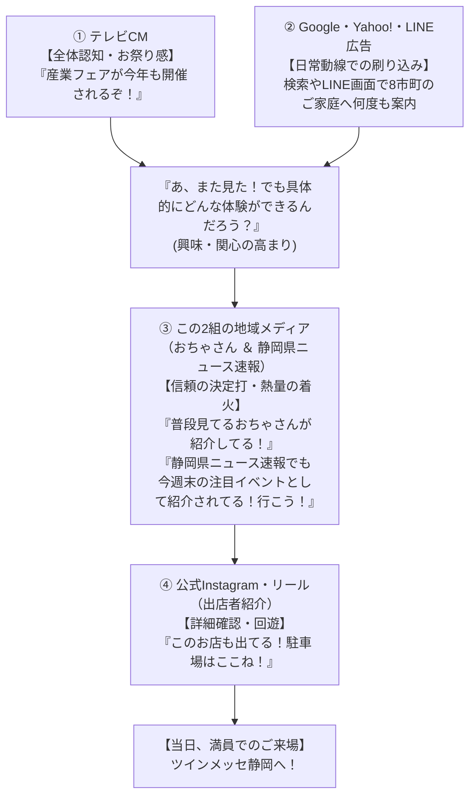
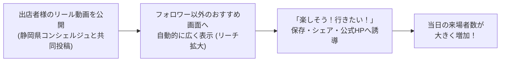
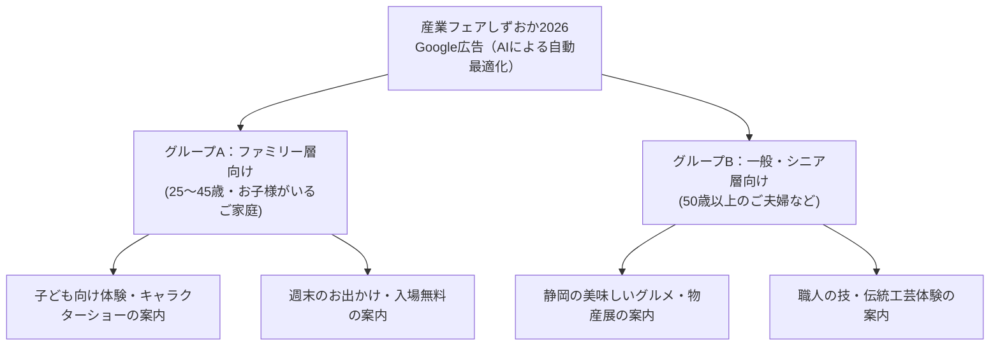
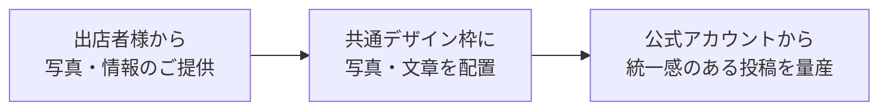

<!-- _class: title -->

# 「産業フェアしずおか2026」

# WEBプロモーション詳細統合計画・提案書

## 【主催者・クライアント説明用】

静岡市産業振興協会 / 産業フェアしずおか実行委員会 御中

---

## 1. 企画の要点（サマリー）

### 本提案の目的

「産業フェアしずおか2026」（2026年11月28日〜29日開催）の来場者数を増やすため、静岡県内の子育て世代（25〜45歳のご家族）へしっかり案内が届く効果的なWebプロモーション計画をご提案いたします。

### 3つの基本方針

1. **静岡県内8市町に限定して配信**: 市外への無駄な広告を完全になくし、実際に来場できる近隣エリアへ集中
2. **Instagramの画像スライドと人気インフルエンサーの活用**: 地元ママ・パパに人気の投稿と画像スライド（カルーセル）を活用し、親しみやすく分かりやすく発信
3. **Google・Yahoo!・LINEの3大媒体連携**: 地元ニュース、検索、LINEの画面をカバーし、見落としのない告知網を構築

---

## 2. 活用する3つの広告と役割

スマートフォンでよく見られている3大サービス（Instagram、Google、Yahoo!・LINE）を組み合わせ、地域の幅広い方へ確実にイベントをお知らせします。

| 広告の種類              | 主な掲載場所                                   | 狙い・期待できる効果                                                     | 想定表示回数        |
| :---------------------- | :--------------------------------------------- | :----------------------------------------------------------------------- | :------------------ |
| **Instagram広告**       | タイムライン、ストーリーズ、おすすめ画面       | 子育て世代のママ・パパへ、写真と口コミ（人気投稿）で魅力を直感的に伝える | **約28.3万回**      |
| **Google広告**          | 地元のニュースサイト、天気予報、YouTubeなど    | 週末のお出かけ先やイベントを探しているご家族へ、バナー画像で広く案内     | **約134.1万回**     |
| **Yahoo!・LINE広告**    | LINEのトーク画面最上部、Yahoo!トップ・ニュース | 普段からLINEやニュースをよく見る幅広い年代・地元の方へ確実にお知らせ     | **約134.1万回**     |
| **合計（3媒体の連携）** | **3大サービスを組み合わせた集中告知**          | **地域・世代を網羅し、見落としのない告知網を構築**                       | **のべ約296.6万回** |

---

## 3. 広告をお届けする地域（8市町限定）

遠くの地域への無駄な配信をなくし、実際にツインメッセ静岡へご来場いただけるエリアだけに絞り込みます。

### 配信する対象エリア（静岡県内8市町限定）

- **静岡市、焼津市、藤枝市、富士市、島田市、吉田町、牧之原市、富士宮市**
- ※各サービスの地域設定機能を使い、「**この8市町にお住まいの方・いま滞在している方**」に限定してお届けします。

### 配信スケジュール

- **配信期間**: 11月1日（日）〜 11月29日（日）
  - ※インフルエンサーによる紹介投稿と連動した広告は、イベント直前の11月中旬から順次スタートします。

---

## 4. お届けする対象（ターゲット設計）

ご来場いただきたいお客様の生活スタイルに合わせて、2つのグループに分けて案内内容を作り分けます。

### グループA：子育てファミリー層（メインの対象）

- **対象**: 25歳〜45歳の男女（未就学児・小学生のお子様がいるお父さん・お母さん）
- **広告が届く見込みの人数**: **約15.4万人 〜 18.1万人**（Instagram公式シミュレーションによる試算）
- **関心事**: 子連れでのお出かけ、工作・ものづくり体験、サンリオショー、おもちゃ、週末イベント
- **アピール内容**: 28日よしもと芸人（ジョイマン＆ぬまんづ）、29日ポムポムプリンショー（シナモロールも登場）、木工体験、雨でも安心のあたたかい屋内会場（ベビーカー置き場あり）

### グループB：一般・シニア・地場産業ファン層（サブの対象）

- **対象**: 50代〜70代の男女（ご夫婦、お孫さんと3世代で来場される方）
- **関心事**: 静岡のグルメ、地元企業・ものづくり、伝統工芸、物産展、地酒
- **アピール内容**: 山・海・里の静岡グルメ、職人さんの伝統工芸体験、地酒・特産品の販売

---

## 5. Instagram公式アカウント運用（基本10回の投稿構成）

子育て世代に「行ってみたい！」と思っていただくため、公式アカウント（@sangyofair_shizuoka）から計画的に全10回の発信を行います。

### ① 全10回の投稿スケジュール構成

| 順番  | 投稿内容                              | 本数・対象          | 狙い・掲載の工夫                                                          |
| :---- | :------------------------------------ | :------------------ | :------------------------------------------------------------------------ |
| **1** | **イベントの全体概要**                | 1本                 | プロフィールの先頭に固定し、日時・見どころを分かりやすく案内              |
| **2** | **出店者様のご紹介（ショート動画）**  | **5本**（最大15社） | 1本に2〜3社をまとめ、計5本で最大15社をリール動画で発信（※詳細は第8・9章） |
| **3** | **前日告知（11/27 金）**              | 1本                 | 「いよいよ明日開催！」の直前案内で週末のお出かけ意欲を刺激                |
| **4** | **当日リアルタイム発信（11/28・29）** | 2本                 | 会場の熱気や混雑状況、ステージの様子をリアルタイムでお届け                |
| **5** | **開催報告・振り返り（12/2 水）**     | 1本                 | 盛況な様子や感謝を伝え、出店者様の実績PRと次回へ繋げる                    |

> ※上記「2. 出店者様のご紹介」は、1本のショート動画（リール）に2〜3社をテーマ別にまとめ、**全5本の投稿で合計「最大15社」**をテンポよくご紹介します。出店者様の不公平感をなくし、参加意欲を高める具体的な企画と依頼内容は、続く第8章・第9章にて詳しく記載しています。

### ② 忙しいママ・パパでも伝わりやすいデザインの工夫（検討案）

> ※具体的なデザインや見せ方は**確定ではなく、主催者様のご意向やブース内容に合わせて柔軟にご相談・調整**いたします。

- **視認性の重視**: スマートフォンを片手で見ている子育て世代を意識し、1つの投稿で情報を詰め込みすぎず、パッと見て要点が伝わりやすい見せ方を工夫します。
- **分かりやすい文字・ビジュアル配置**: 写真や動画の邪魔にならず、一目でイベントの魅力が伝わる文字サイズやレイアウトを検討します。
- **ハッシュタグ等の活用**: 「#産業フェアしずおか2026」「#静岡子連れお出かけ」などを案内し、来場者の感想投稿も広げます。

---

## 6. 全体プロモーション連携 ＆ 起用メディアの選定理由（この2組でしかできないこと）

本施策では、テレビCMやWEB広告（Google・Yahoo!・LINE）と、地域で絶大な影響力を持つInstagramメディアを連携させ、最大の相乗効果を生み出します。

### ① テレビCM・WEB広告・地域メディアの4層連携（相乗効果）

テレビCM、WEB広告、公式SNS、起用メディアの4つがバラバラに動くのではなく、**1本のストーリーとして来場者の心理を動かします**。

- **CMとWEB広告で「知っている」状態を作り、この2組が「行く！」という決定打を与える**:
  テレビCMやLINE・ネット検索で名前を見聞きして「気になっている」県民のスマホに、普段から一番信頼しているメディアの投稿が流れてくることで、**「単なる広告」から「自分ごと（本当に行くべき週末の予定）」へと一気に変わります**。

---

### ② 「この2組でしかできないこと」（他では代わりがきかない理由）

「なぜ他のインフルエンサーではなく、この2組でなければならないのか？」という明確な選定理由です。

#### 1. 「静岡県コンシェルジュ」おちゃ さんでしかできないこと

> **単なる有名人ではなく、県民の「週末お出かけインフラ」になっている唯一の存在**

- **他との違い**:
  静岡県内にもカフェ巡り、ラーメン、美容、モデルなどのインフルエンサーはいますが、彼らは個人の趣味嗜好に特化しています。
- **おちゃさんだけの価値**:
  おちゃさんは**「静岡県全域のファミリーお出かけ・週末イベント」に特化して信頼を積み上げた県内唯一・最大（17.3万人）の地域メディア**です。
- **決定的な差（来場転換力）**:
  フォロワーは暇つぶしで見ているのではなく、「今週末どこ行こう？」と**“実際に行く気満々の状態”**で見ています。だからこそ、他のインフルエンサーとは**「実際の来場につながる行動力」が桁違い**です。

#### 2. 「静岡県ニュース速報」でしかできないこと

> **イベントPRが得意な「地域ニュース速報」として、開催の話題性を一気に広げる**

- **他との違い**:
  個人の主観的なレビューではなく、「静岡県内の最新ニュース・話題・イベント情報」を分かりやすくスピーディに伝える地域メディアです。
- **静岡県ニュース速報だけの価値**:
  AIを活用した制作手法により、運用数か月で1万回再生を連発するなど**イベントPRで高い拡散実績**を持っています。写真とテキストの情報さえあれば、事務局に余計な負担をかけることなく、高品質で目を引くPR動画を素早く制作・発信できます。
- **決定的な差（速報性とニュース価値）**:
  おちゃさんの「体験レビュー」とは異なる**「【速報】今週末、ツインメッセ静岡で最大級の産業フェア開催！」というニュース形式の切り口**で、幅広い世代の県民へタイムリーに注目を促します。

#### 3. この2組のタッグでしかできないこと（体験の深掘り × ニュース速報の完全補完）

- **おちゃさん**が「楽しそう！美味しい！子どもと行きたい！」という**【体験・感情】**を刺激する。
- **静岡県ニュース速報**が「今週末こんなビッグイベントがあるんだ！」という**【話題性・速報性】**で広く注意を引く。
- この2組が揃うことで、**「お出かけ先を探しているファミリー層」と「地域の最新情報・イベントを追う幅広い県民層」の両方に確実に届く**完璧な布陣が完成します。

#### 4. 担当者が安心できる「安全・確実な事前審査体制」

- 発信する画像・動画・テキストは、**すべて事前に内容を確認・監修した上で投稿（公開）**します。公的催事としての信頼性・品位を100%維持したまま、安全にプロモーションを実施できます。

---

### ③ 起用メディア2組の詳細と投稿内容（合計3回投稿）

#### 1. 「静岡県コンシェルジュ」おちゃ さん ― 計2回投稿

- **アカウント名**: `@shizuoka_info`（[Instagramはこちら](https://www.instagram.com/shizuoka_info/?hl=ja)）
- **フォロワー数**: **静岡県内最大の地域メディアアカウント**
- **読者層**: 若年層〜主婦層まで幅広く支持。以前は「なつデートプランナー」として活動しており、Instagramユーザーからは県内で広く認知されています。
- **実績**: 100万回再生を連発。動画の特徴として「流行」を押さえており、平均20万閲覧数を獲得しています。

**投稿内容（2回）**

| 回数      | 形式                 | 投稿時期の目安                           | 内容                                                               |
| :-------- | :------------------- | :--------------------------------------- | :----------------------------------------------------------------- |
| **1回目** | 写真投稿（フィード） | （※日程調整中／イベント約2週間前を想定） | 会場の全体マップや見どころを分かりやすくまとめた画像投稿           |
| **2回目** | 動画投稿（リール）   | （※日程調整中／開催直前週を想定）        | イベントの楽しさや体験コーナーの魅力をテンポよく伝えるショート動画 |

#### 2. 「静岡県ニュース速報」― 計1回投稿

- **アカウント名**: `@shizuoka_news_ai`（[Instagramはこちら](https://www.instagram.com/shizuoka_news_ai/?hl=ja)）
- **特徴**: 静岡県内初となるAIを活用した情報発信アカウント。地域の最新ニュースやイベント情報を発信し、すでに高い認知度を獲得しています。
- **実績**: 運用から数か月で1万回再生を連発。イベントPRも得意としており、写真とテキストの情報をご提供いただければ、スムーズにPRを実施できます。
- **産業フェアとの相性**: 幅広い世代の県民が注目する地域ニュースメディアであり、大規模イベントの開催速報と非常に相性が良く、タイムリーな情報拡散が期待できます。

**投稿内容（1回）**

| 回数      | 形式                       | 投稿時期の目安                    | 内容                                                                 |
| :-------- | :------------------------- | :-------------------------------- | :------------------------------------------------------------------- |
| **1回目** | 投稿（写真＋テキスト形式） | （※日程調整中／開催直前週を想定） | 産業フェアの全体概要や見どころをニュース速報の視点で分かりやすく紹介 |

---

## 7. 地域メディア連携でリーチと来場が確実に伸びる理由

テレビCMやWEB広告と連動し、2組・合計3回の投稿を行うことで、公式アカウント単独では届かない大きな反響を生み出します。

### ① 「身近なおすすめ」として受け入れられる高い信頼感

- 「企業・主催者からの一方的な宣伝」は流されがちですが、普段から「週末のお出かけ情報」として信頼されているメディアの言葉を介することで、**「遠くの広告」ではなく「身近なおすすめ」**として自然に受け入れられます。

### ② 2組の連携で「ファミリー」と「幅広い県民・情報関心層」を両方カバー

- **おちゃさん（静岡県コンシェルジュ）**: 静岡県内のファミリー層・主婦層へ直接届く
- **静岡県ニュース速報**: 地域の身近な話題や最新イベントを追う幅広い県民へ届く
- **2組合わせることで**、産業フェアの多彩な魅力を余すことなく県内全域へ広げられます。

### ③ 「共同投稿（コラボ機能）」で既存フォロワーに加え17万人以上へ届く

- 公式アカウントの投稿をインフルエンサーと「共同投稿」にすることで、**公式アカウントの既存フォロワーへの案内に留まらず、インフルエンサーの持つ17万人以上の読者全員の画面にも同時に表示**されます。公式アカウント単独の枠を大きく超えて、一気に県内全域へ情報を行き渡らせることができます。

### ④ 事前チェック体制による安心・確実な情報発信

- 投稿する画像・動画・テキストは、**事前に事務局が内容をチェック・承認してから公開**します。公的催事としての信頼性を損なうことなく、安心して実施いただけます。

### ⑤ 発見 ➔ 来場 ➔ 口コミ拡散の好循環

- テレビCMやWEB広告、インスタで発見（認知） ➔ 「行きたい！」と保存・シェア ➔ 特設ホームページで詳細を確認 ➔ 当日ご家族で来場 ➔ 会場の写真を投稿して友達へ広がる、という自然な連鎖を生み出します。

---

## 8. 出店者様ご紹介（5本投稿・最大15社）：リール動画でリーチを伸ばし、来場者数を増やす

本章の内容は、**第5章の基本投稿スケジュール（全10回）の「2. 出店者様のご紹介（5本）」を具現化する具体的な企画**です。

1本のショート動画（リール）の中に2〜3社の出店店舗をテーマ別（例：「体験・ワークショップ3選」「静岡グルメおすすめ3選」等）にまとめ、**全5本の投稿で合計「最大15社」**をテンポよくご紹介します。

特定のお店だけを限定するのではなく、動画素材をご提供いただけた出店者様から順次、最大15社を広く公式PRすることで、出店者様の積極的な参加を促し、不公平感を解消します。

静止画ではなく「ショート動画（リール）」を採用する最大の目的は、**まだ産業フェアを知らない県内の方へ広く情報を届け（リーチ拡大）、当日の来場者数を確実に増やすこと**にあります。

### ① なぜリールなのか？（リーチが伸びる＝来場者が増える理由）

- **フォロワー以外へ自動で届く唯一の形式**:
  通常の写真投稿は「すでにフォローしてくれている人」を中心に表示されますが、**リール動画は、InstagramのAIが「静岡近隣のお出かけや子育てに関心がある人」を自動で見つけ出し、フォロワー以外の画面（おすすめ・発見画面）へどんどん表示**します。
- **リーチ拡大が来場者数増に直結**:
  「イベントを知っている人」の母数（リーチ数）が1万人から10万人、20万人へと増えれば、それに比例して「行ってみよう」と考えるご家族の絶対数も確実に増加します。
- **インフルエンサーとの共同投稿でさらに倍増**:
  静岡県コンシェルジュ（17.3万人フォロワー）との共同投稿にすることで、公開直後から大きな視聴数が生まれ、Instagram側のおすすめ表示もさらに加速します。

### ② 認知から来場へ繋がる5つのステップ

| ステップ                | ユーザーの動き                                       | 期待できる効果                       |
| :---------------------- | :--------------------------------------------------- | :----------------------------------- |
| **1. リール動画の表示** | スマホの画面に、魅力的なお店や職人の手元動画が流れる | 「なんだろう？」と目を留める（認知） |
| **2. 共感・興味**       | 「こんな体験ができるんだ！」「美味しそう！」         | 「週末ここ行きたい」と感じる         |
| **3. 保存・シェア**     | 投稿を保存したり、家族・ママ友にLINEやインスタで共有 | 行き先候補として記憶に残る（検討）   |
| **4. 詳細の確認**       | プロフィールのリンクから公式ホームページへアクセス   | 日時・アクセス・無料駐車場を確認     |
| **5. 当日ご来場**       | 11/28(土)・29(日)にご家族でツインメッセ静岡へ来場    | **来場者数の達成！**                 |

---

## 9. 出店者様への動画撮影・素材提供のお願い（依頼内容の詳細）

出店者様にご負担をかけず、かつ誰が撮影しても魅力的なプロ品質の動画に仕上げるための「依頼スキーム」を設計しています。

### ① 事務局と出店者様の役割分担（負担の最小化）

- **現地取材・撮影は行いません**: 出店者様のご負担や日程調整の手間をなくすため、現地取材は実施しません。
- **スマホで撮って送るだけ**: 出店者様には、お手持ちのスマートフォンで短い動画をいくつか撮影し、簡単なアンケートと一緒にお送りいただきます。
- **編集・加工はすべて事務局にお任せ**: 文字入れ、音楽（BGM）、カット割り、テンポ調整はプロの運用チームが担当し、洗練された公式PR動画に仕上げます。

### ② 出店者様にお願いする動画の基本仕様

| 項目              | 内容・指定                                            | 理由・ポイント                                 |
| :---------------- | :---------------------------------------------------- | :--------------------------------------------- |
| **撮影の向き**    | **スマートフォン縦向き（9:16 縦画面）**               | リールは縦画面いっぱいに表示されるため         |
| **カット数**      | **10カット程度**（難しければ5カット以上）             | 素材が多いほど編集の質が上がり、見応えが出ます |
| **1カットの長さ** | **5秒〜10秒程度**                                     | 手ブレを防ぎ、テンポよく切り替えるため         |
| **撮影環境**      | できるだけ明るい場所 / カメラレンズを拭く             | 映像が鮮明になり、見やすさが大幅アップします   |
| **編集の有無**    | **編集・文字入れ・BGMは一切不要（無加工の元データ）** | 事務局で統一感のあるプロの編集を行うため       |

### ③ スマホで簡単！失敗しない「4つの撮影ルール」

1. **カメラを固定して撮る（手ブレ防止）**:
   カメラを動かしたりズームしたりせず、構図を決めたら「5〜10秒間じっと固定」して撮影します。
2. **「全体」と「アップ」の両方を撮る**:
   同じ商品や作業でも、「お店全体の引きの映像」と「職人の手元や商品のアップ映像」の両方があると、動画のメリハリが劇的に向上します。
3. **現場の音（環境音）はそのままでOK**:
   調理の音、木工の作業音、賑わいの声など、リアルな現場の音は動画の大切な魅力になります（※スタッフ同士の私語だけ入らないようご注意いただきます）。
4. **無加工のまま送るだけ**:
   フィルター加工や文字入れはせず、スマホで撮ったそのままのデータを提出していただきます。

### ④ 撮影対象の具体例（出店者様へ案内する撮影イメージ）

出店者様が「何を撮ればいいか」迷わないよう、具体的な撮影例を案内します。

- **お店・会社の顔**: 外観、看板、入口、のれん
- **空間・雰囲気**: 店内全体の様子、ブースのレイアウト
- **商品・サービス**: 販売するイチ押し商品、体験キット
- **職人・製造の様子**: 職人さんの手元作業、作っている工程のアップ（非常に人気が出やすいシーンです）
- **スタッフの様子**: 笑顔での接客風景、作業している真剣な表情

### ⑤ 出店者様へお伺いする情報（確認シート案）

動画と一緒に、以下の簡単なアンケート（テキスト情報）を提出していただきます。

1. **基本情報**: 店舗名・事業者名、所在地、Instagramアカウント、ホームページURL、創業年
2. **お店の魅力・概要**: 事業コンセプト（どのようなお店・会社か）、主な商品・サービス、強みやこだわり
3. **イチ押しの商品・体験**: 一番アピールしたい商品・体験名、価格、こだわりのポイント、おすすめしたいお客様層（ご家族連れなど）、来場者へのメッセージ

### ⑥ 制作イメージと参考動画

店舗全体をカメラで流し撮りするのではなく、「固定された短いカット（5〜10秒）」をテンポよくつなぎ合わせることで、誰でもクオリティの高いおしゃれなリール動画が完成します。

- **参考制作イメージ（Instagramリール）**:
  [参考リール動画はこちら](https://www.instagram.com/reel/DakUE65sil5/)
  （※短い固定カットを音楽に合わせてテンポよくつなぐ構成イメージ）

### ⑦ ご案内とご提出の流れ

出店者様向けには、スマートフォンから写真・動画を直接アップロードできる専用の「簡単入力フォーム」をご案内します。出店者様が余裕を持って撮影できるよう、出店確定後すみやかにご案内シートを配布するスケジュールを想定しています。

---

## 10. Instagram広告戦略①：人気投稿の活用 ＆ 画像スライド

反響の大きい「画像スライド（カルーセル広告）」と「インフルエンサーの投稿」を活用します。

### ① 地元で人気のインフルエンサー投稿をそのまま広告に活用

- **事前の体験・紹介**: 静岡県内で子育て・お出かけ情報を発信している人気アカウントにイベントを紹介してもらいます。
- **安心感のある広告配信**: 主催者側からの一方的な広告ではなく、普段から親しまれているインフルエンサーの投稿として配信されるため、読者に信頼されやすく、高い関心を集められます。

### ② 自社で作成する画像スライド広告（正方形・5枚スライド）

- **画像スライドで多角的な魅力を発信**: 正方形の画像をめくって見るスライド形式を採用し、会場の多彩な見どころを分かりやすくお届けします。
  - **1枚目**: 「入場無料！週末どこ行く？」と目を引く表紙
  - **2〜4枚目**: 「28日よしもと芸人 / 29日ポムポムプリン＆シナモロール・木工体験・グルメ」の魅力を写真で紹介　※審査によっては、著名人の画像NGの可能性あり
  - **5枚目**: 「開催日時・アクセス方法・公式ホームページのご案内」

### ③ 広告配信に向けた事前準備・ご協力のお願い

Instagram広告（およびインフルエンサー投稿の広告配信）をスムーズに実施するため、以下の設定・操作へのご協力をお願いいたします。

- **公式Instagramアカウントの共有**: 広告配信用の連携・管理設定を行うため、公式アカウントの共有（または連携作業）をお願いいたします。
- **Facebookページ等の操作・設定**: 広告配信システムの仕組み上、連携するFacebookページなどの操作や権限付与をお願いする場合がございます。
- ※実際の設定や操作手順につきましては、弊社にて丁寧にサポート・ご案内いたします。ご協力のほど、よろしくお願いいたします。

---

## 11. Instagram広告戦略②：配信対象の詳細設定と見込み人数

Instagram（Meta）の公式管理画面にて実際に試算・検証済みの、確実な配信設定と見込み人数です。

### 配信対象の詳細設定（関心・興味の絞り込み）

| 項目               | 設定内容（どのような人にお届けするか）                                                                                                  |
| :----------------- | :-------------------------------------------------------------------------------------------------------------------------------------- |
| **お届けする地域** | **静岡県内8市町限定（お住まいの方・滞在している方）**（静岡市、焼津市、藤枝市、富士市、島田市、吉田町、牧之原市、富士宮市）             |
| **年齢・性別**     | **25歳〜45歳の男女**（お出かけ先を決めるお父さん・お母さん世代）                                                                        |
| **家族・子育て**   | **子育て（育児・子ども）**に関心がある方                                                                                                |
| **お買い物・趣味** | **おもちゃ（玩具）**に関心がある方                                                                                                      |
| **その他の関心事** | **工作・DIYのアイデア** / **サンリオ** / **ハローキティ** / **教育・学習** / **お祭り・イベント** / **子ども・子育て** / **木工・工芸** |

### 広告が届く見込みの人数（Instagram公式の試算結果）

- **対象となる人数**: **約154,600人 〜 181,900人**
- ※8市町にお住まいの25〜45歳で、子育てやイベントに関心がある方に絞っても、**約15.5万〜18.2万人**の十分な人数がいます。ターゲット層へ期間中に複数回しっかり案内が届く、ちょうど良い規模感です。

---

## 12. Google広告戦略①：掲載場所と配信の仕組み

世界最大手のGoogleの仕組みを使い、地元のニュースサイトやブログ、YouTubeの画面へ案内を表示します。

### 1つのまとまりで無駄なく賢く配信

- 配信設定を細かく分けすぎず、1つにまとめることで、Googleの最新AIが「いまイベントに興味を持ってくれそうな人」を自動で見つけ出して効率よく案内を表示します。

### 掲載される主な場所

- **ウェブサイトの広告枠**: 静岡の地元ニュース、天気予報サイト、地域情報ブログなどのバナー枠
- **YouTubeの画面**: YouTubeで動画を見ているときの画面や、動画の合間の案内枠

---

## 13. Google広告戦略②：関心に合わせた配信設定

Googleで普段検索している言葉や、よく見ているウェブサイトの好みに合わせて案内をお届けします。

### グループA（ファミリー層）の設定内容

- **ご家族の状況**: 0〜12歳のお子様がいる親御さん
- **最近検索した言葉**: 「静岡 子連れ お出かけ」「子ども 工作 体験」「サンリオ 静岡」「ツインメッセ 駐車場」など
- **関心が高い分野**: おもちゃ、ゲーム、家族向けテーマパーク・レジャー施設

### グループB（一般・シニア層）の設定内容

- **年齢**: 50歳以上の男女
- **最近検索した言葉**: 「静岡 グルメ イベント」「静岡 物産展」「伝統工芸 静岡」「静岡 地酒」など
- **関心が高い分野**: 料理・ご当地グルメ、日本酒・ワイン、伝統工芸・美術品

---

## 14. Yahoo!・LINE広告戦略①：LINE画面の活用

日本で最も多くの人が毎日使っている「LINE」と「Yahoo! JAPAN」の画面にお知らせを表示します。

### 掲載される主な場所

- **LINEのトーク一覧の最上部**: 家族や友だちとのメッセージを開くとき、一番目立つ一番上の枠
- **LINE NEWS・ウォレット画面**: 主婦層や若い世代が日常的にチェックするニュース画面
- **Yahoo! JAPANのトップページ・ニュース**: 信頼性が高く、幅広い年代が毎日見る画面

### 無駄な配信を防ぐための工夫

- **不適切なアプリの除外**: ゲームアプリなど効果の出にくい配信先はあらかじめカットし、関心の高い場所だけに絞って案内を表示します。
- **しつこく出さない設定**: 同じ人に1日に何十回も出ないよう、適切な回数（1日数回まで）に上限を設定します。

---

## 15. Yahoo!・LINE広告戦略②：検索キーワード連動

Yahoo!でイベントや静岡に関する言葉を調べた人へ、タイミングよく案内を表示します。

### 検索キーワードに合わせたお届け

- **ファミリー層向け（検索した言葉）**:
  「静岡 無料 イベント」「静岡 週末 お出かけ 雨の日」「スタンプラリー 静岡」「ツインメッセ 産業フェア」など
- **シニア層向け（検索した言葉）**:
  「静岡市 イベント 週末」「静岡 特産品」「工芸品 体験」「ツインメッセ 駐車場」など

### 画面に合わせた画像サイズ

- スマートフォンやパソコンの画面に合わせて、一番見やすい形で自動的にトリミング（最適な大きさで表示）されます。

---

## 16. 広告で表示する文章のイメージ案

それぞれの画面の広さや、見てくださる方の好みに合わせたメッセージ案です。

### 📸 Instagram広告（インフルエンサー投稿・画像スライド）

- **紹介文章（本文）**:
  「【入場無料】11/28(土)・29(日) ツインメッセ静岡で開催！🎉 28日はよしもと芸人『ジョイマン＆ぬまんづ』、29日は『ポムポムプリンスペシャルステージ（シナモロールもあそびにくるよ！）』が登場✨ 職人さんに教わる木工体験や静岡グルメも大集合♪ 週末のご家族でのお出かけにぜひ！」
- **画像の中の文字**: 「28日ジョイマン＆ぬまんづ！」「29日ポムポムプリン＆シナモロール！」
- **ボタンの文字**: `詳細を見る`

### 🌐 Google広告（バナー表示）

- **短い見出し（全角15文字以内）**: `【入場無料】産業フェアしずおか` / `週末はツインメッセ静岡へ！`
- **長い見出し（全角45文字以内）**: `28日よしもと芸人／29日ポムポムプリン登場！体験＆グルメ満載`
- **説明の文章（全角45文字以内）**: `11/28・29ツインメッセ静岡！ステージや工作体験、静岡グルメが大集合！入場無料`

### 🔴 Yahoo!・LINE広告（トーク画面・ニュース）

- **LINEトーク画面の最上部（全角18文字以内）**: `【入場無料】ツインメッセ静岡イベント！`
- **Yahoo!のタイトル（全角20文字以内）**: `28日ジョイマン／29日プリン登場！`
- **Yahoo!の説明文章（全角44文字以内）**: `11/28・29ツインメッセ静岡！工作体験や静岡グルメ、豪華ステージが大集合！入場無料`

---

## 17. 【追加オプション案】出店者様紹介「テンプレート投稿」の展開

> ※こちらは**決定事項ではなく、公式アカウントの投稿数・露出ボリュームをさらに増やしたい場合の【選択肢（オプション案）】**です。必ず実施するものではなく、ご要望に応じて検討いたします。

リール動画（最大15社）の基本投稿に加えて、より多くの出店者様を公平・魅力的にご紹介するための追加投稿フォーマットです。動画の撮影が難しい出店者様でも、静止画とテキストで手軽に紹介できます。

### ① 1つのデザイン枠で手軽に量産する仕組み

- 出店者様からご提供いただいた写真と情報をもとに、**統一感のある1つのデザインテンプレート**を用意します。
- 社名・写真・紹介文を差し替えてテンポよく投稿していくことで、多くの出店者様を次々にご紹介できます。

### ② テンプレート投稿のメリット

- **多くの出店者様をPR可能**: 動画が出せない店舗も含め、ご希望される出店者様を広く公平に紹介できます。
- **アカウントの統一感と見やすさ**: 整ったデザインが並ぶことで、公式アカウントの信頼性が高まります。
- **出店者様ご自身による拡散**: 「公式で紹介されました！」と出店者様自身が自分のSNSでシェアしやすくなり、さらに情報が広がります。

---

## 18. まとめ ＆ 今後の進め方

### 本計画の3つの強み

- **高い情報伝達力**: テレビCM・WEB広告と地域メディア（2組）の連携により、子育て世代へイベントの魅力をダイレクトにお届け
- **地域密着・確実なお届け**: 静岡県内8市町の子育て世代（約15.5万〜18.2万人）へ、期間中しっかりと複数回お届け
- **分かりやすい結果のご報告**: アクセス解析や広告レポートを用いて、「何回表示され、何人が見に来たか」を明確にご報告

### 今後のお願い・ご確認事項

1. 本計画内容についてのご確認・ご了承
2. 起用メディア2組（静岡県コンシェルジュ様、静岡県ニュース速報様）の投稿スケジュールおよび広告連携の最終確認
3. 出店者様向けのご案内（撮影要綱・申請フォーム・写真提供依頼）の確定と配布スケジュールのご相談
4. **Instagram広告配信に伴う連携のご協力**（公式アカウントの共有、およびFacebookページ等の操作・権限付与のお願い）
