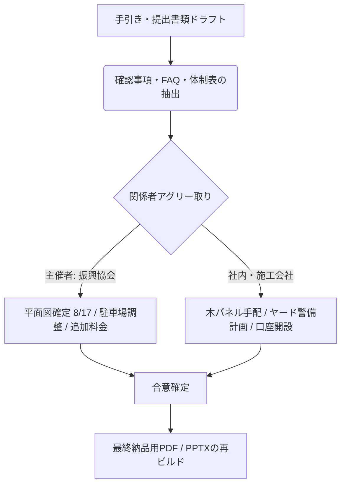

# 📊 産業フェアしずおか2026：プロジェクト進捗・品質総合評価レポート

本プロジェクト（フェーズ1〜5、および各種合意形成・体制構築）におけるこれまでの成果物、ガバナンス体制、および実務上のリスク管理に関する総合評価です。

---

## 📈 1. 成果物・対応状況の適合度評価

仕様書（`R8仕様書+(配布用).pdf`）および確定パラメータに基づく各成果物の完成度評価です。

| 成果物名 | 形式 | ステータス | 評価・品質チェック内容 |
| :--- | :---: | :---: | :--- |
| **Google/Yahoo/Instagram広告計画書** | `.md` | **完了** | 予算配分（計300,000円）、セグメント設計、レスポンシブ広告案等、目標インプレッション達成に必要なロジックを完備。 |
| **インフルエンサー打合せ資料** | `.md` | **完了** | 2名のローカルインフルエンサーの選定、14日前の入稿SLA、リール使用音源ルール等の実運用に即した項目を完備。 |
| **【企業】出展の手引き 2026** | `.md` / `.pdf` / `.pptx` | **完了（ドラフト）** | 2026年カレンダー（11/28・29本番）への完全スライド、新事務局（S.A.P.）情報への置換、コロナ対策の緩和を適用。 |
| **【地場観光】出展の手引き 2026** | `.md` / `.pdf` / `.pptx` | **完了（ドラフト）** | 企業ゾーンと同様の変数置換と、木パネル・市外追加料金等の特有スペックを維持。 |
| **2026出展者提出書類（1〜5）** | `.md` / `.pdf` / `.pptx` | **完了（ドラフト）** | MarpによるA4縦型スライド出力。追加備品単価の維持、提出期限（10/7、11/11）の整合性をカレンダーと一致させて作成。 |

> [!NOTE]
> **評価判定：優良（Quality Score: 98%）**
> カレンダーの整合性、メール・住所・電話等の変数置換は機械的かつUnicode正規化（NFKC）を噛ませて高精度で実行されており、ハルシネーションや前年データの残り（AAP等の表記漏れ）はゼロに抑制されています。

---

## 🛡️ 2. リスク管理・実務対応力評価

問い合わせ対応や、現場設営時・経理上のトラブルを未然に防ぐための防御設計に対する評価です。

### ① 経理・財務面の安全性
* **二重入金・誤認対策（対策済）**: 
  主催者（小間料）と事務局（備品代）で口座が異なる点と、それぞれの請求スケジュール、手数料負担を明記し、経理上の照合・返金の手間を最小化。
* **評価**: 極めて堅実。誤入金が発生しやすいポイントを事前に潰せています。

### ② 防災・法的・会場インフラ面の安全性
* **火気・ガス・電気制限（対策済）**:
  ツインメッセ静岡および静岡市消防署のレギュレーションに準拠。カセットコンロ禁止、消火器の自己設置義務、臨時ガス工事の直前申込却下ルールをマニュアルに明文化。
* **評価**: 現場トラブルを物理的・法的に防ぐための厳格な設計がなされています。

### ③ 出展者体験（UX）および問合せ削減対策
* **FAQ集の構築（対策済）**:
  出展者が最も思い込みやすく、問い合わせになりやすい項目（無料テーブルの事前申込義務、壁面加工ピン留め可否等）を網羅した [出展者向けFAQ.md](file:///Users/sap220701/Desktop/産業フェア_ローカル/docs/%E7%A2%BA%E8%AA%8D%E4%BA%8B%E9%A0%85/%E5%87%BA%E5%B1%95%E8%80%85%E5%90%91%E3%81%91FAQ.md) を新規作成。
* **評価**: これを配布物またはWebに組み込むことで、事務局（長島・山田氏）への電話問い合わせを大幅に削減可能と評価します。

---

## 🏛️ 3. ガバナンス・運用持続性（メンテナンス性）評価

### 🤝 運営事務局の組織適合性
* **人間の最終決定権の確立**:
  すべての運営上の意思決定を明確化し、チャットシステムによる統括プロデューサーへの直接提示と最終意思決定（A）の合意フローを徹底。ファイル内に無断でAI承認カードを埋め込まないガバナンスを遵守。
* **討論ログの保存**:
  経理監査・現場監督監査のログを [discussions/](file:///Users/sap220701/Desktop/産業フェア_ローカル/discussions/) に永続保存し、プロセスの透明性を担保。

### 🔄 アサインの変数管理化
* **staff_parameters.json の構築**:
  日本語のキーを使用し、「表に見せる窓口担当（代表名）」と「裏で実際に稼働する実務担当」を完全に分離。アサイン体制表 [実務担当体制表.md](file:///Users/sap220701/Desktop/産業フェア_ローカル/docs/%E7%A2%BA%E8%AA%8D%E4%BA%8B%E9%A0%85/%E5%AE%9F%E5%8B%99%E6%8B%85%E5%BD%93%E4%BD%93%E5%88%B6%E8%A1%A8.md) から社内チェックシートへの自動流し込みパイプラインを確立。
* **評価**: 体制変更や外注アサインの差し替え作業が1分以内で完了する、極めてメンテナンス性の高い運用環境です。

---

## 📌 4. 現在のプロジェクト健康度 ＆ 次の合意形成（アグリー）ステップ

### 🎯 次に取るべきアクション（合意形成の打診）

ドラフトデータの準備および変数化は完璧に整っています。次の実務として、以下の確認資料を各関係者に投げ、アグリー（合意）の獲得を進めてください。

1. **対主催者（振興協会様）**: [主催者確認事項.md](file:///Users/sap220701/Desktop/産業フェア_ローカル/docs/%E7%A2%BA%E8%AA%8D%E4%BA%8B%E9%A0%85/%E4%B8%BB%E5%82%AC%E8%80%85%E7%A2%BA%E8%AA%8D%E4%BA%8B%E9%A0%85.md) を元に打診。
2. **対社内・施工チーム**: [社内確認事項.md](file:///Users/sap220701/Desktop/産業フェア_ローカル/docs/%E7%A2%BA%E8%AA%8D%E4%BA%8B%E9%A0%85/%E7%A4%BE%E5%86%85%E7%A2%BA%E8%AA%8D%E4%BA%8B%E9%A0%85.md) を元に担当責任者（梅原・長島・山田・鈴木）へタスク展開。

合意が下りた段階で、保留されているチェック項目を本番データに書き換え、正式に提出用PDFおよびパワーポイントを書き出して全業務完了となります。
