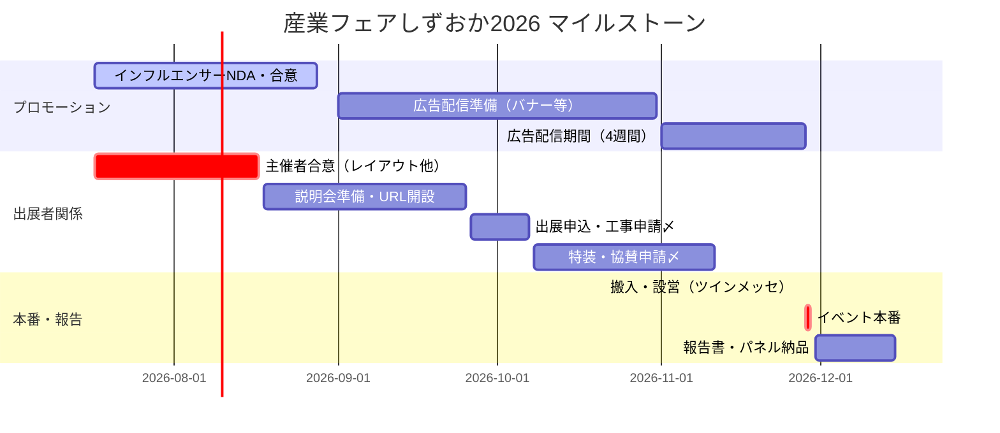

<!-- _class: title -->

# 📅 産業フェアしずおか2026：全体マイルストーン ＆ のびのびワークライフバランス計画書

---

## 🏛️ 1. のびのびハッピーワーク（残業禁止）のための3大原則

本プロジェクトでは、無理な深夜残業や突発的な手戻りによる精神的疲労を徹底的に排除するため、以下のガバナンスを適用します。

1. **【2週間バッファ原則（前倒し進行）】**
   すべての提出物、クリエイティブ、フォーム開設などの「納品デッドライン」に対し、社内目標（マイルストーン）は**原則2週間前**に設定します。他の仕事が飛び込んできても、慌てずに対処できる余白を常に維持します。
2. **【一方向レビューの徹底（無限ループ防止）】**
   最高憲法（v1.8.3）に基づき、レビューは「実務AI ➔ ペルソナ ➔ 監査役 ➔ トモさん（最終決裁）」の一方向のみとします。差し戻しは具体的な修正指示を添えて1回のみとし、同じ議論を何度も繰り返す不毛な残業を禁止します。
3. **【インフルエンサー進行の現実化】**
   撮影が10月中旬〜11月上旬に行われるため、タイアップ投稿開始（11/9）に対する初稿確認スケジュールを「14営業日前」から「**7営業日前**」へと現実的に緩和します。これにより、インフルエンサーおよび実務担当（山田）の深夜に及ぶ編集・確認作業を防ぎます。

---

## 📅 2. 全体マイルストーン＆スケジュール（2026年）

2026年度の暦（8/21=金、11/28・29=土日）に完全準拠したスケジュールです。

### 🟩 7月〜8月：土台づくりと外堀の合意（ゆったり期）
* **【8月7日（金）】インフルエンサーNDA（秘密保持契約）締結**
  * 実務：契約書締結。
* **【8月17日（月）】主催者（振興協会・静岡市）合意期限（★重要マイルストーン）**
  * 実務: 最新レイアウト図（仮）、総合庁舎駐車場規約、地場観光追加料金を確定。
  * **ゆとり対策**: お盆休み（8/13〜16）を挟むため、主催者への打診は8月3日の週に完了させ、休み明けに即回収できるようにします。
* **【8月28日（金）】インフルエンサー構成・台本合意**
  * 実務: キックオフを経て、投稿の構成イメージをアサイン会社と合意。

### 🟦 9月：説明会に向けたツール開設（パタパタ期）
* **【9月11日（金）】出展者向けGoogleフォーム開設（山田）**
  * 実務: 9/25説明会に間に合わせるため、2週間前にフォームを開設し、テストを完了させます。
* **【9月18日（金）】出展の手引き＆提出書類 最終ビルド完了（鈴木・梅原）**
  * 実務: Googleフォームの本番URLを埋め込み、手引き・提出書類の印刷用PDFとPPTXを最終書き出し。
* **【9月25日（金）】出展者説明会 開催（草ヶ谷・梅原）**
  * 実務: 手引きの配布、駐車許可証の配布、説明の実施。

### 🟧 10月：申込回収とインフルエンサー撮影（コツコツ期）
* **【10月7日（水）】出展申込＆追加備品・電気・ガス工事 申請締切（★重要マイルストーン）**
  * **ゆとり対策**: 直前になって慌てないよう、締切の3日前（10/4）に未提出の出展者へリマインド連絡を自動送信。
* **【10月20日（火）】インフルエンサー現地撮影・編集 完了デッドライン**
  * **ゆとり対策**: 投稿日（11/9）の7営業日前（10/29）に初稿を提出してもらうため、撮影は10月20日までに完了するスケジュールを厳守させます。

### 🟥 11月：本番直前インフラ確定 ＆ 本番（ワクワク・集中期）
* **【11月11日（水）】協賛品申込 ＆ 特装ブース申請 締切**
* **【11月13日（金）】追加設備代金 振込期日**
* **【11月27日（金）】ツインメッセ前日設営・搬入日**
  * **ゆとり対策**: 搬入ヤードは「15分退去ルール」を徹底し、警備員・アルバイトは十分な休憩交代枠を設けたシフトで現場運営します。
* **【11月28日（土）・29日（日）】産業フェアしずおか2026 本番**
  * **ゆとり対策**: 救護看護師（長島）の配置、現場トラブル対応の指揮系統（草ヶ谷・梅原）を明確にし、想定外の事態にも冷静に対処します。

---

## 👥 3. 各実務担当ののびのびタスク配分（残業防止設計）

偏った負荷による「燃え尽き」を防ぐため、アサイン体制を平準化しています。

### 👷‍♂️ 梅原（現場施工・物流ヤード）: 現場の安全とスムーズな物流を支える
* **主なミッション**:
  * 8/17までの主催者折衝（レイアウト図の回収など）
  * 施工会社との「木パネル調達価格」の確認
  * 設営日のヤード警備マニュアルと本番のブレーカー巡回ルールの策定
* **のびのび対策**: 設営日当日の肉体労働・現場立ちっぱなしを防ぐため、警備会社との事前調整を10月中に完了させ、現場指揮に専念できる環境を作します。

### 🧑‍💻 山田（デジタル・事務局管理）: デジタル動線と調整ハブ
* **主なミッション**:
  * Instagram画像回収用Googleフォームの開設（9/11目標）
  * インフルエンサーの進行窓口およびスケジュール監視
  * 本番の来場者アンケート回収（1,000件目標）
* **のびのび対策**: フォーム開設を9月中旬に前倒しすることで、10月の出展申込締切（10/7）とインフルエンサーの撮影完了（10/20）が重なる「10月後半」の精神的・事務的負荷を減らします。

### 🧑‍🎨 鈴木（デザイン）: 美しくわかりやすいビジュアル制作
* **主なミッション**:
  * 手引きおよび提出書類の最終PDF/PPTXの仕上げ
  * 搬入用「駐車許可証」のデザイン作成
  * 会期後の実績報告書（A4 18P）およびポスターパネルのデザイン
* **のびのび対策**: 本番直前のデザイン修正依頼を防ぐため、すべての基本デザインテンプレート（駐車許可証など）は9月中に完成させ、10月は微調整のみとします。

---

## 🚦 4. 進捗管理のSLA（進行信号システム）

AI COO（改善責任者）は、毎週の進捗を監視し、以下の「進行信号」でトモプロデューサーへ報告します。

* 🟢 **青信号（予定通り）**: すべてのタスクがバッファの範囲内で進行。誰も残業していません。
* 🟡 **黄信号（注意）**: タスクがデッドラインの1週間前になっても未完了。AI COOがボトルネックを分析し、山田または梅原のタスクの一部を他のAI社員へ一時アサインして平準化します。
* 🔴 **赤信号（危機）**: スケジュールの遅れにより残業が発生しそうな状態。即座にトモプロデューサーへ報告し、一部の要件を削るか、外注協力会社へリソースを一部切り出すかを決定します。
