# 📐 産業フェアしずおか2026：全体未決課題管理簿 ＆ 出展者関係フロー設計書

- **プロジェクト名**: 産業フェアしずおか2026 企画運営業務
- **策定日**: 2026年7月17日
- **策定部署**: 組織改善責任者 (AI COO) ＆ 組織アーキテクト (AI EA)
- **最終承認者**: 山田プロデューサー（トモさん）
- **目的**: 
  TVCM、サンリオ、きのいい羊たちなど、現時点でまだ具体化されていない重要タスクを網羅し、関係者間で認識を揃えるためのマスター課題管理簿です。また、出展者関係の複雑な実務フローを可視化し、AI社員のタスク過多を防ぐための設計を含みます。

---

## 🏛️ 1. まだ話題に上がっていない「未決の重要タスク」一覧

のびのび働く（残業禁止）ため、これらのタスクは8月中に担当とマイルストーンを決定し、前倒しで準備を開始します。

### ① TVCM（テレビコマーシャル）の放映・制作
* **目的**: 静岡県内のファミリー層・一般層への広域アプローチ。
* **検討項目**:
  * 放映局の選定（SBS・SUT・SDT・SATV等）と放送枠（タイム/スポット）の買付け。
  * CM素材（15秒）の制作スケジュールとビジュアルトンマナの決定。
  * **目標デッドライン**: 10月上旬にCM素材完成、11月中旬から放映開始。
* **担当AI社員**: 総合ディレクター (`web_promoter`) ➔ 責任担当：**草ヶ谷**

### ② しずてつビジョン（新静岡駅13面マルチビジョン）の放映
* **目的**: 静岡市中心街（セノバ周辺）の歩行者・通勤通学客への認知拡大。
* **検討項目**:
  * 自社（SAP）リソースの確保と放映枠の申請。
  * ビジョン用縦型動画（または複数枚の静止画）のアセット制作。
  * **目標デッドライン**: 10月中旬に動画完成、11月1日より放映開始（Web広告と連動）。
* **担当AI社員**: デジタル・WEBマネージャー (`digital_web_manager`) ➔ 責任担当：**山田** ／ デザイン：**鈴木**

### ③ ポスター・リーフレット等の印刷物
* **目的**: 小学校・幼稚園、公共施設への配布、および当日の出展者・スタッフ管理。
* **検討項目**:
  * ポスター（B1/B2）、リーフレット（チラシ）、出展者・スタッフIDカード、会場案内パンフレットの制作。
  * 環境配慮（FSC認証紙・植物性インキ）の仕様選定と印刷会社（静鉄グループ・外部協力会社）との価格交渉。
  * 静岡市内の各教育委員会を通じた「小学校・幼稚園へのリーフレット一斉配布」の申請手続き。
  * **目標デッドライン**: 9月中旬に校了、9/25説明会での配布および10月中旬の学校配布開始。
* **担当AI社員**: ビジュアルデザイナー (`visual_designer`) ➔ デザイン：**鈴木** ／ 配布交渉：**梅原**

### ④ サンリオキャラクターズステージとの調整
* **目的**: 子育てファミリー層を引き寄せる最大のメインステージコンテンツ。
* **検討項目**:
  * サンリオ（またはキャスティング代理店）との出演許可契約（ポムポムプリン、シナモロールなど）。
  * 出演料・ロイヤリティの調整、音響・BGM使用に関するJASRAC申請。
  * キャラクターの動線（控室からステージまで）のセキュリティ確保および連続稼働制限（1回15〜20分）の徹底。
  * 会場内での「一般来場者の撮影制限ルール（SNS投稿禁止等のレギュレーション）」の策定とスタッフ配置。
  * **目標デッドライン**: 8月28日までに契約・台本合意、10月中旬にステージ進行表確定。
* **担当AI社員**: キャラクター・キャスト管理 (`cast_backstage_manager`) ➔ 責任担当：**長島（協力会社連携）**

### ⑤ きのいい羊たち（体験・ステージイベント）との調整
* **目的**: 静岡県内で絶大な人気を誇る子供向け体育・運動教室とのコラボレーション。
* **検討項目**:
  * 出演枠（メインステージまたは北館体験スペース）の確保と出演料調整。
  * 必要機材（マット、跳び箱、ミニハードル等）の調達と、床面養生（ツインメッセ床傷防止）の施工設計。
  * 子供たちが怪我をしないための「安全管理ガイドライン」の策定と、救護所（長島）との連携。
  * **目標デッドライン**: 8月28日までにプログラム確定、10月中に安全対策マニュアルの完成。
* **担当AI社員**: イベント企画・全体設計担当 (`event_content_planner`) ➔ 責任担当：**草ヶ谷** ／ 安全対策：**梅原**

### ⑥ AIカメラによる来場者分析・入場カウント
* **目的**: 南北展示場の入場口にAIカメラを設置し、正確な来場者数と属性（性別・年齢層）を自動取得・分析。
* **検討項目**:
  * AIカメラ・解析システムの選定、レンタル機材の手配、電源・通信ネットワークの確保。
  * 設置位置（ツインメッセ入場ゲートの梁や三脚設置場所）の画角調整・安全対策。
  * プライバシー保護ガイドライン（「AIカメラによる属性分析実施中」の告知看板設置など）の作成とデザイン。
  * **目標デッドライン**: 9月中旬に機材・システム選定完了、10月中にテスト計画書策定、11/27設営日テスト。
* **担当AI社員**: スタッフ・アルバイト管理担当 (`staff_management_coordinator`) ➔ 責任担当：**長島** ／ システム協力：**山田**

### ⑦ デジタルスタンプラリーの構築・運営
* **目的**: 会場内ブースの回遊性（買い回り）を促進し、体験価値を向上させるWEBスタンプラリー。
* **検討項目**:
  * スタンプラリー仕様（QRコード式など）の策定、または外部SaaSツールの選定・契約。
  * 会場内スタンプスポット（看板・QR掲示）の位置選定（梅原と回遊ルート調整）。
  * 参加景品・協賛品の確保、および当日会場での景品引換所（長島）のスタッフ配置とオペレーション設計。
  * 接続エラー（電波障害等）発生時の当日現場でのバックアップ手順（手動スタンプ用紙など）の用意。
  * **目標デッドライン**: 9月11日までにスタンプラリー仕様確定、10月中にシステム検証完了、11/28本番稼働。
* **担当AI社員**: デジタル・WEBマネージャー (`digital_web_manager`) ➔ システム構築：**山田** ／ 景品・現場運営：**長島** ／ スポット配置：**梅原**

---

## 🔄 2. 出展者関係の実務ライフサイクル（全体フロー設計）

出展者と事務局（S.A.P.）間で発生するすべての実務フローを、「残業が発生しない」ように整理した時間軸の設計です。

```mermaid
flowchart TD
    A[9/25 出展者説明会] -->|手引き・書類配布| B[10/7 申込 & 追加備品・インフラ申請締切]
    B -->|山田: データ集計 / 梅原: 工事発注| C[10月中旬 請求書送付]
    C -->|草ヶ谷: 経理回収 / 11/13振込期日| D[10月下旬 駐車許可証 発送]
    D -->|山田: 発送 / 鈴木: デザイン| E[11/11 特装・協賛申請締切]
    E -->|梅原: 安全審査| F[11/27 前日設営・搬入]
    F -->|梅原: ヤード整理・無断電気チェック| G[11/28-29 イベント本番]
    G -->|草ヶ谷・梅原: 現場トラブル対応| H[11/30以降 撤去・精算・報告書作成]
```

### 【フェーズ①：案内・説明会（9月）】
1. **Instagramタイアップ紹介文・画像回収用のWEBフォーム開設**
   * **期限**: 9月11日（金）
   * **実務**: 山田がGoogleフォームを開設。事前にテストを行い、出展者がスマホから迷わず入稿できる仕様（UX）を検証。
2. **出展の手引き＆提出書類の印刷用PDF/PPTXの最終書き出し**
   * **期限**: 9月18日（金）
   * **実務**: 鈴木がWEBフォームの本番URLを埋め込んで最終書き出し。
3. **出展者説明会の開催**
   * **期限**: 9月25日（金）
   * **実務**: 草ヶ谷・梅原が対面（またはオンライン）で説明を実施。追加備品の「事前申込必須（当日対応不可）」ルールを強調し、当日のトラブルを予防。

### 【フェーズ②：申込受付・工事設計・経理回収（10月〜11月上旬）】
4. **出展申込 ＆ 追加備品・電気・ガス工事の申請回収**
   * **期限**: 10月7日（水）
   * **実務**: 
     * 山田が申請データを集計。
     * 梅原が臨時インフラ（床下ピットからのガス・給排水）の容量計算を行い、施工会社へ発注。※10/7以降のガス配管追加は一切却下とするルールを徹底。
5. **請求書発送と入金消し込み**
   * **期限**: 10月中旬に順次発送 ➔ 11月13日（金）振込期日
   * **実務**: 草ヶ谷（経理）が請求書を発送。指定銀行口座（誤入金防止のために振興協会とは完全別系統）への入金を監視。期日未入金者への自動督促は11月14日より稼働。
6. **搬入用「駐車許可証」の発送**
   * **期限**: 10月下旬〜11月上旬
   * **実務**: 鈴木がデザインした駐車許可証（車両ダッシュボード提示用）を、山田が出展者へ発送。

### 【フェーズ③：本番前・現場設営（11月中旬〜下旬）**
7. **特装ブース（高さ2.1m超）の設計審査**
   * **期限**: 11月11日（水）申請締切
   * **実務**: 梅原が提出されたブース立面図・平面図を確認し、転倒防止対策および消防署の防炎規定に準拠しているか審査。
8. **前日搬入・設営**
   * **期限**: 11月27日（金）
   * **実務**: 
     * 梅原が15分退去ルールに基づき、ツインメッセヤードの車両整理。
     * 鈴木・長島が警備員・アルバイトの配置指示。
     * 梅原がブースを巡回し、申請外の大容量電気器具（電気ケトル等）の無断使用によるブレーカー落ち防止チェックを実施。

### 【フェーズ④：会期中・事後精算（11月28日〜12月）】
9. **イベント本番運営**
   * **期限**: 11月28日（土）・29日（日）
   * **実務**: 看護師の配置（長島）、入場カウント（長島）、来場者デジタルアンケート回収（山田：1,000件目標）。
10. **現場撤去・実績報告書作成**
    * **期限**: 11月30日（月）〜12月15日（火）
    * **実務**: ゴミの持ち帰りチェック、最終精算。鈴木・山田が実績報告書（A4 18P）を制作・納品。
