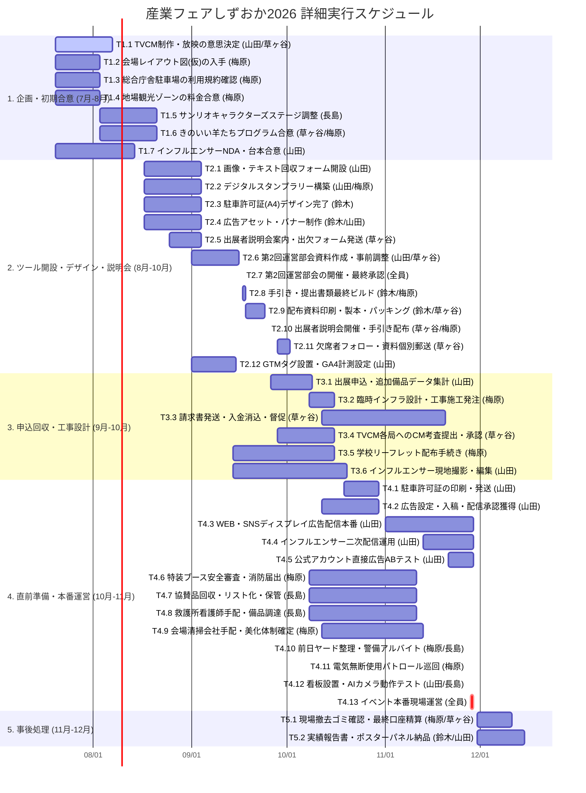

# 📅 産業フェアしずおか2026：詳細実行タスク管理簿 ＆ ガントチャート

本ドキュメントは、「産業フェアしずおか2026」の準備から会期終了・実績報告書納品に至るすべての実務タスクを、実務サブタスク（「誰が」「誰と連絡をとり」「何を行うか」）レベルまで徹底的に分解・詳細化した**詳細版・実行タスク管理簿**です。
事務局の「残業禁止・2週間前倒しバッファ原則」に準拠し、すべてのサブタスクに具体的な開始日と終了日を設定しています。
また、事務局内合同会議にて洗い出された「食品衛生管理」「災害・防災避難マニュアル」「電波障害オフライン対策」「前日テクニカルリハーサル」「バリアフリー優先案内看板」「広告効果ROI対比分析」の実務サブタスクを網羅しています。

---

## 📊 1. プロジェクト詳細スケジュール（Mermaid ガントチャート）

このガントチャートは、2026年度の暦（11/28・29本番）に完全準拠し、各実務担当者の並行タスクを可視化しています。進捗会議の際は、このタイムラインを見ながら各タスクの進行状況（遅延の有無）を確認してください。

---

## 📝 2. 行動プロセス・日付つき詳細タスク管理簿

* **表記ルール**: `[ ]` 未着手 / `[/]` 進行中 / `[x]` 完了

### 🟩 フェーズ 1：企画・初期合意フェーズ（7月20日〜8月28日）

| ID | タスク名 / サブタスク | 責任担当 | 事務局内連携役割 / 機能 | 具体的行動プロセス（誰と連絡をとり何を行うか） | 開始日 | 終了日 | 成果物 | ステータス |
| :--- | :--- | :---: | :---: | :--- | :---: | :---: | :--- | :---: |
| **T1.1** | **TVCMの制作・放映予算および放送局配分の決定** | **山田** (決裁) **草ヶ谷** (進行) | 全体統括ディレクター | 草ヶ谷が山田（統括プロデューサー）に放映枠・制作予算ポートフォリオの社内決定案を提示し、最終決裁を仰ぐ。 | 07/20 | 08/07 | 確定CM配分表（SBS 1本決定） | `[x]` |
| T1.1.1 | 放映予算枠の提示とテレビ局配分案の作成 | 草ヶ谷 | 全体統括ディレクター | 広告代理店と調整し、SBS静岡放送1本に集中的に枠を買付ける配分プランを作成する。 | 07/20 | 07/21 | 局別枠買付け配分案 | `[x]` |
| T1.1.2 | 制作会社とのCM絵コンテ案の調整 | 草ヶ谷 | デザイン制作部 | CM制作協力会社（担当：〇〇様）と連絡をとり、15秒CMのビジュアルトンマナ、絵コンテ案、音楽使用許可について調整する。 | 07/20 | 08/03 | CM絵コンテドラフト | `[/]` |
| T1.1.3 | 山田（統括プロデューサー）への最終意思決定仰ぎ | 草ヶ谷 | 全体統括ディレクター | 山田に対し、チャット上でTVCM制作放映予算および放送局配分ポートフォリオの最終判断を仰ぎ、SBS 1本決定を得る。 | 07/21 | 07/21 | 最終意思決定回収（SBS決定） | `[x]` |
| **T1.2** | **最新の会場レイアウト図（仮）の入手・確認** | **梅原** | 設営・会場設営統括 | 静岡産業振興協会の担当者（〇〇様）に連絡し、2026年版の仮会場平面図（まぐろゾーン、体験コーナー増設反映分）を受領する。 | 07/20 | 08/03 | 仮レイアウト図 | `[ ]` |
| T1.2.1 | 振興協会への仮レイアウト提供打診・受領 | 梅原 | 設営・会場設営統括 | 振興協会の担当窓口（〇〇様）へメールまたは電話で連絡し、まぐろ、林業・家具、体験等のゾーニングが反映された2026年度仮会場平面図（CAD/PDF）を回収する。 | 07/20 | 07/27 | 受領済平面図PDF | `[ ]` |
| T1.2.2 | 出展配置スペースおよび動線の不整合チェック | 梅原 | 設営・会場設営統括 | 回収した図面を確認し、体験ブースやステージ周辺の通路幅がアクセシビリティ方針（DADS仕様）に準拠しているか、インフラ工事（ピット位置）と矛盾がないか検証する。 | 07/27 | 08/03 | レイアウト確認レポート | `[ ]` |
| **T1.3** | **総合庁舎駐車場の利用可能時間・規約の確認** | **梅原** | 安全衛生警備事務局 | 静岡産業振興協会の担当者（〇〇様）を通じて静岡県担当部署へ申請状況を確認。本番日利用時間（7:30〜）および夜間留め置き規約を回収する。 | 07/20 | 08/03 | 駐車場規約文書 | `[ ]` |
| T1.3.1 | 振興協会経由の静岡県への駐車場利用申請状況確認 | 梅原 | 安全衛生警備事務局 | 振興協会（〇〇様）へ連絡を取り、県への総合庁舎駐車場利用申請の進捗をヒアリングする。 | 07/20 | 07/27 | 申請ステータス記録 | `[ ]` |
| T1.3.2 | 利用可能時間・夜間駐車規約の回収とデータ化 | 梅原 | 安全衛生警備事務局 | 駐車場の前日・本番当日（7:30〜）の利用時間制限、車高制限、夜間留め置き可否の正式回答書（メール）を受領し、手引き改訂用のデータを作成する。 | 07/27 | 08/03 | 駐車場運用概要テキスト | `[ ]` |
| **T1.4** | **地場観光ゾーンの市外追加料金（3万円）設定の合意** | **梅原** | 協賛・営業進行部 | 主催者（静岡市および振興協会）の担当者と連絡をとり、地場観光ゾーンの「市外事業者の1小間目からの3万円有料化」に今年度も変更がないか確認・合意する。 | 07/20 | 08/03 | 料金規定合意書 | `[ ]` |
| T1.4.1 | 静岡市・振興協会との料金改定ヒアリング・確認 | 梅原 | 協賛・営業進行部 | 静岡市商業労政課および振興協会担当者へ連絡し、地場観光ゾーンの市外事業者追加料金（30,000円）が昨年度と同様であるか書面で確認をとる。 | 07/20 | 08/03 | 料金継続合意メモ | `[ ]` |
| **T1.5** | **サンリオキャラクターズステージ出演契約・台本の合意** | **長島** | キャラキャスト管理窓口 | キャスティング代理店（〇〇様）と連絡をとり、出演枠・出演料・連続稼働制限（1回15〜20分）・会場内撮影制限ルールの合意と契約締結を行う。 | 08/03 | 08/21 | 出演合意契約書 | `[ ]` |
| T1.5.1 | キャスティング代理店へのオファーと出演条件交渉 | 長島 | キャラキャスト管理窓口 | 代理店担当者（〇〇様）へ出演料・ロイヤリティ条件、出演キャラクターのスケジュール確保を打診し、見積書を回収する。 | 08/03 | 08/10 | 出演見積書PDF | `[ ]` |
| T1.5.2 | 動線警備計画および連続稼働制限（15-20分）の確認 | 長島 | キャラキャスト管理窓口 | 控室からステージまでのキャスト警備動線、出演時間が1回15〜20分を超えないこと、および出演時以外は控室に留まる運営ルールをエージェンシー側と確認・合意する。 | 08/10 | 08/17 | キャスト運営計画書 | `[ ]` |
| T1.5.3 | 撮影制限ルールの策定および出演契約書の締結 | 長島 | キャラキャスト管理窓口 | 一般来場者のステージ撮影制限（SNS投稿禁止等のキャラクター版権保護レギュレーション）の文面を策定。双方がサインした出演契約書を回収する。 | 08/17 | 08/21 | 締結済契約書PDF | `[ ]` |
| **T1.6** | **きのいい羊たちプログラム確定・安全対策合意** | **草ヶ谷** **梅原** | イベント企画・演出窓口 | 「きのいい羊たち」担当者（〇〇様）と連絡をとり、体験プログラム内容を確定。梅原はツインメッセ床傷防止のマット養生施工について安全対策を合意する。 | 08/03 | 08/21 | 安全施工設計図 | `[ ]` |
| T1.6.1 | プログラム内容および出演枠・費用の確定 | 草ヶ谷 | イベント企画・演出窓口 | 「きのいい羊たち」の担当者（〇〇様）と連絡をとり、体操体験のプログラム詳細、メインステージ／体験スペースの稼働時間割を確定する。 | 08/03 | 08/14 | プログラム仕様書 | `[ ]` |
| T1.6.2 | 衝撃緩和マット・床傷防止養生施工設計の合意 | 梅原 | 設営・会場設営統括 | ツインメッセ静岡の床面に傷をつけないための床面シート養生仕様、および子供の落下怪我防止用の衝撃緩和マット配置設計について梅原が合意をとる。 | 08/10 | 08/21 | 養生施工平面図 | `[ ]` |
| **T1.7** | **インフルエンサーのNDA締結および撮影台本の合意（社内確認中）** | **山田** | システム・デジタル運用部 | 提携インフルエンサー2名（@shizuoka_info, @shizuokaosanponikki）に連絡し、NDAを締結。11月の投稿に向けた撮影スケジュール・台本構成を合意する。 | 07/20 | 08/14 | 署名済NDA 撮影台本 | `[/]` |
| T1.7.1 | インフルエンサーへのNDA送付と回収（社内確認中） | 山田 | システム・デジタル運用部 | 提携インフルエンサー2名の公式連絡先へNDAを送付し、署名・捺印済みのPDFデータを回収する。 | 07/20 | 08/07 | 締結済NDAファイル | `[/]` |
| T1.7.2 | 撮影スケジュールおよび投稿用台本構成の合意 | 山田 | システム・デジタル運用部 | 「親子お出かけ」「伝統体験」「絶品グルメ」の3軸で11/9公開予定の動画について、構成案（リール動画・フィード投稿用台本）および10月中旬の現地撮影日を合意する。 | 08/07 | 08/14 | 投稿構成案テキスト | `[ ]` |

### 🟦 フェーズ 2：ツール開設・デザイン・説明会準備フェーズ（8月17日〜10月2日）

| ID | タスク名 / サブタスク | 責任担当 | 事務局内連携役割 / 機能 | 具体的行動プロセス（誰と連絡をとり何を行うか） | 開始日 | 終了日 | 成果物 | ステータス |
| :--- | :--- | :---: | :---: | :--- | :---: | :---: | :--- | :---: |
| **T2.1** | **出展者紹介画像・テキスト回収用Googleフォームの開設** | **山田** | システム・デジタル運用部 | 事務局Google Workspaceにてフォームを作成。150字入力制限、10MB以下の画像アスペクト比（1:1/4:5）テスト回答を検証し、短縮URLを発行する。 | 08/17 | 09/04 | 回収フォームURL | `[ ]` |
| T2.1.1 | Google Workspace事務局アカウントでのフォーム作成 | 山田 | システム・デジタル運用部 | 事務局用Google Workspaceにログインし、フォームを新規作成。必須項目（企業名、ブース番号、紹介文、画像）を設定する。 | 08/17 | 08/25 | 新規フォームドラフト | `[ ]` |
| T2.1.2 | 入力制限および送信後編集許可等のセキュリティ設定 | 山田 | システム・デジタル運用部 | 紹介文に「最大150文字制限」、画像ファイルに「1ファイル・10MB以下」のバリデーションを設定。送信後の回答編集を「許可」、組織外限定アクセスを「OFF」にする。 | 08/25 | 08/30 | 設定済フォーム | `[ ]` |
| T2.1.3 | テスト送信および画像保存ドライブ検証と短縮URL発行 | 山田 | システム・デジタル運用部 | 山田がスマホから画像アスペクト比（1:1/4:5）を指定通りにテスト投稿。ドライブへ正しく保存されるか確認後、「送信」から短縮URLを発行する。 | 08/30 | 09/04 | 本番用短縮URL | `[ ]` |
| **T2.2** | **デジタルスタンプラリー（QRコード式）のシステム構築** | **山田** **梅原** | システム・デジタル運用部 | システム・デジタル運用部にてスタンプ用QRコードの発行、Web画面仕様、および接続エラー時の紙のバックアップ台紙デザインを確定する。 | 08/17 | 09/04 | ラリーシステム 予備用紙データ | `[ ]` |
| T2.2.1 | ラリーシステム選定およびQRコード発行 | 山田 | システム・デジタル運用部 | WEBスタンプラリーシステムの管理画面を構築。スタンプスポット用のユニークなQRコードを発行し、スタンプが押された際の画像等のアセットを登録する。 | 08/17 | 08/25 | 設定済システム管理画面 | `[ ]` |
| T2.2.2 | 会場内スタンプスポット（看板・QR）の配置設計 | 山田 梅原 | 設営・会場設営統括 | 会場内の混雑を防ぐための回遊動線を考慮し、北館・南館の指定スポット設置箇所および看板デザインを梅原と合意決定する。 | 08/25 | 08/30 | スポット配置図PDF | `[ ]` |
| T2.2.3 | 電波障害・通信エラー時用の紙製予備スタンプ台紙デザイン | 山田 鈴木 | デザイン制作部 | 会場内の電波状況により接続エラーが発生した場合のバックアップ手順として、鈴木がA5サイズの「紙スタンプ用紙」をデザインしデータを作成する。 | 08/30 | 09/04 | 紙台紙印刷用データ | `[ ]` |
| T2.2.4 | 出展者向け「電波障害（決済エラー）対策推奨文」の策定 | 山田 | システム・デジタル運用部 | 会場Wi-Fi等の混雑を見越し、出展者へ「オフライン決済機能の有効化」または「バックアップ現金（釣り銭）準備」を促す手引き用案内文を作成する。 | 08/30 | 09/04 | 手引掲載用案内テキスト | `[ ]` |
| **T2.3** | **搬入車両用「駐車許可証（A4）」のデザイン完成** | **鈴木** | デザイン制作部 | 鈴木がIllustrator等でA4縦サイズの駐車許可証（緊急連絡先・社名手書き枠、下部に進入ルート図を掲載）のデザインデータを作成する。 | 08/17 | 09/04 | 駐車許可証PDF | `[ ]` |
| T2.3.1 | A4縦サイズ駐車許可証のテンプレート作成 | 鈴木 | デザイン制作部 | Illustratorを用い、「駐車許可証（搬入用）」の極太赤字タイトル、および「ヤード作業15分以内制限」の警告テンプレートを作成する。 | 08/17 | 08/25 | 駐車許可証ラフデータ | `[ ]` |
| T2.3.2 | 手書き用空欄の配置および進入ルート図の埋め込み | 鈴木 | デザイン制作部 | 「貴社名」「ドライバー携帯番号」の手書き空欄と、ツインメッセ北館・南館それぞれの進入方向を示す矢印マーク付きヤード詳細図をレイアウトし校了データを出力する。 | 08/25 | 09/04 | 校了済許可証PDF | `[ ]` |
| T2.3.3 | ユニバーサル案内看板（授乳室・バリアフリー）のデザイン | 鈴木 | デザイン制作部 | 遠くからでも見やすいユニバーサルカラーおよびピクトグラムを用いた「授乳室・バリアフリー（車椅子・ベビーカー優先動線）」の案内サイン看板をデザインする。 | 08/25 | 09/04 | 案内看板デザインPDF | `[ ]` |
| **T2.4** | **プロモーション用広告アセット（バナー・テキスト）制作** | **鈴木** **山田** | デザイン制作部 | Google/Yahooディスプレイ広告およびInstagram広告用バナーと、広告テキスト5案ずつのアセット制作を完了する。 | 08/17 | 09/04 | 広告入稿用アセット | `[ ]` |
| T2.4.1 | Google/Yahoo/Meta広告用バナー画像（全サイズ）制作 | 鈴木 | デザイン制作部 | 「体験重視（木のジャングルジム等）」「グルメ重視（まぐろ丼等）」の2軸で、ディスプレイ広告枠用バナー画像（各種比率・サイズ）のデザインを出力する。 | 08/17 | 08/28 | バナー画像データ一式 | `[ ]` |
| T2.4.2 | ターゲット別レスポンシブテキスト（各5案）のライティング | 山田 | プロモーション・広告運用部 | ファミリー層向け「親子お出かけ訴求」、一般・シニア層向け「伝統工芸・ご当地グルメ訴求」のレスポンシブテキスト（タイトル・説明文）各5案を作成・校正する。 | 08/24 | 09/04 | 広告コピーテキストファイル | `[ ]` |
| **T2.5** | **出展者説明会開催案内状の発送および出欠回答フォーム開設** | **草ヶ谷** | 出展者サポート事務局 | 出展確定企業（約200社）宛てに、9/25説明会開催案内および会場アクセス、事前出欠確認用のGoogleフォームURLを送付・回収管理する。 | 08/25 | 09/04 | 説明会案内状 出欠管理DB | `[ ]` |
| T2.5.1 | 出展者説明会開催案内状および会場アクセス情報の作成・送付 | 草ヶ谷 | 出展者サポート事務局 | 説明会日時（9/25 13:30〜）・会場情報および事前持ち物を明記した案内状を作成し、出展者へメール・郵送便にて一斉送付する。 | 08/25 | 09/01 | 開催案内通知文面 | `[ ]` |
| T2.5.2 | 説明会出欠回答用フォーム開設と回答状況の集計・督促 | 草ヶ谷 | 出展者サポート事務局 | 事前出欠確認用のGoogleフォームを開設し、各社の参加者氏名・人数・欠席理由を集計。未回答企業へリマインドを行い確定する。 | 08/25 | 09/04 | 確定出欠リスト | `[ ]` |
| **T2.6** | **第2回運営部会 審議提出資料の作成および事務局内事前確認** | **山田** **草ヶ谷** | 全体統括ディレクター | 第2回運営部会（9/17 13:30〜16:00）に向け、仮レイアウト、手引きドラフト、プロモーション計画、追加インフラ制限規則等の資料を起草し事前確認を行う。 | 09/01 | 09/16 | 運営部会審議資料一式 | `[ ]` |
| T2.6.1 | 仮レイアウト・手引きドラフト・施工制限規約の資料起草 | 山田 梅原 | 設営・会場設営統括 | 静岡市・振興協会との協議用に、会場ゾーニング仮図面、手引き案、および追加電気・ガス制限規則をまとめた報告スライドを作成する。 | 09/01 | 09/10 | 運営部会提出用スライド | `[ ]` |
| T2.6.2 | 運営部会前の事務局内事前レクおよび質疑応答の整理 | 草ヶ谷 山田 | 全体統括ディレクター | 山田統括プロデューサーおよび事務局主要メンバーで事前打ち合わせを実施し、運営部会での質疑応答方針および承認フローを確定する。 | 09/10 | 09/16 | 事前レク議事メモ | `[ ]` |
| **T2.7** | **第2回運営部会の開催および手引き・安全規約の最終承認獲得** | **全員** | 全体統括ディレクター | 2026年09月17日（木）13:30〜16:00の第2回運営部会に出席。手引き内容、レイアウト、追加工事当日不可ポリシーの最終決裁を獲得する。 | 09/17 | 09/17 | 運営部会議事録 承認済通知控 | `[ ]` |
| T2.7.1 | 第2回運営部会（9/17 13:30〜16:00）の出席・審議進行 | 全員 | 全体統括ディレクター | 主催者および構成機関との審議を行い、進捗報告ならびに説明会配布用『出展の手引き2026』等の全議題について承認を得る。 | 09/17 | 09/17 | 運営部会決裁記録 | `[ ]` |
| T2.7.2 | 運営部会での指摘・修正要求事項の即時洗い出しと反映指示 | 山田 | 全体統括ディレクター | 部会中に発生した文言修正やレイアウト補正指示を即座にリストアップし、鈴木・梅原へ手引き最終データへの反映を指示する。 | 09/17 | 09/17 | 修正指示一覧 | `[ ]` |
| **T2.8** | **出展の手引き・提出書類の最終書き出し（ビルド）** | **鈴木** **梅原** | 出展者サポート事務局 | 9/17運営部会の決裁内容を反映し、回収フォームURL、進入ルート図、問い合わせ先等を埋め込んだ手引きおよび提出書類PDF/PPTXの最終ビルドを行う。 | 09/17 | 09/18 | 配布用手引きPDF一式 | `[ ]` |
| T2.8.1 | 回収用フォームURLや緊急連絡先・静鉄新住所の反映 | 鈴木 | デザイン制作部 | 手引きの指定箇所に、T2.1.3のGoogleフォーム短縮URL、T2.3.2の進入ルート図、静鉄アド・パートナーズの新Email/住所・連絡先を埋め込む。 | 09/07 | 09/11 | 修正済手引きドラフト | `[ ]` |
| T2.8.2 | 運営部会承認事項の最終反映およびPDF/PPTX書き出し | 鈴木 梅原 | 出展者サポート事務局 | 9/17部会での修正要求を最終反映。追加備品・工事申請書類（書類1〜4）および手引きについて誤字脱字・日付等を梅原が最終監査の上、鈴木が最終書き出しする。 | 09/17 | 09/18 | 最終ビルド済手引きPDF | `[ ]` |
| **T2.9** | **説明会当日配布用資料一式の印刷・製本・パッキング** | **鈴木** **草ヶ谷** | 出展者サポート事務局 | 最終ビルドデータをもとに、説明会当日配布用の手引き・提出書類・駐車許可証サンプル等の印刷・製本および約200社分の封入パッキングを完了する。 | 09/18 | 09/24 | 印刷製本完了品 配布用封筒セット | `[ ]` |
| T2.9.1 | 手引き・提出書類・駐車許可証サンプルの印刷・製本発注 | 鈴木 | デザイン制作部 | 校了データに基づき、説明会配布用手引き冊子（200部＋予備50部）および提出書類・駐車許可証サンプルの印刷・製本を協力印刷会社へ発注・回収する。 | 09/18 | 09/22 | 納品済冊子一式 | `[ ]` |
| T2.9.2 | 出展者約200社分の配布用セットパッキングおよび予備確保 | 草ヶ谷 | 出展者サポート事務局 | 届いた冊子・書類一式を出展者別の封筒にパッキング。当日飛び込み参加者や予備用のセットを含め、会場搬入可能な状態に準備する。 | 09/22 | 09/24 | パッキング完了箱一式 | `[ ]` |
| **T2.10** | **出展者説明会（9/25 13:30〜）の会場設営・手引き配布・安全説明** | **草ヶ谷** **梅原** | 出展者サポート事務局 | 2026年9月25日（金）13:30より説明会を開催。手引き配布、回収フォーム・決済電波障害対策の解説、追加インフラ当日不可ルールの口頭徹底を行う。 | 09/25 | 09/25 | 説明会実施報告書 配布・出席ログ | `[ ]` |
| T2.10.1 | 会場AV機材・投影テスト・受付設営（11:30〜13:00） | 梅原 | 設営・会場設営統括 | 9/25午前中に会場入りし、マイク・プロジェクター・スライド投影テストおよび受付・誘導案内看板の設営を完了させる。 | 09/25 | 09/25 | 設営完了確認チェック | `[ ]` |
| T2.10.2 | 説明会開会（13:30〜）、手引き配布、回収フォーム・決済電波障害対策の解説 | 草ヶ谷 山田 | 出展者サポート事務局 | 13:30開会。手引き等を配布し、重要項目（10/7提出期限）やGoogleフォーム入力方法、キャッシュレス決済電波障害対策の推奨事項をスライド解説する。 | 09/25 | 09/25 | 説明会進行スライドログ | `[ ]` |
| T2.10.3 | 「搬入ヤード15分制限」「追加工事当日不可」等の安全・施工ルールの口頭徹底 | 梅原 | 安全衛生警備事務局 | 出展者に対し「会期当日の臨時ガス配管・電気コンセントの追加は一切受け付けない」点および「搬入ヤード15分退去規則」を強く口頭説明し理解を得る。 | 09/25 | 09/25 | 口頭周知記録 | `[ ]` |
| **T2.11** | **説明会欠席企業への資料補添郵送および受領フォロー** | **草ヶ谷** | 出展者サポート事務局 | 説明会を欠席した出展者を特定し、手引き・提出書類一式を追跡便にて即時郵送。受領と提出期限（10/7）の確認を電話・メールで追跡フォローする。 | 09/28 | 10/02 | 欠席者資料発送ログ 受領確認シート | `[ ]` |
| T2.11.1 | 欠席企業・未受領企業の特定および発送用追跡伝票作成 | 草ヶ谷 | 出展者サポート事務局 | 説明会当日の受付出席ログを照合し、欠席した企業をリスト化。追跡可能な郵送便（レターパック等）の発送伝票を作成する。 | 09/28 | 09/29 | 欠席者発送リスト | `[ ]` |
| T2.11.2 | 資料一斉発送および着荷・手引き受領の電話・メールフォロー | 草ヶ谷 | 出展者サポート事務局 | 欠席企業へ資料を一斉発送。到着確認後、電話またはメールで「手引き受領」および「10/7申請〆切」を個別に案内しフォローを完了する。 | 09/29 | 10/02 | フォロー完了報告 | `[ ]` |
| **T2.12** | **GTMタグ発行依頼・HTML埋め込み・GA4疎通検証** | **山田** | プロモーション・広告運用部 | 別部署へGTMタグ発行を依頼し、受領したGTMコンテナコード（head/body）を特設LPのHTMLに埋め込み、GA4リアルタイム表示での疎通・発火テストを完了させる。 | 09/01 | 09/15 | GTM設置済サイト GA4計測ログ | `[ ]` |
| T2.12.1 | 別部署宛てGTMコンテナタグ発行＆アクセス権限の申請依頼 | 山田 | プロモーション・広告運用部 | メールテンプレートを使用し別部署担当者へ連絡。サイトURL、埋め込みコード送付、およびアカウント権限付与を依頼する。 | 09/01 | 09/04 | 発行依頼送信ログ | `[ ]` |
| T2.12.2 | 受領GTMコードのHTML（<head> / <body>）直下への埋め込み | 山田 | システム・デジタル運用部 | 受領した<script>コードをindex.htmlの<head>直下、および<noscript>コードを<body>直下に貼り付ける。 | 09/05 | 09/10 | GTMコード挿入済HTML | `[ ]` |
| T2.12.3 | GTMプレビューモードおよびGA4リアルタイム表示での疎通テスト | 山田 | プロモーション・広告運用部 | GTMプレビューモードでConnectedを確認し、GA4リアルタイムレポートにてアクセスおよびUTMパラメータが計測されていることをテスト・確認する。 | 09/10 | 09/15 | 発火テスト完了画面 | `[ ]` |

### 🟧 フェーズ 3：申込回収・インフラ設計・工事手配フェーズ（9月26日〜10月31日）

| ID | タスク名 / サブタスク | 責任担当 | 事務局内連携役割 / 機能 | 具体的行動プロセス（誰と連絡をとり何を行うか） | 開始日 | 終了日 | 成果物 | ステータス |
| :--- | :--- | :---: | :---: | :--- | :---: | :---: | :--- | :---: |
| **T3.1** | **200社の出展申込および追加備品データの回収・集計** | **山田** | 出展者サポート事務局 | 10/7申込締切に伴い、出展者各社から提出された申込書・インフラ申請データを山田がGoogleスプレッドシート等に一括回収・マージ集計する。 | 09/26 | 10/09 | 申込集計データ | `[ ]` |
| T3.1.1 | 提出された申込書およびインフラ工事データのデータ入力 | 山田 | 出展者サポート事務局 | 出展者（企業ゾーン・地場産業観光ゾーン約200社）より提出された「申込書・追加備品/工事申請（書類1〜3）」の内容をマスター集計スプレッドシートに入力・集計する。 | 09/26 | 10/08 | 集計スプレッドシート | `[ ]` |
| T3.1.2 | 未提出者への確認連絡と集計データの最終確定 | 山田 | 出展者サポート事務局 | 10/7〆までに申請のなかった出展者、または記載不備のある出展者に連絡を取り、データを完全修正して集計を締め切る。 | 10/08 | 10/09 | 確定版追加備品・工事集計表 | `[ ]` |
| **T3.2** | **臨時ガス・電気・給排水の容量計算および施工発注** | **梅原** | 設営・会場設営統括 | 集計データに基づき臨時配管・電源ピット位置を算出し、施工協力会社（望月商事の担当〇〇様）へ連絡して、容量図面と共に本工事発注を行う。 | 10/08 | 10/16 | 臨時インフラ発注書 | `[ ]` |
| T3.2.1 | ブース位置（小間割り図）へのガス・電気配線・給排水位置プロット | 梅原 | 設営・会場設営統括 | 集計表に基づき、ツインメッセ床下ピットからの配線・配管位置をCAD小間割り平面図上にプロットし、全体の電気容量・ガス使用容量の合計を算出する。 | 10/08 | 10/12 | 施工配管・配線指示図面 | `[ ]` |
| T3.2.2 | 施工協力会社（望月商事）への見積依頼および本工事発注 | 梅原 | 設営・会場設営統括 | 施工会社である望月商事（担当〇〇様）へ臨時インフラ工事図面を送付し、見積書を回収の上、本発注書を締結する。 | 10/12 | 10/16 | 発注書および工事請書 | `[ ]` |
| T3.2.3 | 「食品衛生管理規約（検食・温度測定等）」の作成と周知 | 梅原 | 安全衛生警備事務局 | 飲食出展ブース向けの食中毒防止ガイドラインを作成し、説明会資料および手引きに埋め込んで周知する。 | 10/08 | 10/16 | 食品衛生管理ガイドライン | `[ ]` |
| **T3.3** | **出展者への請求書発送および入金消込・未納督促** | **草ヶ谷** | 経理・財務管理部 | 追加設備代金の請求書を発行・発送。指定銀行口座の入金監視を行い、11/13の振込期日以降の未入金者に対し、11/14より督促電話・メールを行う。 | 10/12 | 11/20 | 請求・入金消込表 | `[ ]` |
| T3.3.1 | 追加設備・電気使用料金等の請求書発行と発送 | 草ヶ谷 | 経理・財務管理部 | 各出展者の追加備品・工事代金の請求書を発行し、出展者の窓口宛てにメール（PDF）および郵送にて発送する。 | 10/12 | 10/20 | 請求書発送管理ログ | `[ ]` |
| T3.3.2 | 銀行口座入金状況の監視と毎日の消し込み処理 | 草ヶ谷 | 経理・財務管理部 | 入金状況をオンラインで確認し、スプレッドシート上で消し込みを行う（11/13振込期日まで毎日監視）。 | 10/20 | 11/13 | 日次消し込みシート | `[ ]` |
| T3.3.3 | 期日未入金者のリストアップおよび電話・メールによる督促 | 草ヶ谷 | 経理・財務管理部 | 11/13時点で入金が確認できない出展者に対し、11/14から電話とメールで督促を行い、最終回収を確認する（11/20予備期日まで完了）。 | 11/14 | 11/20 | 督促履歴・精算完了リスト | `[ ]` |
| **T3.4** | **TVCMの各放送局への「CM考査」提出と承認獲得** | **草ヶ谷** | 行政広報渉外窓口 | 放映予定の静岡県内テレビ局（SBS・SUT・SDT・SATV等）の担当窓口にCM素材および考査書類を提出し、放映承認を確実に獲得する。 | 09/28 | 10/16 | 各局CM考査承認書 | `[ ]` |
| T3.4.1 | CM素材の納品・考査用提出書類の作成 | 草ヶ谷 | 行政広報渉外窓口 | 制作会社から納品された15秒CM素材のファイルと、局指定の「CM考査申請書（広告主証明、表現証明書等）」を準備する。 | 09/28 | 10/09 | 考査申請書・素材ファイル | `[ ]` |
| T3.4.2 | 主要4局への考査申請および承認の回収 | 草ヶ谷 | 行政広報渉外窓口 | 各テレビ局の考査窓口に提出し、修正要求があった場合は表現を即座に修正。10/16までに全局からの「放映承認」を獲得する。 | 10/09 | 10/16 | 局別承認済通知書PDF | `[ ]` |
| **T3.5** | **教育委員会を通じた学校リーフレット配布手続き** | **梅原** | 行政広報渉外窓口 | 静岡・焼津・藤枝・富士等の各教育委員会担当者に連絡し、学校配布用のチラシ配送・クラス仕分けの申請手続きおよび配送手配を完了する。 | 09/14 | 10/16 | 配布申請承認記録 | `[ ]` |
| T3.5.1 | 4市教育委員会への「学校配布許可申請」提出と承認 | 梅原 | 行政広報渉外窓口 | 静岡市、焼津市、藤枝市、富士市の各教育委員会担当窓口へリーフレット学校一斉配布申請書を提出し、配布許可書を受領する。 | 09/14 | 09/25 | 配布許可通知書 | `[ ]` |
| T3.5.2 | チラシの各小学校・幼稚園のクラス数・仕分け配送手配 | 梅原 | 行政広報渉外窓口 | 教育委員会から提供された各校のデータに基づき、リーフレットをクラス単位に山仕分け（帯留め梱包）し、指定配送業者を通じて各校へ10/16までに納品する。 | 09/25 | 10/16 | 配送料金表・納品受領書 | `[ ]` |
| **T3.6** | **インフルエンサーの現地撮影同行・動画編集初稿確認** | **山田** | システム・デジタル運用部 | 提携インフルエンサー2名のツインメッセ静岡での事前現地撮影（10月中旬）に調整・同行し、編集された動画の初稿を回収。誤字や不適切表現がないか校正を行う。 | 09/14 | 10/20 | 動画初稿データ | `[ ]` |
| T3.6.1 | インフルエンサー現地撮影スケジュールの調整と同行 | 山田 | システム・デジタル運用部 | インフルエンサー2名のツインメッセ静岡での事前撮影日（10月中旬）を調整・決定。当日は山田が現場同行する。 | 09/14 | 10/09 | 撮影日程表・ロケスケ | `[ ]` |
| T3.6.2 | 編集動画の初稿データ回収およびテロップ表記校正 | 山田 | システム・デジタル運用部 | インフルエンサーからリール動画の初稿を回収。テロップ表記に誤りがないか校正し、修正指示を行う（10/20までに最終確定）。 | 10/09 | 10/20 | 最終校了動画データ | `[ ]` |

### 🟥 フェーズ 4：直前プロモーション・本番現場設営運営フェーズ（10月12日〜11月29日）

| ID | タスク名 / サブタスク | 責任担当 | 事務局内連携役割 / 機能 | 具体的行動プロセス（誰と連絡をとり何を行うか） | 開始日 | 終了日 | 成果物 | ステータス |
| :--- | :--- | :---: | :---: | :--- | :---: | :---: | :--- | :---: |
| **T4.1** | **駐車許可証（搬入車両用）の印刷および郵送発送** | **山田** | 出展者サポート事務局 | 鈴木がデザインした駐車許可証を印刷し、出展者各社へ郵送で発送する（10月下旬）。封入漏れがないかダブルチェックを行う。 | 10/19 | 10/30 | 発送記録ログ | `[ ]` |
| T4.1.1 | 駐車許可証の必要部数印刷および発送伝票・案内書面準備 | 山田 | 出展者サポート事務局 | 鈴木デザインの駐車許可証PDFを各社必要台数分印刷。同封する「搬入ヤード利用の手引き（15分ルール）」案内書面を用意する。 | 10/19 | 10/23 | 印刷済許可証・封筒 | `[ ]` |
| T4.1.2 | 出展者各社（約200社）への郵送封入・発送および到着監視 | 山田 | 出展者サポート事務局 | 200社の出展者住所へ指定郵送便で一斉発送し、追跡番号をもとに10/30までに全社へ到着しているかステータスを確認する。 | 10/23 | 10/30 | 郵送追跡記録シート | `[ ]` |
| **T4.2** | **広告アカウント設定およびアセット入稿** | **山田** | プロモーション・広告運用部 | Googleディスプレイ広告、Yahoo!ディスプレイ広告、Meta広告管理画面にて、8市町行政境界ロックを含むターゲット設定と素材の入稿を行う。 | 10/12 | 10/30 | 広告審査完了確認 | `[ ]` |
| T4.2.1 | 広告アカウント内キャンペーンおよび広告セット構築 | 山田 | プロモーション・広告運用部 | 各広告管理画面にログイン。予算制限を設定したキャンペーンおよび広告セットを構築する。 | 10/12 | 10/23 | 設定済キャンペーン画面 | `[ ]` |
| T4.2.2 | 配信地域指定、アセット入稿と審査提出 | 山田 | プロモーション・広告運用部 | 8市町（静岡・焼津・藤枝・富士・島田・吉田・牧之原・富士宮）の行政境界を指定し、鈴木デザインのバナー・コピーを入稿して審査にかける。 | 10/23 | 10/30 | 承認済ステータス画面 | `[ ]` |
| **T4.3** | **WEBおよびSNSディスプレイ広告の配信本番稼働** | **山田** | プロモーション・広告運用部 | 各広告配信を開始（4週間）。週次で表示回数とクリック率、消化予算を管理画面でモニタリングする。 | 11/01 | 11/29 | 配信パフォーマンス | `[ ]` |
| T4.3.1 | 広告配信のスタート確認と日次予算・消化状況監視 | 山田 | プロモーション・広告運用部 | 11/1の配信開始を各管理画面で確認。極端な消化ペースの過不足がないか毎日モニタリングする。 | 11/01 | 11/09 | 日次配信パフォーマンス | `[ ]` |
| T4.3.2 | 中間パフォーマンス分析と非効率クリエイティブの停止・調整 | 山田 | プロモーション・広告運用部 | 各広告セットのCTRやCPCを週次分析。効果の低いバナーを停止させ、ターゲットCPAの範囲内で最適化調整を行う。 | 11/09 | 11/20 | 週次広告改善レポート | `[ ]` |
| **T4.4** | **インフルエンサー二次配信（Metaパートナーシップ広告）の開始** | **山田** | プロモーション・広告運用部 | インフルエンサーから受領した「パートナーシップ広告コード」をMeta広告管理画面に入力し、タイアップブースト広告の配信・監視を開始する。 | 11/13 | 11/29 | 配信実績レポート | `[ ]` |
| T4.4.1 | インフルエンサーのMeta Business Suite接続・認証設定 | 山田 | プロモーション・広告運用部 | インフルエンサー2名に連絡し、事務局との「広告パートナーシップ接続」を設定・承認してもらう。 | 10/12 | 10/30 | 接続完了ステータス | `[ ]` |
| T4.4.2 | タイアップ投稿公開と「広告コード」受領および入稿設定 | 山田 | プロモーション・広告運用部 | 11/9にインフルエンサーがオーガニック投稿を公開後、発行された「パートナーシップ広告コード」を受領。Meta管理画面に入力し、11/13にブースト配信を開始する。 | 10/30 | 11/13 | 配信開始済インフルエンサー広告 | `[ ]` |
| T4.4.3 | インフルエンサー広告のインプレッション・予算消化監視 | 山田 | プロモーション・広告運用部 | 2アカウント合計55,000円が11/29までに均等かつ効果的に消化されるよう、表示回数とクリック単価（CPC）を毎日監視・調整する。 | 11/13 | 11/29 | デイリー消化報告ログ | `[ ]` |
| **T4.5** | **公式アカウント直接広告（体験・グルメABテスト）の配信** | **山田** | プロモーション・広告運用部 | 公式アカウント名義でリール動画（体験）とカルーセル（グルメ）の配信を開始し、ABテストのデータに基づいて最適な予算配分を調整する。 | 11/21 | 11/29 | ABテストデータ | `[ ]` |
| T4.5.1 | ABテスト広告（体験型リール vs グルメ型カルーセル）入稿と配信開始 | 山田 | プロモーション・広告運用部 | 公式アカウントから、リール（体験型）とカルーセル（グルメ型）の広告を配信開始する（11/21）。 | 11/13 | 11/21 | 稼働中ABテスト広告 | `[ ]` |
| T4.5.2 | ABテストのCTR/CPAデータ分析および予算自動配分調整 | 山田 | プロモーション・広告運用部 | 配信開始後、2日間のクリックデータおよびLP遷移後の行動データを分析。CPAが低いクリエイティブに残り予算を自動傾斜配分する。 | 11/21 | 11/29 | ABテスト分析シート | `[ ]` |
| **T4.6** | **高さ2.1m超の特装ブース自立構造物の安全審査・届出** | **梅原** | 設営・会場設営統括 | 特装申請のあった出展者ブースの図面（立面図・平面図）を審査し、転倒防止策を確認後、静岡市消防局の窓口へ火気および安全届出を行う。 | 10/08 | 11/11 | 消防届出控え | `[ ]` |
| T4.6.1 | 特装希望出展者からの詳細図面・防炎証明書の回収と審査 | 梅原 | 設営・会場設営統括 | 高さ2.1mを超える木構造物などを申請した出展者（11/11〆）から立面図・平面図・防炎処理証明書を回収し、構造安全性が担保されているか梅原が確認する。 | 10/08 | 11/02 | 審査済ブース図面PDF | `[ ]` |
| T4.6.2 | 静岡市消防局および警察署・保健所への行政申請・届出 | 梅原 | 設営・会場設営統括 | 静岡市消防局へ「裸火使用・防炎対象物」の届出、保健所へ飲食提供申請、警察署へ道路使用届を提出し、受理控えを保管する。 | 10/20 | 11/11 | 受理済行政申請書控え一式 | `[ ]` |
| **T4.7** | **協賛品の回収・リスト化・保管管理** | **長島** | 本番運営事務局 | 協賛出展者と連絡をとり、イベント景品用協賛品（実物）を確認・回収し、リスト化のうえ事務局の倉庫に一時保管する。 | 10/08 | 11/11 | 協賛品保管リスト | `[ ]` |
| T4.7.1 | 協賛出展者との協賛品仕様・数量確認と受取日程調整 | 長島 | 本番運営事務局 | 協賛申請のあった企業（11/11〆）に連絡し、提供品（品目、数量等）を確定し、送付・受取日を調整する。 | 10/08 | 11/02 | 協賛品調整台帳 | `[ ]` |
| T4.7.2 | 協賛品実物の受領・検品・リスト登録および倉庫保管 | 長島 | 本番運営事務局 | 届いた実物を検品し、保管数とリストが合致しているか確認の上、本番設営日まで鍵付き事務局倉庫にて安全に保管する。 | 11/02 | 11/11 | 倉庫保管状況報告ログ | `[ ]` |
| **T4.8** | **救護所（仕様書要求）看護師の手配および備品調達** | **長島** | 安全衛生警備事務局 | 看護師派遣会社へ看護師1名（2日間）の派遣を確定・発注。折り畳みベッド・救急箱・最短AED動線マップ等を調達・準備する。 | 10/08 | 11/11 | 看護師契約書 救護所備品リスト | `[ ]` |
| T4.8.1 | 看護師派遣会社への見積・正式発注 | 長島 | 安全衛生警備事務局 | 看護師派遣会社に連絡し、仕様書要求である「開催中2日間の看護師常駐（8:30〜17:30）」について正式発注契約を締結する。 | 10/08 | 10/23 | 看護師派遣発注請書 | `[ ]` |
| T4.8.2 | 救護所エリアの備品調達および緊急連絡マニュアル作成 | 長島 | 安全衛生警備事務局 | 折り畳みベッド1台、救急箱、AED位置図、および近隣緊急搬送先病院（県立総合病院等）への連携ダイヤル表を用意し、救護所用備品として梱包する。 | 10/23 | 11/11 | 救護所開設マニュアル一式 | `[ ]` |
| T4.8.3 | 災害時緊急避難計画および会場内緊急マイク放送マニュアル作成 | 長島 | 安全衛生警備事務局 | 巨大地震や火災発生時に出展者・来場者を安全に誘導するための避難経路マップと、日本語・英語による本部マイク避難放送原稿テンプレートを整備する。 | 10/23 | 11/11 | 防災避難マニュアル・放送原稿 | `[ ]` |
| **T4.9** | **会場清楽会社の手配および常駐美化体制の確定** | **梅原** | 本番運営事務局 | 清掃協力会社と連絡をとり、11/26〜11/29の4日間の清掃スタッフのシフト配置とゴミ回収フローを確定・発注する。 | 10/12 | 11/13 | 清掃発注請書 | `[ ]` |
| T4.9.1 | 清掃協力会社への見積依頼とスタッフシフト配置の調整 | 梅原 | 本番運営事務局 | 清掃会社（担当〇〇様）に連絡し、設営日前日から撤去日までの4日間、特に飲食エリアでの「常時ゴミ回収およびテーブル美化」を行う清掃員のシフト配置と契約額を確定する。 | 10/12 | 11/13 | 清掃発注請書・請負契約 | `[ ]` |
| **T4.10** | **前日ヤード整理の警備員指示およびアルバイト配置** | **梅原** **長島** | 本番運営事務局 | 警備会社と連絡をとり、11/27のヤード車両誘導（15分以内ルール）の警備シフトを指示。長島は運営アルバイト4名の配置と当日の業務説明を行う。 | 11/27 | 11/27 | 当日警備/バイト指示書 | `[ ]` |
| T4.10.1 | 警備会社との搬入ヤード15分退去制限警備指示の確定 | 梅原 | 本番運営事務局 | 警備会社（担当〇〇様）に連絡し、11/27のヤード車両誘導警備員数を確定。搬入車両のダッシュボードに「駐車許可証」を確認の上、15分以内の荷下ろし・即出展者駐車場への移動を徹底する警備指示書を共有する。 | 10/12 | 11/13 | ヤード警備マニュアル | `[ ]` |
| T4.10.2 | 運営アルバイト配置・オリエンテーション資料作成 | 長島 | 本番運営事務局 | 主催者アルバイト（4名）の受け入れ準備。当日の案内マップ、スタンプラリー引換所や来場入場カウント、救護所補助の配置計画、および朝の業務説明資料を作成する。 | 11/16 | 11/27 | アルバイト業務マニュアル | `[ ]` |
| T4.10.3 | 前日ステージリハーサル時間枠の監督と音響・照明テスト | 草ヶ谷 梅原 | 本番運営事務局 | 11/27（金）14:00〜17:00における音響・照明、および出演キャスト（サンリオ、きのいい羊たち、アナウンサー）の現場立ち位置・リハーサル進行を監督する。 | 11/27 | 11/27 | リハーサル実施記録 | `[ ]` |
| T4.10.4 | 授乳室・バリアフリー優先案内看板の設営 | 梅原 | 設営・会場設営統括 | 前日設営日において、鈴木がデザインした授乳室案内看板およびベビーカー優先動線を示す看板を、目立つ高さと位置に施工会社へ指示して設置する。 | 11/27 | 11/27 | 看板設営確認写真 | `[ ]` |
| **T4.11** | **大容量電気器具の無断使用防止のための巡回チェック** | **梅原** | 安全衛生警備事務局 | 前日設営日および本番中のブースを巡回。申請外の電気ケトル、ドライヤー等の無断使用を発見した場合は使用停止を求め、ブレーカー落ちを防ぐ。 | 11/27 | 11/29 | 電源パトロール記録 | `[ ]` |
| T4.11.1 | 無断電源パトロール用のチェックシートおよび巡回ルート選定 | 梅原 | 安全衛生警備事務局 | 「無断電源使用チェックパトロールシート」を作成。企業ゾーン・地場観光ゾーンそれぞれの全ブース番号を網羅し、巡回ルートを決定する。 | 11/16 | 11/26 | 巡回パトロールシート | `[ ]` |
| T4.11.2 | 前日設営日・本番中の各ブース巡回パトロールと使用停止対応 | 梅原 | 安全衛生警備事務局 | 前日設営中および本番当日中、梅原と巡回スタッフがパトロールを実施。大容量器具の無断接続がないかチェックし、発見時は使用を停止させる。 | 11/27 | 11/29 | 署名済パトロールログ | `[ ]` |
| T4.11.3 | 本番中の飲食出展ブースにおける食品衛生・温度管理パトロール | 梅原 | 安全衛生警備事務局 | 食中毒防止のため、前日および会期中に各飲食出展ブースを巡回し、冷蔵・調理温度および検食保管がガイドラインに沿っているか確認する。 | 11/27 | 11/29 | 食品衛生パトロール記録 | `[ ]` |
| **T4.12** | **スタンプラリー看板設置およびAIカメラ動作確認テスト** | **山田** **長島** | システム・デジタル運用部 | 会場内にデジタルスタンプラリーQR看板を設置。長島・山田は、ツインメッセ入場ゲートの梁に設置したAIカメラの入場カウント動作テストを行う。 | 11/27 | 11/27 | テスト検知ログ | `[ ]` |
| T4.12.1 | スタンプラリー看板設置および紙の予備スタンプ用紙の配備 | 山田 梅原 | システム・デジタル運用部 | 会場内スタンプラリースポット看板を設置。電波エラー時に備え、南館の景品引換所（本部横）に紙製スタンプ台紙および物理スタンプ（1,000部以上）を配備する。 | 11/27 | 11/27 | 設置完了スタンプスポット | `[ ]` |
| T4.12.2 | AIカメラ入場カウント・エッジデータ破棄スクリプトのテスト | 長島 山田 | システム・デジタル運用部 | 南北ゲートの梁に設置したAIカメラを稼働し、テストカウントの動作確認。「AIカメラでの属性分析実施中」の告知看板を設置し、エッジデータ即時破棄スクリプトをテスト実行する。 | 11/27 | 11/27 | システム動作テストログ | `[ ]` |
| T4.12.3 | 電波障害発生時のスタンプラリー・キャッシュレス紙運用切替の準備 | 長島 | システム・デジタル運用部 | 万が一会場内で大規模なモバイル電波障害が起きた場合、長島が本部でスタンプラリー物理台紙の配布指示を行い、店舗へ現金決済切替の周知を行う。 | 11/27 | 11/27 | 紙運用切替マニュアル | `[ ]` |
| **T4.13** | **「産業フェアしずおか2026」イベント本番の現場運営** | **全員** | 本番運営事務局 | 2日間の現場運営。救護所運営（長島）、入場属性カウント（長島）、来場者アンケート回収（山田：1000件目標）、ステージ演出・キャスト管理（草ヶ谷）。 | 11/28 | 11/29 | 2日間の運営日誌 | `[ ]` |
| T4.13.1 | 救護所（看護師常駐）の運営および救急搬送連携体制 | 長島 | 安全衛生警備事務局 | 救護所の運営を監督。緊急怪我・体調不良者が出た場合、事前に共有された緊急搬送ルートに基づき、救急車および提携病院へ連携連絡する。 | 11/28 | 11/29 | 救護所処置記録ログ | `[ ]` |
| T4.13.2 | AIカメラ入場分析の監視および来場者アンケート1,000件の回収 | 山田 長島 | システム・デジタル運用部 | AIカメラによる入場者数の日次データを出力・監視。山田は案内を行い、会場内QR経由での来場者アンケート回答を促し、1,000件以上を回収する。 | 11/28 | 11/29 | アンケート回収DB | `[ ]` |
| T4.13.3 | ステージ進行・アナウンサー監督およびキャラクター連続稼働制限管理 | 草ヶ谷 長島 | 本番運営事務局 | アナウンサーのステージ進行を監督。長島はキャスト出演時、控室〜ステージの安全を確保し、稼働時間が1回15〜20分を超えないようタイマー監視する。 | 11/28 | 11/29 | ステージ進行日誌 | `[ ]` |
| T4.13.4 | 会場内音響・BGM使用の著作権管理（JASRAC申請） | 梅原 | 音響・AV演出担当 | 会場内で使用されるBGM・映像用音響に著作権侵害がないか確認。JASRACへのイベント使用許可届出状況を本番中に再度確認する。 | 11/28 | 11/29 | JASRAC許諾番号確認メモ | `[ ]` |

### 🟫 フェーズ 5：現場撤去・事後処理・報告書納品フェーズ（11月30日〜12月15日）

| ID | タスク名 / サブタスク | 責任担当 | 事務局内連携役割 / 機能 | 具体的行動プロセス（誰と連絡をとり何を行うか） | 開始日 | 終了日 | 成果物 | ステータス |
| :--- | :--- | :---: | :---: | :--- | :---: | :---: | :--- | :---: |
| **T5.1** | **現場撤去時のゴミ持ち帰りチェックおよび口座最終精算** | **梅原** **草ヶ谷** | 経理・財務管理部 | 出展者がブースを原状回復し、ゴミを持ち帰ったか現場チェック。草ヶ谷は追加設備代金の銀行口座入金状況を最終確認し、請求・消込精算を行う。 | 11/30 | 12/11 | 口座精算確定書 | `[ ]` |
| T5.1.1 | 出展者ブースの完全原状回復およびゴミの持ち帰り確認 | 梅原 | 本番運営事務局 | 出展者が指定時間内にブースを原状回復し、発生したゴミを自社で持ち帰っているか、梅原が全ブースを直接巡回して目視チェックする。 | 11/30 | 11/30 | 原状回復チェックリスト | `[ ]` |
| T5.1.2 | 口座の全請求の入出金突合・消し込みおよび最終経理精算 | 草ヶ谷 | 経理・財務管理部 | 追加インフラや電気・ガス代金、追加備品代金等の銀行口座の最終的な入金状況を全社分突合し、不一致がないか消し込みを締め切る。 | 11/30 | 12/11 | 最終入出金精算報告書 | `[ ]` |
| **T5.2** | **実績報告書（A4 18P）および実績パネルの制作・納品** | **鈴木** **山田** | デザイン制作部 | 山田が入場者数・アンケートデータを集計分析して文章を作成。鈴木が A4判18Pの実績報告書および実績発表ポスターパネルをデザインし納品する。 | 11/30 | 12/15 | 実績報告書PDF 実績パネルデータ | `[ ]` |
| T5.2.1 | AIカメラ入場者属性データおよびアンケート回収データの集計分析 | 山田 | システム・デジタル運用部 | AIカメラが記録した総入場者数、および回収した1,000件以上の来場者アンケートデータをクロス集計。ターゲット層の来場傾向をグラフ化し、分析報告文を起草する。 | 11/30 | 12/08 | アンケート集計分析レポート | `[ ]` |
| T5.2.2 | A4判18P実績報告書および実績発表ポスターパネルの制作と納品 | 鈴木 山田 | デザイン制作部 | 山田の分析文章をもとに、鈴木がA4判18Pの実績報告書冊子のレイアウトをデザイン。さらに実績発表用ポスターパネルデータを制作・印刷し、主催者へ納品する。 | 12/08 | 12/15 | 納品完了受領書PDF | `[ ]` |
| T5.2.3 | デジタル広告の費用対効果対比分析 | 山田 鈴木 | プロモーション・広告運用部 | キャンペーンA（インフルエンサー二次配信）とB（直接広告）のクリック単価、コンバージョン単価（CPA）、およびROIを対比分析したチャートを制作し、実績報告書に統合する。 | 11/30 | 12/08 | 広告効果ROI分析チャート | `[ ]` |

---

## 🚦 3. 進捗会議でのガントチャート運用ガイドライン

毎週の進捗会議では、本ドキュメントのガントチャートおよびタスク表をプロジェクターや画面共有で投影し、以下のプロセスで進行してください。

1. **全体進捗シグナルの確認**
   * [進捗会議ポータル.md](file:///Users/yamadatomoyuki/Desktop/産業フェア_ローカル/docs/04_体制・評価/進捗会議ポータル.md) の進行信号（🔴/🟡/🟢）を確認します。
2. **本日時点のタイムライン上のタスク確認**
   * ガントチャート（Mermaid図）を参照し、本日時点で「進行中（`active`）」になっているべきタスクおよびそのサブタスクを特定します。
3. **担当者別進捗確認（梅原・長島・鈴木・山田）**
   * 各サブタスクの具体的行動プロセス（「誰と連絡をとるか」「何を調達するか」）が完了しているか、または遅延していないかを確認します。
   * プロセスが完了したサブタスクは、ステータスを `[ ]` ➔ `[x]` に書き換え、必要に応じて成果物をリンクさせます。
4. **遅延時の早期アクション**
   * 事務局ルールに基づき、すべてのデッドラインに対して「2週間前倒し」の社内目標を設定しているため、進行が黄色信号（🟡）になった場合はバッファを使って早期にリスケジュールし、深夜残業が発生しないように調整します。
