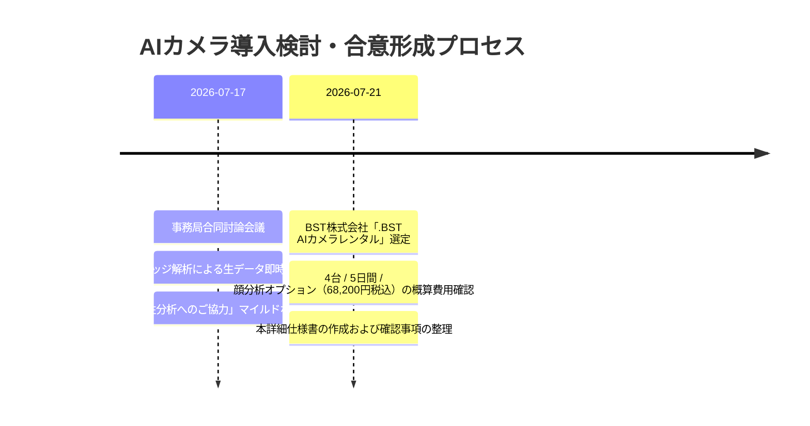

# 📸 産業フェアしずおか2026：AIカメラ 導入・運用詳細仕様書

本ドキュメントは、「産業フェアしずおか2026」（ツインメッセ静岡）における来場者数カウントおよび属性分析（性別・年代層）を自動化する**AIカメラシステム**の導入計画、技術仕様、現場設営・設置画角、個人情報保護（プライバシー）対応、およびやり取りの経緯を一元管理する正式仕様書です。

---

## 📅 1. 基本情報・事業者コンタクト

| 項目 | 内容 |
| :--- | :--- |
| **施策名** | 来場者カウント ＆ 属性分析用 AIカメラ運用 |
| **採用サービス** | `.BST AIカメラレンタル` |
| **事業者名** | **BST株式会社**（[https://bstinc.co.jp/](https://bstinc.co.jp/)） |
| **実施期間** | 2026年11月26日(木) 〜 11月30日(月)（計5日間：設営・リハーサル・本番2日間・撤収） |
| **実本番日時** | 2026年11月28日(土) 9:30〜17:00 / 11月29日(日) 9:30〜16:00 |
| **設置台数** | **4台**（北館入場口 1台 / 南館入場口 1台 / 動線・連絡通路 2台） |
| **概算費用** | **68,200円（税込）**（5日レンタル・8h/日稼働・顔分析オプション 1,100円/台含む） |
| **社内責任者** | スタッフ・アルバイト管理担当（長島） ／ システム協力（山田） ／ 安全警備（梅原） |

---

## 🏛️ 2. これまでの検討経緯・合意事項（やり取り履歴）



### 【主要な決定事項】
1. **データ処理・プライバシー**: カメラ映像はオンプレミスのエッジ解析端末で即時リアルタイム処理。「30代女性1名」等の数値化ログのみを送信し、**生映像・顔写真は端末内で即時破棄（サーバー保存なし）**。
2. **法務・告示対応**: 国の「カメラ画像利活用ガイドライン」に基づき、入場口手前3箇所に「AIカメラ運用中」の告知看板を設置（事務局問合せ先: 054-252-3132）。
3. **施工・安全基準**: 通行障害や落下事故を防ぐため、床上2.5m以上の高所（天井梁・支柱クランプ）に固定。配線は配線モール・モールテープで完全保護。

---

## 📐 3. システム・機材仕様 ＆ 設置レイアウト

### 機材・機能スペック
- **カメラ本体**: 高画質IPネットワークカメラ 4台
- **解析エンジン**: `.BST AI分析モジュール`（人物検知・カウント・性別推定・年代推定）
- **オプション**: **顔分析機能**（1,100円/台）
- **通信・電源**: 各カメラへ100V電源供給 ＋ エッジ端末からPoE給電（LAN配線）

### 設置レイアウト
```
【北館展示場 入口】  ────────── 🎥 カメラ① (中央梁 高所3.5m)
【南館展示場 入口】  ────────── 🎥 カメラ② (左支柱 高所3.0m)
【南北連絡通路 A】  ────────── 🎥 カメラ③ (動線カウント用)
【南北連絡通路 B】  ────────── 🎥 カメラ④ (回遊・滞留分析用)
```

---

## 🛡️ 4. 個人情報保護（プライバシー）対応 ＆ 告知看板仕様

> [!CAUTION]
> **【進行ステータス】告知看板の印刷手配は保留（ストップ）中**
> 山田プロデューサー（トモさん）指示により、現時点での印刷手配は進めません。
> BST株式会社（パートナー）に対し、他自治体・大型展示会での**「個人情報保護・属性分析告知看板の設置事例・推奨文言」**をヒアリング・回収した上で、最終デザイン・文言を決定します。

### 告知看板の文言検討案（事例ヒアリング予定）
来場者（特にシニア層・子育てファミリー層）への不快感・監視感を払拭するため、他社事例を踏まえて調整します。

```
+-------------------------------------------------------+
|  【お知らせ】                                         |
|  来場者カウント・属性分析へのご協力のお願い           |
|                                                       |
|  当会場（ツインメッセ静岡）では、今後のイベント改善・ |
|  混雑緩和を目的として、AIカメラによる来場者数および  |
|  属性（年代・性別）の統計分析を行っております。        |
|                                                       |
|  ※映像および顔写真はエッジ端末にて即時破棄され、     |
|    個人を特定するデータは一切保存されません。         |
|                                                       |
|  ［問い合わせ先］                                     |
|  産業フェアしずおか実行委員会 事務局                  |
|  TEL : 054-252-3132                                   |
+-------------------------------------------------------+
```

### 次回アクション
- [ ] **BST株式会社へ類似事例の問い合わせ**: 他の自治体・大型イベントでの告知看板文言・掲示事例の回収
- [ ] **文言・デザインの再提案**: 回収事例を元に山田プロデューサーへ再提示・承認後に印刷手配

---

## 📋 5. 現場設営・テスト・運用タイムライン

- **11月26日(木)**: BST社より機材受取・点検、エッジ端末初期設定
- **11月27日(金) 13:00〜16:00**:
  - ツインメッセ北館・南館の指定高所にカメラ4台設置施工（梅原・長島）
  - 画角確認・画角内照度テスト・カウント精度テスト実施（山田）
  - 告知看板3箇所の設置完了確認
- **11月28日(土) 9:00**: 本番自動カウントスタート（終日監視）
- **11月29日(日) 16:30**: 本番終了・データログバックアップ・撤収作業

---

## 🔗 6. 関連ドキュメント
- 💰 **[AIカメラ・デジタルスタンプラリー仕様見積書 (BST社想定)](file:///Users/sap220701/Desktop/産業フェア_ローカル/docs/06_IT・DX・システム/AIカメラ・デジタルスタンプラリー仕様見積書_BST.md)**
- 🤝 **[アライアンス先・パートナー統合管理表](file:///Users/sap220701/Desktop/産業フェア_ローカル/docs/07_アライアンス/アライアンス先管理一覧.md)**
- 📐 **[AIカメラ設置・プライバシー分析討論ログ](file:///Users/sap220701/Desktop/産業フェア_ローカル/discussions/AIカメラ設置_プライバシー分析討論ログ.md)**
