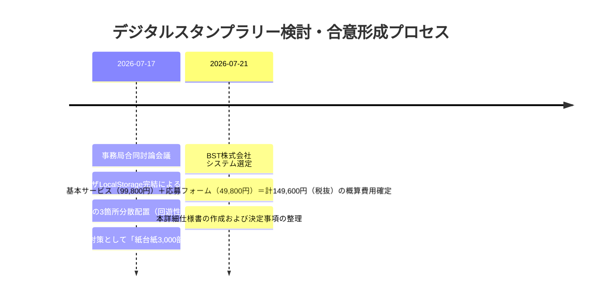
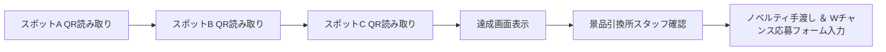

# 📱 産業フェアしずおか2026：デジタルスタンプラリー 導入・運用詳細仕様書

本ドキュメントは、「産業フェアしずおか2026」（ツインメッセ静岡）における会場内回遊促進および体験価値向上のため導入する**デジタルスタンプラリーシステム**（提供元：BST株式会社）の仕様書、スポット配置、応募フォーム設計、障害時バックアップ手順、およびやり取りの経緯を一元管理する正式仕様書です。

---

## 📅 1. 基本情報・事業者コンタクト

| 項目 | 内容 |
| :--- | :--- |
| **施策名** | WEBブラウザ完結型 デジタルスタンプラリー ＆ 景品応募 |
| **採用システム** | BST株式会社 デジタルスタンプラリーシステム |
| **事業者名** | **BST株式会社**（[https://bstinc.co.jp/](https://bstinc.co.jp/)） |
| **稼働期間** | 2026年11月28日(土) 9:00 〜 11月29日(日) 16:30 |
| **概算費用** | **149,600円（税抜） / 164,560円（税込）**<br>（内訳: 基本サービス料 99,800円 ＋ 応募フォームオプション 49,800円） |
| **デザイン仕様** | システム標準テンプレート＋イベントロゴ/主要画像差し替え（※完全オリジナルデザイン時別途見積） |
| **物理バックアップ**| 紙のスタンプ台紙 ＆ 物理スタンプ 3,000部常備 |
| **社内責任者** | システム構築（山田） ／ 景品・現場運営（長島） ／ スポット施工配置（梅原） |

---

## 🏛️ 2. これまでの検討経緯・合意事項（やり取り履歴）



### 【主要な決定事項】
1. **アプリ不要・登録不要**: スマートフォンの標準カメラでQRコードを読み取るだけで起動。ブラウザの `LocalStorage`（ローカル保存）を活用し、個人情報登録不要でスタンプを保持。
2. **回遊動線設計**: スタンプスポットを北館・南館奥・南館手前の3箇所に分散し、両館の往来を促進。
3. **景品応募フォーム**: 3スポット達成者にのみ、景品応募（ノベルティ手渡し＋ダブルチャンス抽選応募）画面を表示。
4. **現場電波障害対策**: 通信エラー・圏外時に備え、景品引換所に紙の台紙3,000部とスタンプ台を常備し、即時対応。

---

## 🗺️ 3. スポット配置・回遊設計

来場者の偏りを防ぎ、全出展エリアの回遊率を高めるため、以下の3箇所にスタンプスポット看板（A型看板 H1,800mm）を設置します。

```
【北館】  スポットA: 「巨大シズレンガ（木のジャングルジム）体験広場」横
            │
            ▼ （南北連絡通路）
            │
【南館奥】スポットB: 「地場産業・まぐろゾーン」PRコーナー
            │
            ▼
【南館手前】スポットC: 「企業ゾーン・静岡しん発見ブース」端
            │
            ▼
【本部横】 🎁 景品引換所（スタッフ確認ボタン押下 ➔ 景品手渡し ＆ 応募フォーム完了）
```

---

## 📲 4. ユーザー利用フロー ＆ 応募フォーム仕様



### 📋 応募フォーム取得項目・提案案（現在検討中）

来場者の入力ストレス（離脱率）を抑えつつ、今後の広報施策・マーケティングに役立つデータを収集するための**おすすめ取得項目案**です。

#### 【案A：シンプル型（入力所要時間：約30秒）★推奨】
1. **氏名（フリガナ）**【必須】
2. **電話番号 または メールアドレス**【必須】（Wチャンス景品当選連絡用）
3. **居住地**【必須】（選択式：静岡市葵区 / 駿河区 / 清水区 / 静岡県内その他 / 静岡県外）
4. **年代・性別**【必須】（選択式：10代未満 / 10代〜60代以上 / 回答しない）

#### 【案B：マーケティング分析型（入力所要時間：約60秒）】
上記【案A】に加えて以下の2項目を追加：
5. **来場認知経路**【必須】（選択式：小学校配布チラシ / Instagram・Web広告 / TVCM / 知人・口コミ / その他）
6. **本日楽しかったゾーン**【任意】（選択式：企業ブース / 地場産・グルメ / キッズ体験・ステージ / サンリオ等）

---

## 🚨 5. 現場トラブル対応（紙バックアップ運用）

ツインメッセ静岡屋内の混雑に伴うキャリア電波障害発生時のマニュアルです。

1. **接続エラー検知**: 来場者が「QRコードが読み込めない」「画面が進まない」と申し出た場合。
2. **即時切り替え**: 景品引換所の長島・スタッフが「紙のスタンプ台紙」を手渡し。
3. **物理スタンプ押印**: 該当スポットの物理スタンプを押印し、その場で景品を手渡し。
4. **準備数**: **紙台紙 3,000部** ＋ 予備スタンプ3個を引換所に常備。

---

## 🔗 6. 関連ドキュメント
- 💰 **[AIカメラ・デジタルスタンプラリー仕様見積書 (BST社想定)](file:///Users/sap220701/Desktop/産業フェア_ローカル/docs/06_IT・DX・システム/AIカメラ・デジタルスタンプラリー仕様見積書_BST.md)**
- 🤝 **[アライアンス先・パートナー統合管理表](file:///Users/sap220701/Desktop/産業フェア_ローカル/docs/07_アライアンス/アライアンス先管理一覧.md)**
- 📐 **[デジタルスタンプラリーシステム仕様・回遊設計討論ログ](file:///Users/sap220701/Desktop/産業フェア_ローカル/discussions/デジタルスタンプラリーシステム仕様・回遊設計討論ログ.md)**
