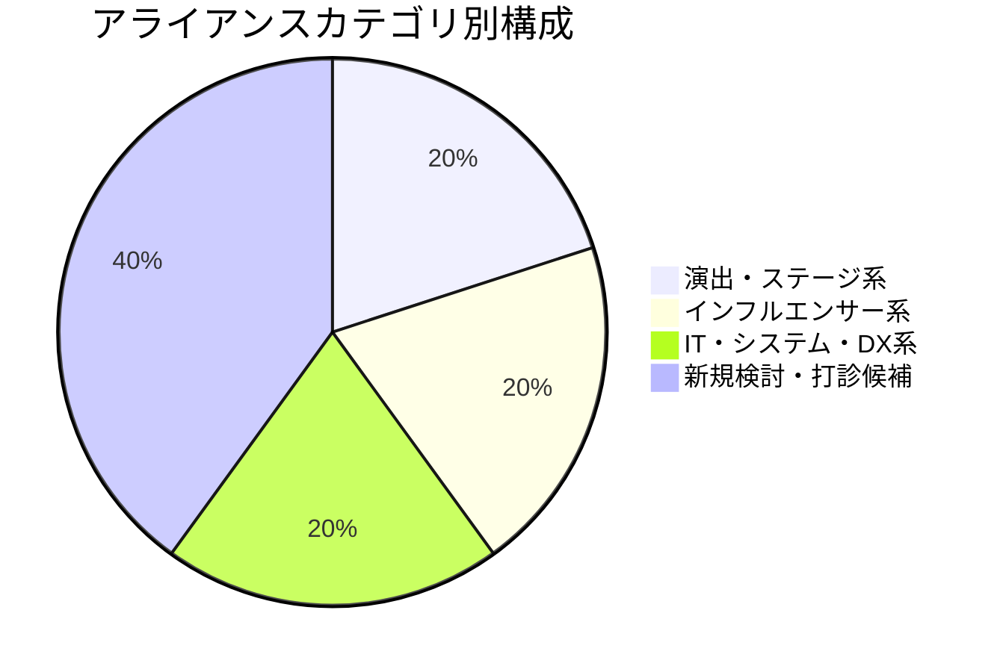
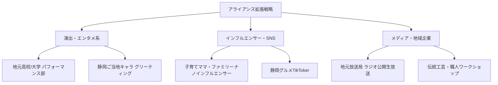

# 🤝 産業フェアしずおか2026 アライアンス先・パートナー統合管理表

本ドキュメントは、「産業フェアしずおか2026」において連携・出展・タイアップを推進する**演出系（ステージ・パフォーマンス）**、**インフルエンサー系（SNS・広報）**、**IT・システム・DX系**、および**メディア・地域パートナー系**のアライアンス先を一覧化し、交渉ステータス・契約条件・担当窓口を一元管理するためのマスターファイルです。

---

## 📊 1. アライアンス全体サマリー・ステータス

### 凡例（ステータス表示）
- 🟢 **契約確定 / アサイン確定**: 条件合意済み・実施確定
- 🟡 **仮押さえ中 / 調整中**: 日程・演目等は確保済み、最終受託・契約確認待ち
- 🔵 **打診中 / 提案段階**: 企画打診中、回答待ち
- ⚪ **検討中 / 候補選定**: 候補リストアップ段階
- 🔴 **辞退 / 見送り**: 条件不一致等により見送り

---

## 📋 2. アライアンスパートナー一覧（概要マトリクス）

| ID | アライアンス先名 | カテゴリ | 実施概要 | 想定予算 / 契約条件 | 実施日程 | ステータス | 社内担当 |
| :--- | :--- | :--- | :--- | :--- | :--- | :---: | :--- |
| **ST-01** | 株式会社サンリオエンターテイメント | 演出・ステージ | ポムポムプリン30周年ステージ「ぱぴぷぺPom！」（シナモロール共演） | 500,000円（税別）＋実費 | 11/29(日) | 🟡 仮押さえ | 齋藤 ➔ 新担当 |
| **ST-02** | 有限会社 きのいい羊達 | 演出・ステージ | 参加型「キッズ運動あそび・体験プログラム」（3名派遣） | 90,000円（税込）/ 1日 | 11/28(土)・29(日) | 🟡 仮押さえ | 齋藤 ➔ 新担当 |
| **INF-01**| 静岡県コンシェルジュ（`@shizuoka_info`） | インフルエンサー | Instagram事前告知（フィード/ストーリーズ）＋本番レポート | 全体枠220,000円（NEXTLOCAL経由） | 11/9〜13, 11/28-29 | 🟢 アサイン確定 | Webプロモーションチーム |
| **INF-02**| 静岡散歩日記（`@shizuokaosanponikki`） | インフルエンサー | Instagram事前告知（グルメ・スポット視点）＋本番レポート | 全体枠220,000円（NEXTLOCAL経由） | 11/9〜13, 11/28-29 | 🟢 アサイン確定 | Webプロモーションチーム |
| **SYS-01**| BST株式会社（.BST） | IT・システム・DX | .BST AIカメラレンタル（4台/5日/顔分析）来場者属性・人数自動取得 | 68,200円（税込） | 11/26〜11/30 | 🟢 導入想定確定 | デジタル・WEB / 長島・山田 |
| **SYS-02**| BST株式会社 | IT・システム・DX | WEBスタンプラリーシステム ＋ 応募フォーム機能 | 149,600円（税抜） | 11/28(土)・29(日) | 🟢 導入想定確定 | デジタル・WEB / 山田 |
| **INF-03**| 子育てママ系ナノインフルエンサー（候補） | インフルエンサー | マイクロ/ナノ層による口コミ拡散・体験談投稿 | 検討中（追加枠） | 11月中旬〜本番 | ⚪ 検討中 | Webプロモーションチーム |
| **MED-01**| 地元TV・ラジオ局タイアップ（候補） | メディア・広報 | 番組連動パブリシティ・ステージ特番 | 協賛/番組制作枠 | 会期前〜当 | ⚪ 検討中 | 協賛・広報チーム |
| **LOC-01**| 静岡市伝統工芸・体験事業者（候補） | 地域連携 | 体験ワークショップブース・伝統工芸演舞 | 出展枠/材料費調整 | 11/28(土)・29(日) | ⚪ 検討中 | 出展進行チーム |

---

## 🎭 3. 演出・ステージ系 アライアンス詳細

### 【ST-01】株式会社サンリオエンターテイメント
- **ステータス**: 🟡 **仮押さえ完了（11/29(日)のみ）**
- **関連詳細資料**: [docs/05_ステージ/サンリオ.md](file:///Users/sap220701/Desktop/産業フェア_ローカル/docs/05_ステージ/サンリオ.md)
- **連絡履歴**: [mail/サンリオ/問い合わせ.md](file:///Users/sap220701/Desktop/産業フェア_ローカル/mail/サンリオ/問い合わせ.md)

| 項目 | 内容・詳細 |
| :--- | :--- |
| **会社名 / 窓口** | 株式会社サンリオエンターテイメント（ビジネスディベロップメント部 佐野 なつ 様） |
| **連絡先** | Email: `n-sano@sanrio-entertainment.co.jp` / TEL: 090-9841-1288 |
| **社内担当者** | 株式会社 静鉄アド・パートナーズ 営業部（旧担当: 齋藤様 ➔ 新担当へ引き継ぎ） |
| **企画内容** | ポムポムプリン30周年スペシャルステージ「ぱぴぷぺPom！」（シナモロール追加出演） |
| **契約金額** | **500,000円（税別）＋ 実費（交通費・宿泊諸経費等）** |
| **注意事項・条件** | ・グリーティング単体は不可（キャラクターショー形態） ・日帰りの場合：初回出演12:00以降（起点8:00発） ・午前中出演の場合：前日スタッフ6名分の前泊費が別途発生 |
| **次回アクション** | ① プロポーザル受託結果に基づき正式決定連絡 ② タイムテーブル（12時以降か前泊か）の確定 ③ 着替えスペース・音響設備・撮影制限ルールの現場調整 |

---

### 【ST-02】有限会社 きのいい羊達
- **ステータス**: 🟡 **仮押さえ完了（11/28(土)・29(日) 両日押さえ中）**
- **関連詳細資料**: [docs/05_ステージ/きのいい羊達.md](file:///Users/sap220701/Desktop/産業フェア_ローカル/docs/05_ステージ/きのいい羊達.md)
- **連絡履歴**: [mail/きのいい羊たち/問い合わせ.md](file:///Users/sap220701/Desktop/産業フェア_ローカル/mail/きのいい羊たち/問い合わせ.md)

| 項目 | 内容・詳細 |
| :--- | :--- |
| **会社名 / 窓口** | 有限会社 きのいい羊達（担当: 磯谷 様 / 初期対応: 鈴木 健太 様） |
| **連絡先** | Email: `k-hitsujitachi@tokai.or.jp` |
| **社内担当者** | 株式会社 静鉄アド・パートナーズ 営業部（旧担当: 齋藤様 ➔ 新担当へ引き継ぎ） |
| **企画内容** | キッズ向け運動あそび体験ステージ（サーキットあそび、玉集め、親子あそび、手作りおもちゃ等） |
| **契約金額** | **90,000円（税込）/ 1日あたり**（3名派遣、1日2〜3ステージ同一料金） |
| **実施条件** | ステージ前の客席エリアを広く開放し、安全対策マット等を設置 |
| **次回アクション** | ① 実施日程の確定（1日のみの場合は対象外日程の仮押さえ解除） ② 発注手続きおよび会場レイアウト（安全対策）の最終打合せ |

---

## 📱 4. インフルエンサー系 アライアンス詳細

- **関連詳細資料**: [docs/03_インフルエンサー/インフルエンサーキックオフ打合せ資料.md](file:///Users/sap220701/Desktop/産業フェア_ローカル/docs/03_インフルエンサー/インフルエンサーキックオフ打合せ資料.md)
- **パートナー情報**: [docs/03_インフルエンサー/アサイン会社_NEXTLOCAL情報.md](file:///Users/sap220701/Desktop/産業フェア_ローカル/docs/03_インフルエンサー/アサイン会社_NEXTLOCAL情報.md)
- **総予算枠**: **220,000円（税込）**（発注額確定、実費等コミコミ）

### 🏢 アサイン代理店・協力会社情報
| 項目 | 内容・詳細 |
| :--- | :--- |
| **会社名** | **株式会社NEXTLOCAL** |
| **代表・担当窓口** | 代表取締役 辻田 敬介 様 |
| **住所** | 〒422-8046 静岡県静岡市駿河区中島203-1 第二昌栄ビル3F |
| **連絡先** | Email: `k-tsujita@next-local.com` / TEL: 090-4404-7325 (辻田様携帯) |
| **役割・管轄** | キャスティングディレクション、インフルエンサー投稿・日程・原稿進行管理、レポーティング |

---

### 【INF-01】静岡県コンシェルジュ（`@shizuoka_info`）
- **ステータス**: 🟢 **アサイン確定**
- **アサイン元**: 株式会社NEXTLOCAL
- **アカウント属性**: Instagram / 静岡県内のお出かけ・ファミリー層向け特化アカウント
- **役割・投稿頻度**: イベント事前告知投稿（フィード1回＋ストーリーズ）＋ 本番当日のリアルタイム・体験レポート
- **確認・運用ルール**:
  - `#PR` 表記のファーストビュー配置徹底（ステマ規制対策）
  - 商用ライセンス対応音源（ビジネスライブラリ）の限定使用
  - 構成案事前承認フロー（14営業日前初稿提出）

### 【INF-02】静岡散歩日記（`@shizuokaosanponikki`）
- **ステータス**: 🟢 **アサイン確定**
- **アサイン元**: 株式会社NEXTLOCAL
- **アカウント属性**: Instagram / 静岡市内のグルメ・スポット情報特化アカウント
- **役割・投稿頻度**: イベント事前告知投稿 ＋ 本番来場取材・レポート
- **確認・運用ルール**:
  - 二次利用権の確認（公式Instagram/特設Webへの無償転載期間：イベント終了後1年間）
  - 一般来場者の顔映り込み防止・撮影マニュアルの遵守

---

## 💻 5. IT・システム・DX系 アライアンス詳細

- **関連詳細資料**: [docs/06_IT・DX・システム/AIカメラ・デジタルスタンプラリー仕様見積書_BST.md](file:///Users/sap220701/Desktop/産業フェア_ローカル/docs/06_IT・DX・システム/AIカメラ・デジタルスタンプラリー仕様見積書_BST.md)
- **事業者情報**: **BST株式会社**（[https://bstinc.co.jp/](https://bstinc.co.jp/)）

### 【SYS-01】.BST AIカメラレンタル（来場者カウント・属性分析）
- **ステータス**: 🟢 **導入想定確定**
- **台数・期間**: 4台 / 5日間（8時間/日）
- **概算費用**: **68,200円（税込）**（顔分析オプション 1,100円/台含む）
- **活用目的**: 北館・南館入場口および連絡通路等でのリアルタイム来場者数カウントおよび性別・年代層のAI属性分析（生映像即時破棄・個人情報保護準拠）

### 【SYS-02】デジタルスタンプラリーシステム
- **ステータス**: 🟢 **導入想定確定**
- **形式・構成**: QRコード読み取り型WEBアプリ（ブラウザ完結・個人情報入力不要） ＋ 景品応募フォームオプション
- **概算費用**: **149,600円（税抜） / 164,560円（税込）**
  - 内訳: 基本サービス料 99,800円（税抜） ＋ 応募フォーム 49,800円（税抜）
  - ※デザイン完全カスタマイズ時は別途見積もり
- **活用目的**: 会場内（北館・南館・体験ブース）の回遊性向上および来場者体験価値の拡大

---

## 💡 6. 今後の新規アライアンス開拓・打診候補

産業フェア2026の集客力向上・コンテンツ充実のため、今後打診を検討するアライアンス候補一覧です。

### 今後打診予定のパートナー候補リスト
1. **地元大学・高校パフォーマー**
   - **内容**: 静岡大学・県立大学のダンス部・吹奏楽部・大道芸サークル等のステージ出演
   - **目的**: 若年層・ファミリー層の集客および地域貢献枠の拡充
2. **静岡県内ご当地キャラクター**
   - **内容**: 静岡県・静岡市のマスコットキャラクター等の合同グリーティング
   - **目的**: サンリオステージ（日曜日）との相乗効果、会場回遊性の向上
3. **地域メディアタイアップ**
   - **内容**: 地元フリーペーパー・FMラジオ局での事前プレゼント企画・パブリシティ連携
   - **目的**: 新聞購読層・ドライブ層へのアプローチ強化

---

## 📝 7. アライアンス管理運用フロー ＆ 変更履歴

### 運用ルール
1. **情報の更新**: 交渉ステータスに変更があった場合（仮押さえ確定、契約締結、辞退等）、本ファイルのステータス表記および変更履歴を即座に更新する。
2. **個別ドキュメントの参照**: 各パートナーとの契約条件や詳細メール履歴は、`docs/05_ステージ/`、`docs/03_インフルエンサー/`、`docs/04_体制・評価/` 配下の個別詳細ファイルとリンクさせる。

### 変更履歴
- **2026-07-21**: 初版作成（サンリオ、きのいい羊達、静岡県コンシェルジュ、静岡散歩日記、株式会社NEXTLOCALを統合）
- **2026-07-21**: IT・DXパートナーとして「BST株式会社（.BST AIカメラレンタル / デジタルスタンプラリー）」の概算条件（総合計211,600円税抜）を統合追加。
